# tiff-reducer Test Report

**Generated:** 2026-03-24 00:36:06

## Summary

| Category | Count | Percentage |
|----------|-------|------------|
| ✅ Working | 297 | 97.4% |
| ❌ Failed | 8 | 2.6% |
| **Total** | **305** | **100%** |

### Failure Breakdown

| Failure Type | Count |
|--------------|-------|
| TIFFWriteDirectorySec crash | 0 |
| Read/Decode errors | 0 |
| Tile errors | 0 |
| Other errors | 8 |

## ✅ Working Images

**297 images** successfully compressed with thumbnails below:

### 12bit.cropped.rgb.tiff

*No thumbnail available*

### 12bit.cropped.tiff

- **Original size:** 6,366 bytes
- **Compressed size:** 2,310 bytes
- **Reduction:** ⬇ 63.7%

### 170918_tn_neutrophil_migration_wave.ome.tif

- **Original size:** 2,122,029 bytes
- **Compressed size:** 1,377,245 bytes
- **Reduction:** ⬇ 35.1%

### 181003_multi_pos_time_course_1_MMStack.ome.tif

- **Original size:** 3,994,219 bytes
- **Compressed size:** 2,345,366 bytes
- **Reduction:** ⬇ 41.3%

### 4D-series.ome.tif

- **Original size:** 2,629,919 bytes
- **Compressed size:** 83,818 bytes
- **Reduction:** ⬇ 96.8%

### BigTIFF.tif

- **Original size:** 12,480 bytes
- **Compressed size:** 514 bytes
- **Reduction:** ⬇ 95.9%

### BigTIFFLong.tif

- **Original size:** 12,480 bytes
- **Compressed size:** 514 bytes
- **Reduction:** ⬇ 95.9%

### BigTIFFMotorola.tif

- **Original size:** 12,480 bytes
- **Compressed size:** 514 bytes
- **Reduction:** ⬇ 95.9%

### MMStack_Pos0.ome.tif

- **Original size:** 88,525,059 bytes
- **Compressed size:** 55,946,636 bytes
- **Reduction:** ⬇ 36.8%

### P1_T0.tif

- **Original size:** 133,426 bytes
- **Compressed size:** 109,588 bytes
- **Reduction:** ⬇ 17.9%

### P1_T1.tif

- **Original size:** 133,426 bytes
- **Compressed size:** 110,076 bytes
- **Reduction:** ⬇ 17.5%

### P1_T2.tif

- **Original size:** 133,426 bytes
- **Compressed size:** 110,122 bytes
- **Reduction:** ⬇ 17.5%

### P1_T3.tif

- **Original size:** 133,426 bytes
- **Compressed size:** 111,218 bytes
- **Reduction:** ⬇ 16.6%

### P1_T4.tif

- **Original size:** 133,426 bytes
- **Compressed size:** 111,500 bytes
- **Reduction:** ⬇ 16.4%

### P1_T5.tif

- **Original size:** 133,426 bytes
- **Compressed size:** 111,934 bytes
- **Reduction:** ⬇ 16.1%

### P1_T6.tif

- **Original size:** 133,426 bytes
- **Compressed size:** 109,866 bytes
- **Reduction:** ⬇ 17.7%

### P1_T7.tif

- **Original size:** 133,426 bytes
- **Compressed size:** 109,390 bytes
- **Reduction:** ⬇ 18.0%

### P1_T8.tif

- **Original size:** 133,426 bytes
- **Compressed size:** 109,328 bytes
- **Reduction:** ⬇ 18.1%

### P1_T9.tif

- **Original size:** 133,426 bytes
- **Compressed size:** 108,984 bytes
- **Reduction:** ⬇ 18.3%

### P2_T0.tif

- **Original size:** 133,426 bytes
- **Compressed size:** 106,424 bytes
- **Reduction:** ⬇ 20.2%

### P2_T1.tif

- **Original size:** 133,426 bytes
- **Compressed size:** 105,896 bytes
- **Reduction:** ⬇ 20.6%

### P2_T2.tif

- **Original size:** 133,426 bytes
- **Compressed size:** 105,970 bytes
- **Reduction:** ⬇ 20.6%

### P2_T3.tif

- **Original size:** 133,426 bytes
- **Compressed size:** 108,676 bytes
- **Reduction:** ⬇ 18.5%

### P2_T4.tif

- **Original size:** 133,426 bytes
- **Compressed size:** 108,704 bytes
- **Reduction:** ⬇ 18.5%

### P2_T5.tif

- **Original size:** 133,426 bytes
- **Compressed size:** 109,832 bytes
- **Reduction:** ⬇ 17.7%

### P2_T6.tif

- **Original size:** 133,426 bytes
- **Compressed size:** 105,992 bytes
- **Reduction:** ⬇ 20.6%

### P2_T7.tif

- **Original size:** 133,426 bytes
- **Compressed size:** 106,134 bytes
- **Reduction:** ⬇ 20.5%

### P2_T8.tif

- **Original size:** 133,426 bytes
- **Compressed size:** 106,066 bytes
- **Reduction:** ⬇ 20.5%

### P2_T9.tif

- **Original size:** 133,426 bytes
- **Compressed size:** 105,998 bytes
- **Reduction:** ⬇ 20.6%

### TSeries-camp-005_Cycle00001_Ch1_000001.ome.tif

- **Original size:** 42,364 bytes
- **Compressed size:** 18,007 bytes
- **Reduction:** ⬇ 57.5%

### TSeries-camp-005_Cycle00001_Ch1_000002.ome.tif

- **Original size:** 33,943 bytes
- **Compressed size:** 9,578 bytes
- **Reduction:** ⬇ 71.8%

### TSeries-camp-005_Cycle00001_Ch1_000003.ome.tif

- **Original size:** 33,943 bytes
- **Compressed size:** 9,600 bytes
- **Reduction:** ⬇ 71.7%

### TSeries-camp-005_Cycle00001_Ch1_000004.ome.tif

- **Original size:** 33,943 bytes
- **Compressed size:** 9,610 bytes
- **Reduction:** ⬇ 71.7%

### TSeries-camp-005_Cycle00001_Ch2_000001.ome.tif

- **Original size:** 33,943 bytes
- **Compressed size:** 9,162 bytes
- **Reduction:** ⬇ 73.0%

### TSeries-camp-005_Cycle00001_Ch2_000002.ome.tif

- **Original size:** 33,943 bytes
- **Compressed size:** 9,152 bytes
- **Reduction:** ⬇ 73.0%

### TSeries-camp-005_Cycle00001_Ch2_000003.ome.tif

- **Original size:** 33,943 bytes
- **Compressed size:** 9,142 bytes
- **Reduction:** ⬇ 73.1%

### TSeries-camp-005_Cycle00001_Ch2_000004.ome.tif

- **Original size:** 33,943 bytes
- **Compressed size:** 9,162 bytes
- **Reduction:** ⬇ 73.0%

### TSeries-camp-005_Cycle00002_Ch1_000001.ome.tif

- **Original size:** 33,943 bytes
- **Compressed size:** 9,540 bytes
- **Reduction:** ⬇ 71.9%

### TSeries-camp-005_Cycle00002_Ch1_000002.ome.tif

- **Original size:** 33,943 bytes
- **Compressed size:** 9,600 bytes
- **Reduction:** ⬇ 71.7%

### TSeries-camp-005_Cycle00002_Ch1_000003.ome.tif

- **Original size:** 33,943 bytes
- **Compressed size:** 9,554 bytes
- **Reduction:** ⬇ 71.9%

### TSeries-camp-005_Cycle00002_Ch1_000004.ome.tif

- **Original size:** 33,943 bytes
- **Compressed size:** 9,594 bytes
- **Reduction:** ⬇ 71.7%

### TSeries-camp-005_Cycle00002_Ch2_000001.ome.tif

- **Original size:** 33,943 bytes
- **Compressed size:** 9,066 bytes
- **Reduction:** ⬇ 73.3%

### TSeries-camp-005_Cycle00002_Ch2_000002.ome.tif

- **Original size:** 33,943 bytes
- **Compressed size:** 9,162 bytes
- **Reduction:** ⬇ 73.0%

### TSeries-camp-005_Cycle00002_Ch2_000003.ome.tif

- **Original size:** 33,943 bytes
- **Compressed size:** 9,080 bytes
- **Reduction:** ⬇ 73.2%

### TSeries-camp-005_Cycle00002_Ch2_000004.ome.tif

- **Original size:** 33,943 bytes
- **Compressed size:** 9,046 bytes
- **Reduction:** ⬇ 73.3%

### TSeries-camp-005_Cycle00003_Ch1_000001.ome.tif

- **Original size:** 33,943 bytes
- **Compressed size:** 9,538 bytes
- **Reduction:** ⬇ 71.9%

### TSeries-camp-005_Cycle00003_Ch1_000002.ome.tif

- **Original size:** 33,943 bytes
- **Compressed size:** 9,612 bytes
- **Reduction:** ⬇ 71.7%

### TSeries-camp-005_Cycle00003_Ch1_000003.ome.tif

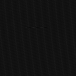

- **Original size:** 33,943 bytes
- **Compressed size:** 9,564 bytes
- **Reduction:** ⬇ 71.8%

### TSeries-camp-005_Cycle00003_Ch1_000004.ome.tif

- **Original size:** 33,943 bytes
- **Compressed size:** 9,542 bytes
- **Reduction:** ⬇ 71.9%

### TSeries-camp-005_Cycle00003_Ch2_000001.ome.tif

- **Original size:** 33,943 bytes
- **Compressed size:** 9,062 bytes
- **Reduction:** ⬇ 73.3%

### TSeries-camp-005_Cycle00003_Ch2_000002.ome.tif

- **Original size:** 33,943 bytes
- **Compressed size:** 9,162 bytes
- **Reduction:** ⬇ 73.0%

### TSeries-camp-005_Cycle00003_Ch2_000003.ome.tif

- **Original size:** 33,943 bytes
- **Compressed size:** 9,126 bytes
- **Reduction:** ⬇ 73.1%

### TSeries-camp-005_Cycle00003_Ch2_000004.ome.tif

- **Original size:** 33,943 bytes
- **Compressed size:** 9,102 bytes
- **Reduction:** ⬇ 73.2%

### Transparency-lzw.tif

- **Original size:** 6,158 bytes
- **Compressed size:** 3,096 bytes
- **Reduction:** ⬇ 49.7%

### background_1_MMStack.ome.tif

- **Original size:** 19,249,906 bytes
- **Compressed size:** 16,709,148 bytes
- **Reduction:** ⬇ 13.2%

### bali.tif

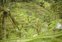

- **Original size:** 179,378 bytes
- **Compressed size:** 156,174 bytes
- **Reduction:** ⬇ 12.9%

### big_g4.tif

*No thumbnail available*

### capitol.tif

- **Original size:** 24,036 bytes
- **Compressed size:** 12,570 bytes
- **Reduction:** ⬇ 47.7%

### capitol2.tif

- **Original size:** 25,170 bytes
- **Compressed size:** 12,570 bytes
- **Reduction:** ⬇ 50.1%

### caspian.tif

*No thumbnail available*

### cmyk-3c-16b.tiff

- **Original size:** 189,934 bytes
- **Compressed size:** 160,752 bytes
- **Reduction:** ⬇ 15.4%

### cmyk-3c-32b-float.tiff

*No thumbnail available*

### cmyk-3c-8b.tiff

- **Original size:** 95,106 bytes
- **Compressed size:** 77,376 bytes
- **Reduction:** ⬇ 18.6%

### cmyk-4c-8b.tiff

*No thumbnail available*

### coffee.tif

- **Original size:** 184,509 bytes
- **Compressed size:** 133,374 bytes
- **Reduction:** ⬇ 27.7%

### cramps-tile.tif

*No thumbnail available*

### cramps.tif

- **Original size:** 194,176 bytes
- **Compressed size:** 78,320 bytes
- **Reduction:** ⬇ 59.7%

### decodedata-rgb-3c-8b.tiff

- **Original size:** 30,180 bytes
- **Compressed size:** 916 bytes
- **Reduction:** ⬇ 97.0%

### dscf0013.tif

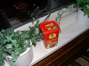

- **Original size:** 654,030 bytes
- **Compressed size:** 463,512 bytes
- **Reduction:** ⬇ 29.1%

### earthlab.tif

*No thumbnail available*

### extra_bits_gray_8b.tiff

*No thumbnail available*

### extra_bits_rgb_8b.tiff

- **Original size:** 482 bytes
- **Compressed size:** 262 bytes
- **Reduction:** ⬇ 45.6%

### fax2d.tif

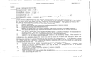

- **Original size:** 32,817 bytes
- **Compressed size:** 30,822 bytes
- **Reduction:** ⬇ 6.1%

### fax4.tiff

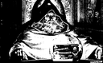

- **Original size:** 33,630 bytes
- **Compressed size:** 32,546 bytes
- **Reduction:** ⬇ 3.2%

### flagler.tif

- **Original size:** 434,350 bytes
- **Compressed size:** 249,258 bytes
- **Reduction:** ⬇ 42.6%

### flower-minisblack-02.tif

- **Original size:** 1,131 bytes
- **Compressed size:** 540 bytes
- **Reduction:** ⬇ 52.3%

### flower-minisblack-04.tif

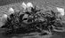

- **Original size:** 1,905 bytes
- **Compressed size:** 1,384 bytes
- **Reduction:** ⬇ 27.3%

### flower-minisblack-06.tif

*No thumbnail available*

### flower-minisblack-08.tif

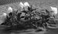

- **Original size:** 3,453 bytes
- **Compressed size:** 3,186 bytes
- **Reduction:** ⬇ 7.7%

### flower-minisblack-10.tif

*No thumbnail available*

### flower-minisblack-12.tif

- **Original size:** 5,043 bytes
- **Compressed size:** 4,914 bytes
- **Reduction:** ⬇ 2.6%

### flower-minisblack-14.tif

*No thumbnail available*

### flower-minisblack-16.tif

- **Original size:** 6,591 bytes
- **Compressed size:** 6,462 bytes
- **Reduction:** ⬇ 2.0%

### flower-minisblack-24.tif

*No thumbnail available*

### flower-minisblack-32.tif

*No thumbnail available*

### flower-palette-02.tif

- **Original size:** 1,164 bytes
- **Compressed size:** 758 bytes
- **Reduction:** ⬇ 34.9%

### flower-palette-04.tif

- **Original size:** 2,010 bytes
- **Compressed size:** 1,566 bytes
- **Reduction:** ⬇ 22.1%

### flower-palette-08.tif

- **Original size:** 4,998 bytes
- **Compressed size:** 4,808 bytes
- **Reduction:** ⬇ 3.8%

### flower-palette-16.tif

*No thumbnail available*

### flower-rgb-contig-02.tif

*No thumbnail available*

### flower-rgb-contig-04.tif

*No thumbnail available*

### flower-rgb-contig-08.tif

- **Original size:** 9,753 bytes
- **Compressed size:** 9,192 bytes
- **Reduction:** ⬇ 5.8%

### flower-rgb-contig-10.tif

*No thumbnail available*

### flower-rgb-contig-12.tif

*No thumbnail available*

### flower-rgb-contig-14.tif

*No thumbnail available*

### flower-rgb-contig-16.tif

- **Original size:** 19,177 bytes
- **Compressed size:** 19,036 bytes
- **Reduction:** ⬇ 0.7%

### flower-rgb-contig-24.tif

*No thumbnail available*

### flower-rgb-contig-32.tif

*No thumbnail available*

### flower-rgb-planar-02.tif

*No thumbnail available*

### flower-rgb-planar-04.tif

*No thumbnail available*

### flower-rgb-planar-08.tif

*No thumbnail available*

### flower-rgb-planar-10.tif

*No thumbnail available*

### flower-rgb-planar-12.tif

*No thumbnail available*

### flower-rgb-planar-14.tif

*No thumbnail available*

### flower-rgb-planar-16.tif

*No thumbnail available*

### flower-rgb-planar-24.tif

*No thumbnail available*

### flower-rgb-planar-32.tif

*No thumbnail available*

### flower-separated-contig-08.tif

- **Original size:** 12,911 bytes
- **Compressed size:** 12,192 bytes
- **Reduction:** ⬇ 5.6%

### flower-separated-contig-16.tif

- **Original size:** 25,483 bytes
- **Compressed size:** 25,328 bytes
- **Reduction:** ⬇ 0.6%

### flower-separated-planar-08.tif

*No thumbnail available*

### flower-separated-planar-16.tif

*No thumbnail available*

### g3test.tif

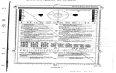

- **Original size:** 50,401 bytes
- **Compressed size:** 42,282 bytes
- **Reduction:** ⬇ 16.1%

### geo-5b.tif

*No thumbnail available*

### gradient-1c-32b-float.tiff

*No thumbnail available*

### gradient-1c-32b.tiff

*No thumbnail available*

### gradient-1c-64b-float.tiff

*No thumbnail available*

### gradient-1c-64b.tiff

*No thumbnail available*

### gradient-3c-32b-float.tiff

*No thumbnail available*

### gradient-3c-32b.tiff

*No thumbnail available*

### gradient-3c-64b.tiff

*No thumbnail available*

### house.tif

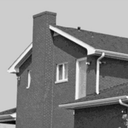

- **Original size:** 525,106 bytes
- **Compressed size:** 140,962 bytes
- **Reduction:** ⬇ 73.2%

### hpredict-1c-12b.tiff

- **Original size:** 158 bytes
- **Compressed size:** 156 bytes
- **Reduction:** ⬇ 1.3%

### imagemagick_group4.tiff

- **Original size:** 1,216 bytes
- **Compressed size:** 1,806 bytes
- **Reduction:** ⬇ -48.5%

### int16.tif

*No thumbnail available*

### int16_rgb.tif

*No thumbnail available*

### int16_zstd.tif

*No thumbnail available*

### int8.tif

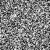

- **Original size:** 4,416 bytes
- **Compressed size:** 4,336 bytes
- **Reduction:** ⬇ 1.8%

### int8_rgb.tif

*No thumbnail available*

### issue_69_lzw.tiff

- **Original size:** 2,941 bytes
- **Compressed size:** 2,266 bytes
- **Reduction:** ⬇ 23.0%

### issue_69_packbits.tiff

- **Original size:** 4,427 bytes
- **Compressed size:** 2,266 bytes
- **Reduction:** ⬇ 48.8%

### jello.tif

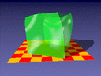

- **Original size:** 47,136 bytes
- **Compressed size:** 21,860 bytes
- **Reduction:** ⬇ 53.6%

### jim___ah.tif

- **Original size:** 67,677 bytes
- **Compressed size:** 14,536 bytes
- **Reduction:** ⬇ 78.5%

### jim___cg.tif

- **Original size:** 94,101 bytes
- **Compressed size:** 59,086 bytes
- **Reduction:** ⬇ 37.2%

### jim___dg.tif

- **Original size:** 94,089 bytes
- **Compressed size:** 65,164 bytes
- **Reduction:** ⬇ 30.7%

### jim___gg.tif

- **Original size:** 94,101 bytes
- **Compressed size:** 65,164 bytes
- **Reduction:** ⬇ 30.8%

### julia.tif

- **Original size:** 467,807 bytes
- **Compressed size:** 8,318 bytes
- **Reduction:** ⬇ 98.2%

### kodim02-lzw.tif

- **Original size:** 726,638 bytes
- **Compressed size:** 633,322 bytes
- **Reduction:** ⬇ 12.8%

### kodim07-lzw.tif

- **Original size:** 643,034 bytes
- **Compressed size:** 634,882 bytes
- **Reduction:** ⬇ 1.3%

### ladoga.tif

- **Original size:** 20,420 bytes
- **Compressed size:** 17,066 bytes
- **Reduction:** ⬇ 16.4%

### logluv-3c-16b.tiff

*No thumbnail available*

### mask_lzw.tif

- **Original size:** 2,328,132 bytes
- **Compressed size:** 11,422 bytes
- **Reduction:** ⬇ 99.5%

### minisblack-1c-16b.tiff

- **Original size:** 47,733 bytes
- **Compressed size:** 43,470 bytes
- **Reduction:** ⬇ 8.9%

### minisblack-1c-3b.tiff

*No thumbnail available*

### minisblack-1c-5b.tiff

*No thumbnail available*

### minisblack-1c-7b.tiff

*No thumbnail available*

### minisblack-1c-8b.tiff

- **Original size:** 24,001 bytes
- **Compressed size:** 17,052 bytes
- **Reduction:** ⬇ 29.0%

### minisblack-1c-i16b.tiff

*No thumbnail available*

### minisblack-1c-i8b.tiff

- **Original size:** 23,982 bytes
- **Compressed size:** 17,016 bytes
- **Reduction:** ⬇ 29.0%

### minisblack-2c-8b-alpha.tiff

*No thumbnail available*

### miniswhite-1c-12b.tiff

*No thumbnail available*

### miniswhite-1c-1b.tiff

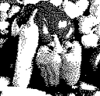

- **Original size:** 3,289 bytes
- **Compressed size:** 2,228 bytes
- **Reduction:** ⬇ 32.3%

### miniswhite-1c-3b.tiff

*No thumbnail available*

### miniswhite-1c-6b.tiff

*No thumbnail available*

### mri.tif

- **Original size:** 230,578 bytes
- **Compressed size:** 136,490 bytes
- **Reduction:** ⬇ 40.8%

### multi-channel-4D-series.ome.tif

- **Original size:** 7,889,559 bytes
- **Compressed size:** 294,852 bytes
- **Reduction:** ⬇ 96.3%

### multi-channel-time-series.ome.tif

- **Original size:** 1,578,825 bytes
- **Compressed size:** 53,096 bytes
- **Reduction:** ⬇ 96.6%

### multi-channel-z-series.ome.tif

- **Original size:** 1,128,003 bytes
- **Compressed size:** 38,922 bytes
- **Reduction:** ⬇ 96.5%

### multi-channel.ome.tif

- **Original size:** 226,459 bytes
- **Compressed size:** 7,438 bytes
- **Reduction:** ⬇ 96.7%

### multifile-Z1.ome.tiff

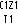

- **Original size:** 1,716 bytes
- **Compressed size:** 1,089 bytes
- **Reduction:** ⬇ 36.5%

### multifile-Z2.ome.tiff

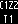

- **Original size:** 1,716 bytes
- **Compressed size:** 1,091 bytes
- **Reduction:** ⬇ 36.4%

### multifile-Z3.ome.tiff

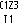

- **Original size:** 1,716 bytes
- **Compressed size:** 1,089 bytes
- **Reduction:** ⬇ 36.5%

### multifile-Z4.ome.tiff

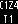

- **Original size:** 1,716 bytes
- **Compressed size:** 1,087 bytes
- **Reduction:** ⬇ 36.7%

### multifile-Z5.ome.tiff

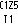

- **Original size:** 1,716 bytes
- **Compressed size:** 1,101 bytes
- **Reduction:** ⬇ 35.8%

### no_rows_per_strip.tiff

- **Original size:** 786,572 bytes
- **Compressed size:** 760,864 bytes
- **Reduction:** ⬇ 3.3%

### nonometif.tif

- **Original size:** 2,256 bytes
- **Compressed size:** 2,240 bytes
- **Reduction:** ⬇ 0.7%

### off_l16.tif

*No thumbnail available*

### off_luv24.tif

*No thumbnail available*

### off_luv32.tif

*No thumbnail available*

### oxford.tif

*No thumbnail available*

### palette-1c-1b.tiff

- **Original size:** 3,312 bytes
- **Compressed size:** 2,260 bytes
- **Reduction:** ⬇ 31.8%

### palette-1c-4b.tiff

- **Original size:** 12,322 bytes
- **Compressed size:** 8,756 bytes
- **Reduction:** ⬇ 28.9%

### palette-1c-8b.tiff

- **Original size:** 25,548 bytes
- **Compressed size:** 18,704 bytes
- **Reduction:** ⬇ 26.8%

### pc260001.tif

- **Original size:** 936,524 bytes
- **Compressed size:** 817,206 bytes
- **Reduction:** ⬇ 12.7%

### planar-rgb-u8.tif

*No thumbnail available*

### poppies.tif

- **Original size:** 765,363 bytes
- **Compressed size:** 441,194 bytes
- **Reduction:** ⬇ 42.4%

### predictor-3-gray-f32.tif

*No thumbnail available*

### predictor-3-rgb-f32.tif

*No thumbnail available*

### quad-lzw-compat.tiff

- **Original size:** 214,342 bytes
- **Compressed size:** 159,142 bytes
- **Reduction:** ⬇ 25.8%

### quad-lzw.tif

- **Original size:** 214,342 bytes
- **Compressed size:** 159,142 bytes
- **Reduction:** ⬇ 25.8%

### quad-tile.tif

*No thumbnail available*

### random-fp16-pred2.tiff

*No thumbnail available*

### random-fp16-pred3.tiff

*No thumbnail available*

### random-fp16.tiff

*No thumbnail available*

### renamed_internalfilenames.ome.tif

- **Original size:** 3,994,219 bytes
- **Compressed size:** 2,345,366 bytes
- **Reduction:** ⬇ 41.3%

### renamed_uuids.ome.tif

- **Original size:** 2,629,919 bytes
- **Compressed size:** 83,818 bytes
- **Reduction:** ⬇ 96.8%

### rgb-3c-16b.tiff

- **Original size:** 142,670 bytes
- **Compressed size:** 129,516 bytes
- **Reduction:** ⬇ 9.2%

### rgb-3c-8b.tiff

- **Original size:** 71,470 bytes
- **Compressed size:** 50,148 bytes
- **Reduction:** ⬇ 29.8%

### seq-1c-10b-6d739fa2.tiff

*No thumbnail available*

### seq-1c-10b-hpredict-6d739fa2.tiff

*No thumbnail available*

### seq-1c-10b-miniswhite-6d739fa2.tiff

*No thumbnail available*

### seq-1c-12b-47c39b31.tiff

- **Original size:** 530 bytes
- **Compressed size:** 504 bytes
- **Reduction:** ⬇ 4.9%

### seq-1c-12b-hpredict-47c39b31.tiff

- **Original size:** 530 bytes
- **Compressed size:** 504 bytes
- **Reduction:** ⬇ 4.9%

### seq-1c-12b-miniswhite-47c39b31.tiff

*No thumbnail available*

### seq-1c-14b-e883657f.tiff

*No thumbnail available*

### seq-1c-14b-hpredict-e883657f.tiff

*No thumbnail available*

### seq-1c-14b-miniswhite-e883657f.tiff

*No thumbnail available*

### seq-1c-16b-bigendian-68f373a0.tiff

- **Original size:** 658 bytes
- **Compressed size:** 194 bytes
- **Reduction:** ⬇ 70.5%

### seq-1c-16b-deflate-68f373a0.tiff

- **Original size:** 500 bytes
- **Compressed size:** 194 bytes
- **Reduction:** ⬇ 61.2%

### seq-1c-16b-lzw-68f373a0.tiff

- **Original size:** 758 bytes
- **Compressed size:** 194 bytes
- **Reduction:** ⬇ 74.4%

### seq-1c-16b-multistrip-68f373a0.tiff

- **Original size:** 682 bytes
- **Compressed size:** 194 bytes
- **Reduction:** ⬇ 71.6%

### seq-1c-16b-tiled-68f373a0.tiff

- **Original size:** 670 bytes
- **Compressed size:** 194 bytes
- **Reduction:** ⬇ 71.0%

### seq-1c-1b-71f6a21a.tiff

- **Original size:** 178 bytes
- **Compressed size:** 150 bytes
- **Reduction:** ⬇ 15.7%

### seq-1c-1b-miniswhite-71f6a21a.tiff

- **Original size:** 178 bytes
- **Compressed size:** 150 bytes
- **Reduction:** ⬇ 15.7%

### seq-1c-24b-072a9dc9.tiff

*No thumbnail available*

### seq-1c-24b-hpredict-072a9dc9.tiff

*No thumbnail available*

### seq-1c-24b-miniswhite-072a9dc9.tiff

*No thumbnail available*

### seq-1c-2b-58b25f76.tiff

- **Original size:** 210 bytes
- **Compressed size:** 150 bytes
- **Reduction:** ⬇ 28.6%

### seq-1c-32f-390fe673.tiff

*No thumbnail available*

### seq-1c-32f-deflate-fpredict-390fe673.tiff

*No thumbnail available*

### seq-1c-3b-ef237c07.tiff

*No thumbnail available*

### seq-1c-3b-miniswhite-ef237c07.tiff

*No thumbnail available*

### seq-1c-4b-fb92dcae.tiff

- **Original size:** 274 bytes
- **Compressed size:** 158 bytes
- **Reduction:** ⬇ 42.3%

### seq-1c-4b-miniswhite-fb92dcae.tiff

- **Original size:** 274 bytes
- **Compressed size:** 158 bytes
- **Reduction:** ⬇ 42.3%

### seq-1c-4b-palette-85108c5a.tiff

- **Original size:** 382 bytes
- **Compressed size:** 266 bytes
- **Reduction:** ⬇ 30.4%

### seq-1c-5b-73098d17.tiff

*No thumbnail available*

### seq-1c-5b-miniswhite-73098d17.tiff

*No thumbnail available*

### seq-1c-64f-afa8560e.tiff

*No thumbnail available*

### seq-1c-64f-deflate-fpredict-afa8560e.tiff

*No thumbnail available*

### seq-1c-6b-miniswhite-79cafbb6.tiff

*No thumbnail available*

### seq-1c-7b-9c61ba70.tiff

*No thumbnail available*

### seq-1c-7b-miniswhite-9c61ba70.tiff

*No thumbnail available*

### seq-1c-8b-bigendian-20f3db0c.tiff

- **Original size:** 402 bytes
- **Compressed size:** 206 bytes
- **Reduction:** ⬇ 48.8%

### seq-1c-8b-bigtiff-20f3db0c.tiff

- **Original size:** 508 bytes
- **Compressed size:** 206 bytes
- **Reduction:** ⬇ 59.4%

### seq-1c-8b-deflate-20f3db0c.tiff

- **Original size:** 414 bytes
- **Compressed size:** 206 bytes
- **Reduction:** ⬇ 50.2%

### seq-1c-8b-lzw-20f3db0c.tiff

- **Original size:** 438 bytes
- **Compressed size:** 206 bytes
- **Reduction:** ⬇ 53.0%

### seq-1c-8b-lzw-hpredict-20f3db0c.tiff

- **Original size:** 212 bytes
- **Compressed size:** 206 bytes
- **Reduction:** ⬇ 2.8%

### seq-1c-8b-multipage-adeefdcc.tiff

- **Original size:** 1,262 bytes
- **Compressed size:** 602 bytes
- **Reduction:** ⬇ 52.3%

### seq-1c-8b-multistrip-20f3db0c.tiff

- **Original size:** 426 bytes
- **Compressed size:** 206 bytes
- **Reduction:** ⬇ 51.6%

### seq-1c-8b-packbits-20f3db0c.tiff

- **Original size:** 418 bytes
- **Compressed size:** 206 bytes
- **Reduction:** ⬇ 50.7%

### seq-1c-8b-palette-89b39bc3.tiff

- **Original size:** 1,950 bytes
- **Compressed size:** 1,754 bytes
- **Reduction:** ⬇ 10.1%

### seq-1c-8b-tiled-20f3db0c.tiff

- **Original size:** 414 bytes
- **Compressed size:** 206 bytes
- **Reduction:** ⬇ 50.2%

### seq-1c-8b-tiled-bigtiff-20f3db0c.tiff

- **Original size:** 528 bytes
- **Compressed size:** 206 bytes
- **Reduction:** ⬇ 61.0%

### seq-1c-8b-tiled-deflate-20f3db0c.tiff

- **Original size:** 426 bytes
- **Compressed size:** 206 bytes
- **Reduction:** ⬇ 51.6%

### seq-1c-8b-tiled-lzw-20f3db0c.tiff

- **Original size:** 450 bytes
- **Compressed size:** 206 bytes
- **Reduction:** ⬇ 54.2%

### seq-1c-i16-63af2488.tiff

*No thumbnail available*

### seq-1c-i32-99fddec2.tiff

*No thumbnail available*

### seq-1c-i8-f8446bbe.tiff

- **Original size:** 402 bytes
- **Compressed size:** 206 bytes
- **Reduction:** ⬇ 48.8%

### seq-3c-10b-contig-d08d5dc0.tiff

*No thumbnail available*

### seq-3c-10b-planar-c82e8ab6.tiff

*No thumbnail available*

### seq-3c-12b-contig-e6f40b4a.tiff

*No thumbnail available*

### seq-3c-12b-planar-e29e8e25.tiff

*No thumbnail available*

### seq-3c-14b-contig-f4dcc6cc.tiff

*No thumbnail available*

### seq-3c-14b-planar-4dde706b.tiff

*No thumbnail available*

### seq-3c-16b-bigtiff-1b40ca6e.tiff

- **Original size:** 1,788 bytes
- **Compressed size:** 302 bytes
- **Reduction:** ⬇ 83.1%

### seq-3c-24b-contig-27b9f8ce.tiff

*No thumbnail available*

### seq-3c-24b-planar-6296c0c9.tiff

*No thumbnail available*

### seq-3c-32f-9a471c2b.tiff

*No thumbnail available*

### seq-3c-5b-contig-09f197f4.tiff

*No thumbnail available*

### seq-3c-64f-9fff098a.tiff

*No thumbnail available*

### seq-3c-7b-contig-2e4f43c5.tiff

*No thumbnail available*

### seq-3c-8b-bigendian-8743c999.tiff

- **Original size:** 926 bytes
- **Compressed size:** 256 bytes
- **Reduction:** ⬇ 72.4%

### seq-3c-8b-lzw-8743c999.tiff

- **Original size:** 770 bytes
- **Compressed size:** 256 bytes
- **Reduction:** ⬇ 66.8%

### seq-3c-8b-multistrip-8743c999.tiff

- **Original size:** 950 bytes
- **Compressed size:** 256 bytes
- **Reduction:** ⬇ 73.1%

### seq-3c-8b-tiled-8743c999.tiff

- **Original size:** 938 bytes
- **Compressed size:** 256 bytes
- **Reduction:** ⬇ 72.7%

### seq-3c-i16-f7fcf423.tiff

*No thumbnail available*

### seq-3c-i8-d7550ce4.tiff

*No thumbnail available*

### seq-4c-16b-cmyk-c6e52592.tiff

- **Original size:** 2,222 bytes
- **Compressed size:** 304 bytes
- **Reduction:** ⬇ 86.3%

### seq-4c-16b-rgba-5181991f.tiff

- **Original size:** 2,222 bytes
- **Compressed size:** 304 bytes
- **Reduction:** ⬇ 86.3%

### seq-4c-8b-cmyk-352ac1da.tiff

- **Original size:** 1,198 bytes
- **Compressed size:** 232 bytes
- **Reduction:** ⬇ 80.6%

### seq-4c-8b-rgba-50969cda.tiff

- **Original size:** 1,198 bytes
- **Compressed size:** 232 bytes
- **Reduction:** ⬇ 80.6%

### seq-4c-8b-rgba-unassoc-50969cda.tiff

- **Original size:** 1,198 bytes
- **Compressed size:** 232 bytes
- **Reduction:** ⬇ 80.6%

### shapes_deflate.tif

- **Original size:** 9,862 bytes
- **Compressed size:** 9,056 bytes
- **Reduction:** ⬇ 8.2%

### shapes_hyper.tif

*No thumbnail available*

### shapes_lzw.tif

- **Original size:** 11,530 bytes
- **Compressed size:** 9,036 bytes
- **Reduction:** ⬇ 21.6%

### shapes_lzw_12bps.tif

*No thumbnail available*

### shapes_lzw_14bps.tif

*No thumbnail available*

### shapes_lzw_palette.tif

- **Original size:** 7,492 bytes
- **Compressed size:** 6,372 bytes
- **Reduction:** ⬇ 14.9%

### shapes_lzw_planar.tif

*No thumbnail available*

### shapes_lzw_planar_10bps.tif

*No thumbnail available*

### shapes_lzw_predictor3.tif

*No thumbnail available*

### shapes_lzw_tiled.tif

- **Original size:** 13,054 bytes
- **Compressed size:** 9,056 bytes
- **Reduction:** ⬇ 30.6%

### shapes_lzw_tiled_planar.tif

*No thumbnail available*

### shapes_multi_color.tif

- **Original size:** 76,174 bytes
- **Compressed size:** 28,390 bytes
- **Reduction:** ⬇ 62.7%

### shapes_multi_size.tif

- **Original size:** 41,472 bytes
- **Compressed size:** 12,238 bytes
- **Reduction:** ⬇ 70.5%

### shapes_tiled_multi.tif

- **Original size:** 37,604 bytes
- **Compressed size:** 20,840 bytes
- **Reduction:** ⬇ 44.6%

### shapes_uncompressed.tif

- **Original size:** 31,692 bytes
- **Compressed size:** 9,036 bytes
- **Reduction:** ⬇ 71.5%

### shapes_uncompressed_half.tif

- **Original size:** 10,898 bytes
- **Compressed size:** 6,366 bytes
- **Reduction:** ⬇ 41.6%

### shapes_uncompressed_tiled_planar.tif

*No thumbnail available*

### single-black-fp16.tiff

*No thumbnail available*

### single-channel.ome.tif

- **Original size:** 76,095 bytes
- **Compressed size:** 3,024 bytes
- **Reduction:** ⬇ 96.0%

### spine.tif

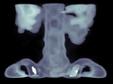

- **Original size:** 69,292 bytes
- **Compressed size:** 31,358 bytes
- **Reduction:** ⬇ 54.7%

### spring.tif

*No thumbnail available*

### strike.tif

- **Original size:** 110,644 bytes
- **Compressed size:** 93,776 bytes
- **Reduction:** ⬇ 15.2%

### subsubifds.tif

*No thumbnail available*

### tiled-cmyk-i8.tif

*No thumbnail available*

### tiled-gray-i1.tif

- **Original size:** 614 bytes
- **Compressed size:** 154 bytes
- **Reduction:** ⬇ 74.9%

### tiled-jpeg-rgb-u8.tif

- **Original size:** 99,730 bytes
- **Compressed size:** 422,594 bytes
- **Reduction:** ⬇ -323.7%

### tiled-oversize-gray-i8.tif

- **Original size:** 115,390 bytes
- **Compressed size:** 98,988 bytes
- **Reduction:** ⬇ 14.2%

### tiled-rect-rgb-u8.tif

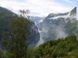

- **Original size:** 590,440 bytes
- **Compressed size:** 424,528 bytes
- **Reduction:** ⬇ 28.1%

### tiled-rgb-u8.tif

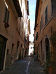

- **Original size:** 416,408 bytes
- **Compressed size:** 413,352 bytes
- **Reduction:** ⬇ 0.7%

### time-series.ome.tif

- **Original size:** 526,767 bytes
- **Compressed size:** 15,652 bytes
- **Reduction:** ⬇ 97.0%

### underwater_bmx.tif

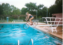

- **Original size:** 1,064,238 bytes
- **Compressed size:** 1,774,612 bytes
- **Reduction:** ⬇ -66.7%

### usda_naip_256_webp_z3.tif

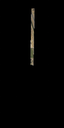

- **Original size:** 20,532 bytes
- **Compressed size:** 158,780 bytes
- **Reduction:** ⬇ -673.3%

### white-fp16-pred2.tiff

*No thumbnail available*

### white-fp16-pred3.tiff

*No thumbnail available*

### white-fp16.tiff

*No thumbnail available*

### z-series.ome.tif

- **Original size:** 376,523 bytes
- **Compressed size:** 11,082 bytes
- **Reduction:** ⬇ 97.1%

## ❌ Failed Images

**8 images** failed to process:

| File | Error |
|------|-------|
| `quad-jpeg.tif` | No output file |
| `quad-tile.jpg.tiff` | Unknown |
| `sample-get-lzw-stuck.tiff` | No output file |
| `smallliz.tif` | No output file |
| `text.tif` | No output file |
| `tiled-jpeg-ycbcr.tif` | No output file |
| `ycbcr-cat.tif` | Unknown |
| `zackthecat.tif` | Unknown |
