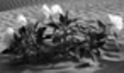
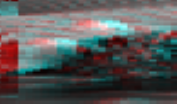
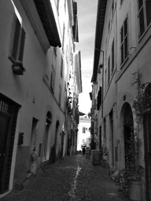
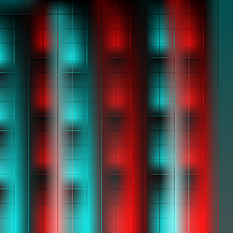
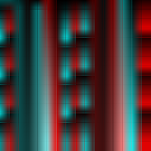

# tiff-reducer Test Report

**Generated:** 2026-05-30 17:55:31

## Summary

- [Lossless Report](#lossless-report): 299 working, 0 failed
- [Lossy Report](#lossy-report): 244 working, 55 failed

## Lossless Report

### Summary

| Category | Count | Percentage |
|----------|-------|------------|
| ✅ Working | 299 | 100.0% |
| ❌ Failed | 0 | 0.0% |
| **Total** | **299** | **100%** |

### ✅ Working Images

| Original | Compressed | Details |
|:---:|:---:|:---:|
|  |  | **File:** `12bit.cropped.rgb.tiff` **Codec:** zstd (lvl 19) **Size:** 18.3 KB → 3.1 KB **Red:** 82.8% **Time:** 10ms |
|  |  | **File:** `12bit.cropped.tiff` **Codec:** zstd (lvl 19) **Size:** 6.2 KB → 2.3 KB **Red:** 63.7% **Time:** 7ms |
|  |  | **File:** `170918_tn_neutrophil_migration_wave.ome.tif` **Codec:** zstd (lvl 19) **Size:** 2.0 MB → 1.3 MB **Red:** 35.1% **Time:** 48ms |
|  |  | **File:** `181003_multi_pos_time_course_1_MMStack.ome.tif` **Codec:** zstd (lvl 19) **Size:** 3.8 MB → 2.2 MB **Red:** 41.3% **Time:** 28ms |
|  |  | **File:** `4D-series.ome.tif` **Codec:** zstd (lvl 19) **Size:** 2.5 MB → 81.9 KB **Red:** 96.8% **Time:** 36ms |
|  |  | **File:** `BigTIFF.tif` **Codec:** zstd (lvl 19) **Size:** 12.2 KB → 514 B **Red:** 95.9% **Time:** 7ms |
|  |  | **File:** `BigTIFFLong.tif` **Codec:** zstd (lvl 19) **Size:** 12.2 KB → 514 B **Red:** 95.9% **Time:** 8ms |
|  |  | **File:** `BigTIFFMotorola.tif` **Codec:** zstd (lvl 19) **Size:** 12.2 KB → 514 B **Red:** 95.9% **Time:** 8ms |
|  |  | **File:** `MMStack_Pos0.ome.tif` **Codec:** zstd (lvl 19) **Size:** 84.4 MB → 53.4 MB **Red:** 36.8% **Time:** 1969ms |
|  |  | **File:** `P1_T0.tif` **Codec:** zstd (lvl 19) **Size:** 130.3 KB → 107.0 KB **Red:** 17.9% **Time:** 8ms |
|  |  | **File:** `P1_T1.tif` **Codec:** zstd (lvl 19) **Size:** 130.3 KB → 107.5 KB **Red:** 17.5% **Time:** 8ms |
|  |  | **File:** `P1_T2.tif` **Codec:** zstd (lvl 19) **Size:** 130.3 KB → 107.5 KB **Red:** 17.5% **Time:** 8ms |
|  |  | **File:** `P1_T3.tif` **Codec:** zstd (lvl 19) **Size:** 130.3 KB → 108.6 KB **Red:** 16.6% **Time:** 8ms |
|  |  | **File:** `P1_T4.tif` **Codec:** zstd (lvl 19) **Size:** 130.3 KB → 108.9 KB **Red:** 16.4% **Time:** 8ms |
|  |  | **File:** `P1_T5.tif` **Codec:** zstd (lvl 19) **Size:** 130.3 KB → 109.3 KB **Red:** 16.1% **Time:** 8ms |
|  |  | **File:** `P1_T6.tif` **Codec:** zstd (lvl 19) **Size:** 130.3 KB → 107.3 KB **Red:** 17.7% **Time:** 8ms |
|  |  | **File:** `P1_T7.tif` **Codec:** zstd (lvl 19) **Size:** 130.3 KB → 106.8 KB **Red:** 18.0% **Time:** 9ms |
|  |  | **File:** `P1_T8.tif` **Codec:** zstd (lvl 19) **Size:** 130.3 KB → 106.8 KB **Red:** 18.1% **Time:** 9ms |
|  |  | **File:** `P1_T9.tif` **Codec:** zstd (lvl 19) **Size:** 130.3 KB → 106.4 KB **Red:** 18.3% **Time:** 8ms |
|  |  | **File:** `P2_T0.tif` **Codec:** zstd (lvl 19) **Size:** 130.3 KB → 103.9 KB **Red:** 20.2% **Time:** 8ms |
|  |  | **File:** `P2_T1.tif` **Codec:** zstd (lvl 19) **Size:** 130.3 KB → 103.4 KB **Red:** 20.6% **Time:** 8ms |
|  |  | **File:** `P2_T2.tif` **Codec:** zstd (lvl 19) **Size:** 130.3 KB → 103.5 KB **Red:** 20.6% **Time:** 8ms |
|  |  | **File:** `P2_T3.tif` **Codec:** zstd (lvl 19) **Size:** 130.3 KB → 106.1 KB **Red:** 18.5% **Time:** 9ms |
|  |  | **File:** `P2_T4.tif` **Codec:** zstd (lvl 19) **Size:** 130.3 KB → 106.2 KB **Red:** 18.5% **Time:** 8ms |
|  |  | **File:** `P2_T5.tif` **Codec:** zstd (lvl 19) **Size:** 130.3 KB → 107.3 KB **Red:** 17.7% **Time:** 8ms |
|  |  | **File:** `P2_T6.tif` **Codec:** zstd (lvl 19) **Size:** 130.3 KB → 103.5 KB **Red:** 20.6% **Time:** 8ms |
|  |  | **File:** `P2_T7.tif` **Codec:** zstd (lvl 19) **Size:** 130.3 KB → 103.6 KB **Red:** 20.5% **Time:** 8ms |
|  |  | **File:** `P2_T8.tif` **Codec:** zstd (lvl 19) **Size:** 130.3 KB → 103.6 KB **Red:** 20.5% **Time:** 8ms |
|  |  | **File:** `P2_T9.tif` **Codec:** zstd (lvl 19) **Size:** 130.3 KB → 103.5 KB **Red:** 20.6% **Time:** 8ms |
|  |  | **File:** `TSeries-camp-005_Cycle00001_Ch1_000001.ome.tif` **Codec:** zstd (lvl 19) **Size:** 41.4 KB → 17.6 KB **Red:** 57.5% **Time:** 8ms |
|  |  | **File:** `TSeries-camp-005_Cycle00001_Ch1_000002.ome.tif` **Codec:** zstd (lvl 19) **Size:** 33.1 KB → 9.4 KB **Red:** 71.8% **Time:** 8ms |
|  |  | **File:** `TSeries-camp-005_Cycle00001_Ch1_000003.ome.tif` **Codec:** zstd (lvl 19) **Size:** 33.1 KB → 9.4 KB **Red:** 71.7% **Time:** 8ms |
|  |  | **File:** `TSeries-camp-005_Cycle00001_Ch1_000004.ome.tif` **Codec:** zstd (lvl 19) **Size:** 33.1 KB → 9.4 KB **Red:** 71.7% **Time:** 8ms |
|  |  | **File:** `TSeries-camp-005_Cycle00001_Ch2_000001.ome.tif` **Codec:** zstd (lvl 19) **Size:** 33.1 KB → 8.9 KB **Red:** 73.0% **Time:** 8ms |
|  |  | **File:** `TSeries-camp-005_Cycle00001_Ch2_000002.ome.tif` **Codec:** zstd (lvl 19) **Size:** 33.1 KB → 8.9 KB **Red:** 73.0% **Time:** 8ms |
|  |  | **File:** `TSeries-camp-005_Cycle00001_Ch2_000003.ome.tif` **Codec:** zstd (lvl 19) **Size:** 33.1 KB → 8.9 KB **Red:** 73.1% **Time:** 8ms |
|  |  | **File:** `TSeries-camp-005_Cycle00001_Ch2_000004.ome.tif` **Codec:** zstd (lvl 19) **Size:** 33.1 KB → 8.9 KB **Red:** 73.0% **Time:** 8ms |
|  |  | **File:** `TSeries-camp-005_Cycle00002_Ch1_000001.ome.tif` **Codec:** zstd (lvl 19) **Size:** 33.1 KB → 9.3 KB **Red:** 71.9% **Time:** 9ms |
|  |  | **File:** `TSeries-camp-005_Cycle00002_Ch1_000002.ome.tif` **Codec:** zstd (lvl 19) **Size:** 33.1 KB → 9.4 KB **Red:** 71.7% **Time:** 8ms |
|  |  | **File:** `TSeries-camp-005_Cycle00002_Ch1_000003.ome.tif` **Codec:** zstd (lvl 19) **Size:** 33.1 KB → 9.3 KB **Red:** 71.9% **Time:** 9ms |
|  |  | **File:** `TSeries-camp-005_Cycle00002_Ch1_000004.ome.tif` **Codec:** zstd (lvl 19) **Size:** 33.1 KB → 9.4 KB **Red:** 71.7% **Time:** 8ms |
|  |  | **File:** `TSeries-camp-005_Cycle00002_Ch2_000001.ome.tif` **Codec:** zstd (lvl 19) **Size:** 33.1 KB → 8.9 KB **Red:** 73.3% **Time:** 8ms |
|  |  | **File:** `TSeries-camp-005_Cycle00002_Ch2_000002.ome.tif` **Codec:** zstd (lvl 19) **Size:** 33.1 KB → 8.9 KB **Red:** 73.0% **Time:** 9ms |
|  |  | **File:** `TSeries-camp-005_Cycle00002_Ch2_000003.ome.tif` **Codec:** zstd (lvl 19) **Size:** 33.1 KB → 8.9 KB **Red:** 73.2% **Time:** 8ms |
|  |  | **File:** `TSeries-camp-005_Cycle00002_Ch2_000004.ome.tif` **Codec:** zstd (lvl 19) **Size:** 33.1 KB → 8.8 KB **Red:** 73.3% **Time:** 8ms |
|  |  | **File:** `TSeries-camp-005_Cycle00003_Ch1_000001.ome.tif` **Codec:** zstd (lvl 19) **Size:** 33.1 KB → 9.3 KB **Red:** 71.9% **Time:** 8ms |
|  |  | **File:** `TSeries-camp-005_Cycle00003_Ch1_000002.ome.tif` **Codec:** zstd (lvl 19) **Size:** 33.1 KB → 9.4 KB **Red:** 71.7% **Time:** 8ms |
|  |  | **File:** `TSeries-camp-005_Cycle00003_Ch1_000003.ome.tif` **Codec:** zstd (lvl 19) **Size:** 33.1 KB → 9.3 KB **Red:** 71.8% **Time:** 8ms |
|  |  | **File:** `TSeries-camp-005_Cycle00003_Ch1_000004.ome.tif` **Codec:** zstd (lvl 19) **Size:** 33.1 KB → 9.3 KB **Red:** 71.9% **Time:** 8ms |
|  |  | **File:** `TSeries-camp-005_Cycle00003_Ch2_000001.ome.tif` **Codec:** zstd (lvl 19) **Size:** 33.1 KB → 8.8 KB **Red:** 73.3% **Time:** 8ms |
|  |  | **File:** `TSeries-camp-005_Cycle00003_Ch2_000002.ome.tif` **Codec:** zstd (lvl 19) **Size:** 33.1 KB → 8.9 KB **Red:** 73.0% **Time:** 8ms |
|  |  | **File:** `TSeries-camp-005_Cycle00003_Ch2_000003.ome.tif` **Codec:** zstd (lvl 19) **Size:** 33.1 KB → 8.9 KB **Red:** 73.1% **Time:** 8ms |
|  |  | **File:** `TSeries-camp-005_Cycle00003_Ch2_000004.ome.tif` **Codec:** zstd (lvl 19) **Size:** 33.1 KB → 8.9 KB **Red:** 73.2% **Time:** 8ms |
|  |  | **File:** `Transparency-lzw.tif` **Codec:** zstd (lvl 19) **Size:** 6.0 KB → 3.0 KB **Red:** 49.7% **Time:** 8ms |
|  |  | **File:** `background_1_MMStack.ome.tif` **Codec:** zstd (lvl 19) **Size:** 18.4 MB → 15.9 MB **Red:** 13.2% **Time:** 64ms |
|  |  | **File:** `bali.tif` **Codec:** zstd (lvl 19) **Size:** 175.2 KB → 152.5 KB **Red:** 12.9% **Time:** 16ms |
|  |  | **File:** `big_g4.tif` **Codec:** zstd (lvl 19) **Size:** 8.1 KB → 140 B **Red:** 98.3% **Time:** 10ms |
|  |  | **File:** `capitol.tif` **Codec:** zstd (lvl 19) **Size:** 23.5 KB → 12.3 KB **Red:** 47.7% **Time:** 8ms |
|  |  | **File:** `capitol2.tif` **Codec:** zstd (lvl 19) **Size:** 24.6 KB → 12.3 KB **Red:** 50.1% **Time:** 8ms |
|  |  | **File:** `caspian.tif` **Codec:** zstd (lvl 19) **Size:** 291.3 KB → 79.0 KB **Red:** 72.9% **Time:** 16ms |
|  |  | **File:** `cmyk-3c-16b.tiff` **Codec:** zstd (lvl 19) **Size:** 185.5 KB → 157.0 KB **Red:** 15.4% **Time:** 9ms |
|  |  | **File:** `cmyk-3c-32b-float.tiff` **Codec:** zstd (lvl 19) **Size:** 6.6 KB → 4.4 KB **Red:** 32.6% **Time:** 8ms |
|  |  | **File:** `cmyk-3c-8b.tiff` **Codec:** zstd (lvl 19) **Size:** 92.9 KB → 75.6 KB **Red:** 18.6% **Time:** 10ms |
|  |  | **File:** `cmyk-4c-8b.tiff` **Codec:** zstd (lvl 19) **Size:** 127.1 KB → 84.1 KB **Red:** 33.9% **Time:** 10ms |
|  |  | **File:** `coffee.tif` **Codec:** zstd (lvl 19) **Size:** 180.2 KB → 130.2 KB **Red:** 27.7% **Time:** 11ms |
|  |  | **File:** `cramps-tile.tif` **Codec:** zstd (lvl 19) **Size:** 768.3 KB → 76.5 KB **Red:** 90.0% **Time:** 13ms |
|  |  | **File:** `cramps.tif` **Codec:** zstd (lvl 19) **Size:** 189.6 KB → 76.5 KB **Red:** 59.7% **Time:** 13ms |
|  |  | **File:** `decodedata-rgb-3c-8b.tiff` **Codec:** zstd (lvl 19) **Size:** 29.5 KB → 916 B **Red:** 97.0% **Time:** 7ms |
|  |  | **File:** `dscf0013.tif` **Codec:** zstd (lvl 19) **Size:** 638.7 KB → 452.6 KB **Red:** 29.1% **Time:** 26ms |
|  |  | **File:** `earthlab.tif` **Codec:** zstd (lvl 19) **Size:** 465.5 KB → 115.7 KB **Red:** 75.1% **Time:** 41ms |
|  |  | **File:** `earthlab_compressed.tif` **Codec:** zstd (lvl 19) **Size:** 115.7 KB → 115.7 KB **Red:** 0.0% **Time:** 48ms |
|  |  | **File:** `extra_bits_gray_8b.tiff` **Codec:** zstd (lvl 19) **Size:** 338 B → 244 B **Red:** 27.8% **Time:** 7ms |
|  |  | **File:** `extra_bits_rgb_8b.tiff` **Codec:** zstd (lvl 19) **Size:** 482 B → 262 B **Red:** 45.6% **Time:** 8ms |
|  |  | **File:** `fax2d.tif` **Codec:** zstd (lvl 19) **Size:** 32.0 KB → 30.1 KB **Red:** 6.1% **Time:** 10ms |
|  |  | **File:** `fax4.tiff` **Codec:** zstd (lvl 19) **Size:** 32.8 KB → 31.8 KB **Red:** 3.2% **Time:** 10ms |
|  |  | **File:** `flagler.tif` **Codec:** zstd (lvl 19) **Size:** 424.2 KB → 243.4 KB **Red:** 42.6% **Time:** 16ms |
|  |  | **File:** `flower-minisblack-02.tif` **Codec:** zstd (lvl 19) **Size:** 1.1 KB → 540 B **Red:** 52.3% **Time:** 8ms |
|  |  | **File:** `flower-minisblack-04.tif` **Codec:** zstd (lvl 19) **Size:** 1.9 KB → 1.4 KB **Red:** 27.3% **Time:** 7ms |
|  |  | **File:** `flower-minisblack-06.tif` **Codec:** zstd (lvl 19) **Size:** 2.6 KB → 2.4 KB **Red:** 6.9% **Time:** 7ms |
|  |  | **File:** `flower-minisblack-08.tif` **Codec:** zstd (lvl 19) **Size:** 3.4 KB → 3.1 KB **Red:** 7.7% **Time:** 7ms |
|  |  | **File:** `flower-minisblack-10.tif` **Codec:** zstd (lvl 19) **Size:** 4.2 KB → 4.0 KB **Red:** 3.0% **Time:** 7ms |
|  |  | **File:** `flower-minisblack-12.tif` **Codec:** zstd (lvl 19) **Size:** 4.9 KB → 4.8 KB **Red:** 2.6% **Time:** 7ms |
|  |  | **File:** `flower-minisblack-14.tif` **Codec:** zstd (lvl 19) **Size:** 5.7 KB → 5.6 KB **Red:** 2.2% **Time:** 7ms |
|  |  | **File:** `flower-minisblack-16.tif` **Codec:** zstd (lvl 19) **Size:** 6.4 KB → 6.3 KB **Red:** 2.0% **Time:** 8ms |
|  |  | **File:** `flower-minisblack-24.tif` **Codec:** zstd (lvl 19) **Size:** 9.5 KB → 7.3 KB **Red:** 23.2% **Time:** 7ms |
|  |  | **File:** `flower-minisblack-32.tif` **Codec:** zstd (lvl 19) **Size:** 12.6 KB → 12.4 KB **Red:** 1.1% **Time:** 7ms |
|  |  | **File:** `flower-palette-02.tif` **Codec:** zstd (lvl 19) **Size:** 1.1 KB → 758 B **Red:** 34.9% **Time:** 8ms |
|  |  | **File:** `flower-palette-04.tif` **Codec:** zstd (lvl 19) **Size:** 2.0 KB → 1.5 KB **Red:** 22.1% **Time:** 7ms |
|  |  | **File:** `flower-palette-08.tif` **Codec:** zstd (lvl 19) **Size:** 4.9 KB → 4.7 KB **Red:** 3.8% **Time:** 8ms |
|  |  | **File:** `flower-palette-16.tif` **Codec:** zstd (lvl 19) **Size:** 390.4 KB → 389.3 KB **Red:** 0.3% **Time:** 10ms |
|  |  | **File:** `flower-rgb-contig-02.tif` **Codec:** zstd (lvl 19) **Size:** 2.6 KB → 1.0 KB **Red:** 61.6% **Time:** 7ms |
|  |  | **File:** `flower-rgb-contig-04.tif` **Codec:** zstd (lvl 19) **Size:** 4.9 KB → 3.4 KB **Red:** 30.1% **Time:** 8ms |
|  |  | **File:** `flower-rgb-contig-08.tif` **Codec:** zstd (lvl 19) **Size:** 9.5 KB → 9.0 KB **Red:** 5.8% **Time:** 7ms |
|  |  | **File:** `flower-rgb-contig-10.tif` **Codec:** zstd (lvl 19) **Size:** 11.8 KB → 11.7 KB **Red:** 1.1% **Time:** 8ms |
|  |  | **File:** `flower-rgb-contig-12.tif` **Codec:** zstd (lvl 19) **Size:** 14.1 KB → 14.0 KB **Red:** 0.9% **Time:** 8ms |
|  |  | **File:** `flower-rgb-contig-14.tif` **Codec:** zstd (lvl 19) **Size:** 16.5 KB → 16.3 KB **Red:** 0.8% **Time:** 7ms |
|  |  | **File:** `flower-rgb-contig-16.tif` **Codec:** zstd (lvl 19) **Size:** 18.7 KB → 18.6 KB **Red:** 0.7% **Time:** 8ms |
|  |  | **File:** `flower-rgb-contig-24.tif` **Codec:** zstd (lvl 19) **Size:** 28.0 KB → 18.9 KB **Red:** 32.4% **Time:** 8ms |
|  |  | **File:** `flower-rgb-contig-32.tif` **Codec:** zstd (lvl 19) **Size:** 37.1 KB → 37.0 KB **Red:** 0.4% **Time:** 8ms |
|  |  | **File:** `flower-rgb-planar-02.tif` **Codec:** zstd (lvl 19) **Size:** 2.7 KB → 624 B **Red:** 77.7% **Time:** 7ms |
|  |  | **File:** `flower-rgb-planar-04.tif` **Codec:** zstd (lvl 19) **Size:** 5.0 KB → 1.5 KB **Red:** 70.6% **Time:** 8ms |
|  |  | **File:** `flower-rgb-planar-08.tif` **Codec:** zstd (lvl 19) **Size:** 9.5 KB → 3.2 KB **Red:** 66.4% **Time:** 7ms |
|  |  | **File:** `flower-rgb-planar-10.tif` **Codec:** zstd (lvl 19) **Size:** 11.9 KB → 4.1 KB **Red:** 65.8% **Time:** 7ms |
|  |  | **File:** `flower-rgb-planar-12.tif` **Codec:** zstd (lvl 19) **Size:** 14.2 KB → 4.8 KB **Red:** 65.9% **Time:** 7ms |
|  |  | **File:** `flower-rgb-planar-14.tif` **Codec:** zstd (lvl 19) **Size:** 16.5 KB → 5.6 KB **Red:** 66.0% **Time:** 7ms |
|  |  | **File:** `flower-rgb-planar-16.tif` **Codec:** zstd (lvl 19) **Size:** 18.7 KB → 6.3 KB **Red:** 66.1% **Time:** 8ms |
|  |  | **File:** `flower-rgb-planar-24.tif` **Codec:** zstd (lvl 19) **Size:** 28.0 KB → 7.7 KB **Red:** 72.4% **Time:** 8ms |
|  |  | **File:** `flower-rgb-planar-32.tif` **Codec:** zstd (lvl 19) **Size:** 37.1 KB → 12.5 KB **Red:** 66.4% **Time:** 8ms |
|  |  | **File:** `flower-separated-contig-08.tif` **Codec:** zstd (lvl 19) **Size:** 12.6 KB → 11.9 KB **Red:** 5.6% **Time:** 7ms |
|  |  | **File:** `flower-separated-contig-16.tif` **Codec:** zstd (lvl 19) **Size:** 24.9 KB → 24.7 KB **Red:** 0.6% **Time:** 7ms |
|  | *N/A* | **File:** `flower-separated-planar-08.tif` **Codec:** zstd (lvl 19) **Size:** 12.6 KB → 3.2 KB **Red:** 74.5% **Time:** 7ms |
|  | *N/A* | **File:** `flower-separated-planar-16.tif` **Codec:** zstd (lvl 19) **Size:** 24.9 KB → 6.4 KB **Red:** 74.4% **Time:** 7ms |
|  |  | **File:** `g3test.tif` **Codec:** zstd (lvl 19) **Size:** 49.2 KB → 41.3 KB **Red:** 16.1% **Time:** 13ms |
|  |  | **File:** `geo-5b.tif` **Codec:** zstd (lvl 19) **Size:** 1.4 KB → 460 B **Red:** 67.6% **Time:** 8ms |
|  |  | **File:** `gradient-1c-32b-float.tiff` **Codec:** zstd (lvl 19) **Size:** 1.3 KB → 1.1 KB **Red:** 14.5% **Time:** 7ms |
|  |  | **File:** `gradient-1c-32b.tiff` **Codec:** zstd (lvl 19) **Size:** 1.3 KB → 1.0 KB **Red:** 23.5% **Time:** 8ms |
|  |  | **File:** `gradient-1c-64b-float.tiff` **Codec:** zstd (lvl 19) **Size:** 2.3 KB → 1.1 KB **Red:** 51.8% **Time:** 7ms |
|  |  | **File:** `gradient-1c-64b.tiff` **Codec:** zstd (lvl 19) **Size:** 2.3 KB → 1.1 KB **Red:** 51.3% **Time:** 8ms |
|  |  | **File:** `gradient-3c-32b-float.tiff` **Codec:** zstd (lvl 19) **Size:** 3.4 KB → 2.9 KB **Red:** 14.9% **Time:** 7ms |
|  |  | **File:** `gradient-3c-32b.tiff` **Codec:** zstd (lvl 19) **Size:** 3.3 KB → 2.6 KB **Red:** 22.8% **Time:** 8ms |
|  |  | **File:** `gradient-3c-64b.tiff` **Codec:** zstd (lvl 19) **Size:** 6.3 KB → 2.7 KB **Red:** 57.7% **Time:** 7ms |
| *N/A* |  | **File:** `house.tif` **Codec:** zstd (lvl 19) **Size:** 512.8 KB → 137.7 KB **Red:** 73.2% **Time:** 16ms |
|  |  | **File:** `hpredict-1c-12b.tiff` **Codec:** zstd (lvl 19) **Size:** 158 B → 156 B **Red:** 1.3% **Time:** 7ms |
|  |  | **File:** `imagemagick_group4.tiff` **Codec:** zstd (lvl 19) **Size:** 1.2 KB → 1.8 KB **Red:** -48.5% **Time:** 7ms |
|  |  | **File:** `int16.tif` **Codec:** zstd (lvl 19) **Size:** 8.3 KB → 7.8 KB **Red:** 5.6% **Time:** 7ms |
|  |  | **File:** `int16_rgb.tif` **Codec:** zstd (lvl 19) **Size:** 24.3 KB → 8.4 KB **Red:** 65.6% **Time:** 8ms |
|  |  | **File:** `int16_zstd.tif` **Codec:** zstd (lvl 19) **Size:** 7.7 KB → 7.8 KB **Red:** -2.5% **Time:** 8ms |
|  |  | **File:** `int8.tif` **Codec:** zstd (lvl 19) **Size:** 4.3 KB → 4.2 KB **Red:** 1.8% **Time:** 9ms |
|  |  | **File:** `int8_rgb.tif` **Codec:** zstd (lvl 19) **Size:** 12.3 KB → 12.3 KB **Red:** 0.5% **Time:** 7ms |
|  |  | **File:** `issue_69_lzw.tiff` **Codec:** zstd (lvl 19) **Size:** 2.9 KB → 2.2 KB **Red:** 23.0% **Time:** 8ms |
|  |  | **File:** `issue_69_packbits.tiff` **Codec:** zstd (lvl 19) **Size:** 4.3 KB → 2.2 KB **Red:** 48.8% **Time:** 7ms |
|  |  | **File:** `jello.tif` **Codec:** zstd (lvl 19) **Size:** 46.0 KB → 21.3 KB **Red:** 53.6% **Time:** 8ms |
|  |  | **File:** `jim___ah.tif` **Codec:** zstd (lvl 19) **Size:** 66.1 KB → 14.2 KB **Red:** 78.5% **Time:** 9ms |
|  |  | **File:** `jim___cg.tif` **Codec:** zstd (lvl 19) **Size:** 91.9 KB → 57.7 KB **Red:** 37.2% **Time:** 10ms |
|  |  | **File:** `jim___dg.tif` **Codec:** zstd (lvl 19) **Size:** 91.9 KB → 63.6 KB **Red:** 30.7% **Time:** 9ms |
|  |  | **File:** `jim___gg.tif` **Codec:** zstd (lvl 19) **Size:** 91.9 KB → 63.6 KB **Red:** 30.8% **Time:** 9ms |
|  |  | **File:** `julia.tif` **Codec:** zstd (lvl 19) **Size:** 456.8 KB → 8.1 KB **Red:** 98.2% **Time:** 9ms |
|  |  | **File:** `kodim02-lzw.tif` **Codec:** zstd (lvl 19) **Size:** 709.6 KB → 618.7 KB **Red:** 12.8% **Time:** 35ms |
|  |  | **File:** `kodim07-lzw.tif` **Codec:** zstd (lvl 19) **Size:** 628.0 KB → 620.2 KB **Red:** 1.2% **Time:** 33ms |
|  |  | **File:** `ladoga.tif` **Codec:** zstd (lvl 19) **Size:** 19.9 KB → 16.7 KB **Red:** 16.4% **Time:** 8ms |
|  | *N/A* | **File:** `logluv-3c-16b.tiff` **Codec:** zstd (lvl 19) **Size:** 166 B → 186 B **Red:** -12.0% **Time:** 9ms |
|  |  | **File:** `mask_lzw.tif` **Codec:** zstd (lvl 19) **Size:** 2.2 MB → 11.2 KB **Red:** 99.5% **Time:** 123ms |
|  |  | **File:** `minisblack-1c-16b.tiff` **Codec:** zstd (lvl 19) **Size:** 46.6 KB → 42.5 KB **Red:** 8.9% **Time:** 7ms |
|  |  | **File:** `minisblack-1c-3b.tiff` **Codec:** zstd (lvl 19) **Size:** 140 B → 150 B **Red:** -7.1% **Time:** 7ms |
|  |  | **File:** `minisblack-1c-5b.tiff` **Codec:** zstd (lvl 19) **Size:** 144 B → 154 B **Red:** -6.9% **Time:** 7ms |
|  |  | **File:** `minisblack-1c-7b.tiff` **Codec:** zstd (lvl 19) **Size:** 148 B → 158 B **Red:** -6.8% **Time:** 7ms |
|  |  | **File:** `minisblack-1c-8b.tiff` **Codec:** zstd (lvl 19) **Size:** 23.4 KB → 16.7 KB **Red:** 29.0% **Time:** 9ms |
|  |  | **File:** `minisblack-1c-i16b.tiff` **Codec:** zstd (lvl 19) **Size:** 46.6 KB → 42.4 KB **Red:** 8.9% **Time:** 8ms |
|  |  | **File:** `minisblack-1c-i8b.tiff` **Codec:** zstd (lvl 19) **Size:** 23.4 KB → 16.6 KB **Red:** 29.0% **Time:** 7ms |
|  | *N/A* | **File:** `minisblack-2c-8b-alpha.tiff` **Codec:** zstd (lvl 19) **Size:** 4.0 KB → 2.0 KB **Red:** 50.8% **Time:** 8ms |
|  |  | **File:** `miniswhite-1c-12b.tiff` **Codec:** zstd (lvl 19) **Size:** 146 B → 156 B **Red:** -6.8% **Time:** 7ms |
|  |  | **File:** `miniswhite-1c-1b.tiff` **Codec:** zstd (lvl 19) **Size:** 3.2 KB → 2.2 KB **Red:** 32.3% **Time:** 7ms |
|  |  | **File:** `miniswhite-1c-3b.tiff` **Codec:** zstd (lvl 19) **Size:** 140 B → 150 B **Red:** -7.1% **Time:** 7ms |
|  |  | **File:** `miniswhite-1c-6b.tiff` **Codec:** zstd (lvl 19) **Size:** 146 B → 156 B **Red:** -6.8% **Time:** 8ms |
|  |  | **File:** `mri.tif` **Codec:** zstd (lvl 19) **Size:** 225.2 KB → 133.3 KB **Red:** 40.8% **Time:** 25ms |
|  |  | **File:** `multi-channel-4D-series.ome.tif` **Codec:** zstd (lvl 19) **Size:** 7.5 MB → 287.9 KB **Red:** 96.3% **Time:** 92ms |
|  |  | **File:** `multi-channel-time-series.ome.tif` **Codec:** zstd (lvl 19) **Size:** 1.5 MB → 51.9 KB **Red:** 96.6% **Time:** 27ms |
|  |  | **File:** `multi-channel-z-series.ome.tif` **Codec:** zstd (lvl 19) **Size:** 1.1 MB → 38.0 KB **Red:** 96.5% **Time:** 23ms |
|  |  | **File:** `multi-channel.ome.tif` **Codec:** zstd (lvl 19) **Size:** 221.2 KB → 7.3 KB **Red:** 96.7% **Time:** 14ms |
|  |  | **File:** `multifile-Z1.ome.tiff` **Codec:** zstd (lvl 19) **Size:** 1.7 KB → 1.1 KB **Red:** 36.5% **Time:** 7ms |
|  |  | **File:** `multifile-Z2.ome.tiff` **Codec:** zstd (lvl 19) **Size:** 1.7 KB → 1.1 KB **Red:** 36.4% **Time:** 8ms |
|  |  | **File:** `multifile-Z3.ome.tiff` **Codec:** zstd (lvl 19) **Size:** 1.7 KB → 1.1 KB **Red:** 36.5% **Time:** 7ms |
|  |  | **File:** `multifile-Z4.ome.tiff` **Codec:** zstd (lvl 19) **Size:** 1.7 KB → 1.1 KB **Red:** 36.7% **Time:** 7ms |
|  |  | **File:** `multifile-Z5.ome.tiff` **Codec:** zstd (lvl 19) **Size:** 1.7 KB → 1.1 KB **Red:** 35.8% **Time:** 7ms |
|  |  | **File:** `no_rows_per_strip.tiff` **Codec:** zstd (lvl 19) **Size:** 768.1 KB → 743.0 KB **Red:** 3.3% **Time:** 10ms |
|  |  | **File:** `nonometif.tif` **Codec:** zstd (lvl 19) **Size:** 2.2 KB → 2.2 KB **Red:** 0.7% **Time:** 7ms |
|  |  | **File:** `occitanie_16bit.tif` **Codec:** zstd (lvl 19) **Size:** 25.1 MB → 18.5 MB **Red:** 26.2% **Time:** 674ms |
|  |  | **File:** `off_l16.tif` **Codec:** zstd (lvl 19) **Size:** 70.5 KB → 55.4 KB **Red:** 21.4% **Time:** 10ms |
|  | *N/A* | **File:** `off_luv24.tif` **Codec:** zstd (lvl 19) **Size:** 220.0 KB → 83.3 KB **Red:** 62.1% **Time:** 14ms |
|  | *N/A* | **File:** `off_luv32.tif` **Codec:** zstd (lvl 19) **Size:** 112.5 KB → 94.8 KB **Red:** 15.7% **Time:** 14ms |
|  |  | **File:** `oxford.tif` **Codec:** zstd (lvl 19) **Size:** 20.7 KB → 2.1 KB **Red:** 90.1% **Time:** 10ms |
|  |  | **File:** `palette-1c-1b.tiff` **Codec:** zstd (lvl 19) **Size:** 3.2 KB → 2.2 KB **Red:** 31.8% **Time:** 7ms |
|  |  | **File:** `palette-1c-4b.tiff` **Codec:** zstd (lvl 19) **Size:** 12.0 KB → 8.6 KB **Red:** 28.9% **Time:** 7ms |
|  |  | **File:** `palette-1c-8b.tiff` **Codec:** zstd (lvl 19) **Size:** 24.9 KB → 18.3 KB **Red:** 26.8% **Time:** 8ms |
|  |  | **File:** `pc260001.tif` **Codec:** zstd (lvl 19) **Size:** 914.6 KB → 798.1 KB **Red:** 12.7% **Time:** 20ms |
|  |  | **File:** `planar-rgb-u8.tif` **Codec:** zstd (lvl 19) **Size:** 506.4 KB → 123.9 KB **Red:** 75.5% **Time:** 13ms |
|  |  | **File:** `poppies.tif` **Codec:** zstd (lvl 19) **Size:** 747.4 KB → 432.9 KB **Red:** 42.1% **Time:** 22ms |
|  |  | **File:** `predictor-3-gray-f32.tif` **Codec:** zstd (lvl 19) **Size:** 100.7 KB → 54.2 KB **Red:** 46.2% **Time:** 11ms |
|  |  | **File:** `predictor-3-rgb-f32.tif` **Codec:** zstd (lvl 19) **Size:** 10.1 KB → 1.9 KB **Red:** 81.5% **Time:** 8ms |
|  |  | **File:** `quad-lzw-compat.tiff` **Codec:** zstd (lvl 19) **Size:** 209.3 KB → 155.9 KB **Red:** 25.5% **Time:** 13ms |
|  |  | **File:** `quad-lzw.tif` **Codec:** zstd (lvl 19) **Size:** 209.3 KB → 155.9 KB **Red:** 25.5% **Time:** 13ms |
|  |  | **File:** `quad-tile.tif` **Codec:** zstd (lvl 19) **Size:** 204.3 KB → 155.9 KB **Red:** 23.7% **Time:** 12ms |
|  |  | **File:** `random-fp16-pred2.tiff` **Codec:** zstd (lvl 19) **Size:** 683 B → 586 B **Red:** 14.2% **Time:** 7ms |
|  |  | **File:** `random-fp16-pred3.tiff` **Codec:** zstd (lvl 19) **Size:** 698 B → 586 B **Red:** 16.0% **Time:** 7ms |
|  |  | **File:** `random-fp16.tiff` **Codec:** zstd (lvl 19) **Size:** 621 B → 586 B **Red:** 5.6% **Time:** 8ms |
|  |  | **File:** `renamed_internalfilenames.ome.tif` **Codec:** zstd (lvl 19) **Size:** 3.8 MB → 2.2 MB **Red:** 41.3% **Time:** 26ms |
|  |  | **File:** `renamed_uuids.ome.tif` **Codec:** zstd (lvl 19) **Size:** 2.5 MB → 81.9 KB **Red:** 96.8% **Time:** 38ms |
|  |  | **File:** `rgb-3c-16b.tiff` **Codec:** zstd (lvl 19) **Size:** 139.3 KB → 126.5 KB **Red:** 9.2% **Time:** 8ms |
|  |  | **File:** `rgb-3c-8b.tiff` **Codec:** zstd (lvl 19) **Size:** 69.8 KB → 49.0 KB **Red:** 29.8% **Time:** 8ms |
|  |  | **File:** `seq-1c-10b-6d739fa2.tiff` **Codec:** zstd (lvl 19) **Size:** 466 B → 464 B **Red:** 0.4% **Time:** 7ms |
|  |  | **File:** `seq-1c-10b-hpredict-6d739fa2.tiff` **Codec:** zstd (lvl 19) **Size:** 466 B → 464 B **Red:** 0.4% **Time:** 7ms |
|  |  | **File:** `seq-1c-10b-miniswhite-6d739fa2.tiff` **Codec:** zstd (lvl 19) **Size:** 466 B → 464 B **Red:** 0.4% **Time:** 8ms |
|  |  | **File:** `seq-1c-12b-47c39b31.tiff` **Codec:** zstd (lvl 19) **Size:** 530 B → 504 B **Red:** 4.9% **Time:** 7ms |
|  |  | **File:** `seq-1c-12b-hpredict-47c39b31.tiff` **Codec:** zstd (lvl 19) **Size:** 530 B → 504 B **Red:** 4.9% **Time:** 7ms |
|  |  | **File:** `seq-1c-12b-miniswhite-47c39b31.tiff` **Codec:** zstd (lvl 19) **Size:** 530 B → 502 B **Red:** 5.3% **Time:** 7ms |
|  |  | **File:** `seq-1c-14b-e883657f.tiff` **Codec:** zstd (lvl 19) **Size:** 594 B → 540 B **Red:** 9.1% **Time:** 7ms |
|  |  | **File:** `seq-1c-14b-hpredict-e883657f.tiff` **Codec:** zstd (lvl 19) **Size:** 594 B → 540 B **Red:** 9.1% **Time:** 7ms |
|  |  | **File:** `seq-1c-14b-miniswhite-e883657f.tiff` **Codec:** zstd (lvl 19) **Size:** 594 B → 536 B **Red:** 9.8% **Time:** 7ms |
|  |  | **File:** `seq-1c-16b-bigendian-68f373a0.tiff` **Codec:** zstd (lvl 19) **Size:** 658 B → 194 B **Red:** 70.5% **Time:** 7ms |
|  |  | **File:** `seq-1c-16b-deflate-68f373a0.tiff` **Codec:** zstd (lvl 19) **Size:** 500 B → 194 B **Red:** 61.2% **Time:** 7ms |
|  |  | **File:** `seq-1c-16b-lzw-68f373a0.tiff` **Codec:** zstd (lvl 19) **Size:** 758 B → 194 B **Red:** 74.4% **Time:** 7ms |
|  |  | **File:** `seq-1c-16b-multistrip-68f373a0.tiff` **Codec:** zstd (lvl 19) **Size:** 682 B → 194 B **Red:** 71.6% **Time:** 7ms |
|  |  | **File:** `seq-1c-16b-tiled-68f373a0.tiff` **Codec:** zstd (lvl 19) **Size:** 670 B → 194 B **Red:** 71.0% **Time:** 7ms |
|  |  | **File:** `seq-1c-1b-71f6a21a.tiff` **Codec:** zstd (lvl 19) **Size:** 178 B → 150 B **Red:** 15.7% **Time:** 7ms |
|  |  | **File:** `seq-1c-1b-miniswhite-71f6a21a.tiff` **Codec:** zstd (lvl 19) **Size:** 178 B → 150 B **Red:** 15.7% **Time:** 8ms |
|  |  | **File:** `seq-1c-24b-072a9dc9.tiff` **Codec:** zstd (lvl 19) **Size:** 914 B → 518 B **Red:** 43.3% **Time:** 7ms |
|  |  | **File:** `seq-1c-24b-hpredict-072a9dc9.tiff` **Codec:** zstd (lvl 19) **Size:** 914 B → 518 B **Red:** 43.3% **Time:** 7ms |
|  |  | **File:** `seq-1c-24b-miniswhite-072a9dc9.tiff` **Codec:** zstd (lvl 19) **Size:** 914 B → 516 B **Red:** 43.5% **Time:** 9ms |
|  |  | **File:** `seq-1c-2b-58b25f76.tiff` **Codec:** zstd (lvl 19) **Size:** 210 B → 150 B **Red:** 28.6% **Time:** 8ms |
|  |  | **File:** `seq-1c-32f-390fe673.tiff` **Codec:** zstd (lvl 19) **Size:** 1.1 KB → 1.1 KB **Red:** 5.5% **Time:** 7ms |
|  |  | **File:** `seq-1c-32f-deflate-fpredict-390fe673.tiff` **Codec:** zstd (lvl 19) **Size:** 298 B → 1.1 KB **Red:** -271.1% **Time:** 7ms |
|  |  | **File:** `seq-1c-3b-ef237c07.tiff` **Codec:** zstd (lvl 19) **Size:** 242 B → 152 B **Red:** 37.2% **Time:** 7ms |
|  |  | **File:** `seq-1c-3b-miniswhite-ef237c07.tiff` **Codec:** zstd (lvl 19) **Size:** 242 B → 152 B **Red:** 37.2% **Time:** 7ms |
|  |  | **File:** `seq-1c-4b-fb92dcae.tiff` **Codec:** zstd (lvl 19) **Size:** 274 B → 158 B **Red:** 42.3% **Time:** 8ms |
|  |  | **File:** `seq-1c-4b-miniswhite-fb92dcae.tiff` **Codec:** zstd (lvl 19) **Size:** 274 B → 158 B **Red:** 42.3% **Time:** 7ms |
|  |  | **File:** `seq-1c-4b-palette-85108c5a.tiff` **Codec:** zstd (lvl 19) **Size:** 382 B → 266 B **Red:** 30.4% **Time:** 7ms |
|  |  | **File:** `seq-1c-5b-73098d17.tiff` **Codec:** zstd (lvl 19) **Size:** 306 B → 170 B **Red:** 44.4% **Time:** 7ms |
|  |  | **File:** `seq-1c-5b-miniswhite-73098d17.tiff` **Codec:** zstd (lvl 19) **Size:** 306 B → 170 B **Red:** 44.4% **Time:** 7ms |
|  |  | **File:** `seq-1c-64f-afa8560e.tiff` **Codec:** zstd (lvl 19) **Size:** 2.1 KB → 1.1 KB **Red:** 47.8% **Time:** 8ms |
|  |  | **File:** `seq-1c-64f-deflate-fpredict-afa8560e.tiff` **Codec:** zstd (lvl 19) **Size:** 318 B → 1.1 KB **Red:** -260.4% **Time:** 8ms |
|  |  | **File:** `seq-1c-6b-miniswhite-79cafbb6.tiff` **Codec:** zstd (lvl 19) **Size:** 338 B → 200 B **Red:** 40.8% **Time:** 7ms |
|  |  | **File:** `seq-1c-7b-9c61ba70.tiff` **Codec:** zstd (lvl 19) **Size:** 370 B → 264 B **Red:** 28.6% **Time:** 7ms |
|  |  | **File:** `seq-1c-7b-miniswhite-9c61ba70.tiff` **Codec:** zstd (lvl 19) **Size:** 370 B → 264 B **Red:** 28.6% **Time:** 7ms |
|  |  | **File:** `seq-1c-8b-bigendian-20f3db0c.tiff` **Codec:** zstd (lvl 19) **Size:** 402 B → 206 B **Red:** 48.8% **Time:** 7ms |
|  |  | **File:** `seq-1c-8b-bigtiff-20f3db0c.tiff` **Codec:** zstd (lvl 19) **Size:** 508 B → 206 B **Red:** 59.4% **Time:** 7ms |
|  |  | **File:** `seq-1c-8b-deflate-20f3db0c.tiff` **Codec:** zstd (lvl 19) **Size:** 414 B → 206 B **Red:** 50.2% **Time:** 7ms |
|  |  | **File:** `seq-1c-8b-lzw-20f3db0c.tiff` **Codec:** zstd (lvl 19) **Size:** 438 B → 206 B **Red:** 53.0% **Time:** 8ms |
|  |  | **File:** `seq-1c-8b-lzw-hpredict-20f3db0c.tiff` **Codec:** zstd (lvl 19) **Size:** 212 B → 206 B **Red:** 2.8% **Time:** 7ms |
|  |  | **File:** `seq-1c-8b-multipage-adeefdcc.tiff` **Codec:** zstd (lvl 19) **Size:** 1.2 KB → 602 B **Red:** 52.3% **Time:** 13ms |
|  |  | **File:** `seq-1c-8b-multistrip-20f3db0c.tiff` **Codec:** zstd (lvl 19) **Size:** 426 B → 206 B **Red:** 51.6% **Time:** 7ms |
|  |  | **File:** `seq-1c-8b-packbits-20f3db0c.tiff` **Codec:** zstd (lvl 19) **Size:** 418 B → 206 B **Red:** 50.7% **Time:** 7ms |
|  |  | **File:** `seq-1c-8b-palette-89b39bc3.tiff` **Codec:** zstd (lvl 19) **Size:** 1.9 KB → 1.7 KB **Red:** 10.1% **Time:** 7ms |
|  |  | **File:** `seq-1c-8b-tiled-20f3db0c.tiff` **Codec:** zstd (lvl 19) **Size:** 414 B → 206 B **Red:** 50.2% **Time:** 8ms |
|  |  | **File:** `seq-1c-8b-tiled-bigtiff-20f3db0c.tiff` **Codec:** zstd (lvl 19) **Size:** 528 B → 206 B **Red:** 61.0% **Time:** 8ms |
|  |  | **File:** `seq-1c-8b-tiled-deflate-20f3db0c.tiff` **Codec:** zstd (lvl 19) **Size:** 426 B → 206 B **Red:** 51.6% **Time:** 8ms |
|  |  | **File:** `seq-1c-8b-tiled-lzw-20f3db0c.tiff` **Codec:** zstd (lvl 19) **Size:** 450 B → 206 B **Red:** 54.2% **Time:** 8ms |
|  |  | **File:** `seq-1c-i16-63af2488.tiff` **Codec:** zstd (lvl 19) **Size:** 658 B → 200 B **Red:** 69.6% **Time:** 7ms |
|  |  | **File:** `seq-1c-i32-99fddec2.tiff` **Codec:** zstd (lvl 19) **Size:** 1.1 KB → 210 B **Red:** 82.1% **Time:** 7ms |
|  |  | **File:** `seq-1c-i8-f8446bbe.tiff` **Codec:** zstd (lvl 19) **Size:** 402 B → 206 B **Red:** 48.8% **Time:** 7ms |
|  |  | **File:** `seq-3c-10b-contig-d08d5dc0.tiff` **Codec:** zstd (lvl 19) **Size:** 1.1 KB → 1.1 KB **Red:** -0.9% **Time:** 7ms |
|  |  | **File:** `seq-3c-10b-planar-c82e8ab6.tiff` **Codec:** zstd (lvl 19) **Size:** 1.1 KB → 506 B **Red:** 55.5% **Time:** 7ms |
|  |  | **File:** `seq-3c-12b-contig-e6f40b4a.tiff` **Codec:** zstd (lvl 19) **Size:** 1.3 KB → 1.2 KB **Red:** 4.1% **Time:** 7ms |
|  |  | **File:** `seq-3c-12b-planar-e29e8e25.tiff` **Codec:** zstd (lvl 19) **Size:** 1.3 KB → 546 B **Red:** 58.9% **Time:** 7ms |
|  |  | **File:** `seq-3c-14b-contig-f4dcc6cc.tiff` **Codec:** zstd (lvl 19) **Size:** 1.5 KB → 1.3 KB **Red:** 9.9% **Time:** 8ms |
|  |  | **File:** `seq-3c-14b-planar-4dde706b.tiff` **Codec:** zstd (lvl 19) **Size:** 1.5 KB → 582 B **Red:** 61.7% **Time:** 7ms |
|  |  | **File:** `seq-3c-16b-bigtiff-1b40ca6e.tiff` **Codec:** zstd (lvl 19) **Size:** 1.7 KB → 302 B **Red:** 83.1% **Time:** 7ms |
|  |  | **File:** `seq-3c-24b-contig-27b9f8ce.tiff` **Codec:** zstd (lvl 19) **Size:** 2.4 KB → 1.4 KB **Red:** 40.5% **Time:** 7ms |
|  |  | **File:** `seq-3c-24b-planar-6296c0c9.tiff` **Codec:** zstd (lvl 19) **Size:** 2.4 KB → 560 B **Red:** 77.4% **Time:** 9ms |
|  |  | **File:** `seq-3c-32f-9a471c2b.tiff` **Codec:** zstd (lvl 19) **Size:** 3.2 KB → 2.9 KB **Red:** 9.3% **Time:** 7ms |
|  |  | **File:** `seq-3c-5b-contig-09f197f4.tiff` **Codec:** zstd (lvl 19) **Size:** 638 B → 194 B **Red:** 69.6% **Time:** 7ms |
|  |  | **File:** `seq-3c-64f-9fff098a.tiff` **Codec:** zstd (lvl 19) **Size:** 6.2 KB → 3.7 KB **Red:** 40.1% **Time:** 8ms |
|  |  | **File:** `seq-3c-7b-contig-2e4f43c5.tiff` **Codec:** zstd (lvl 19) **Size:** 830 B → 288 B **Red:** 65.3% **Time:** 8ms |
|  |  | **File:** `seq-3c-8b-bigendian-8743c999.tiff` **Codec:** zstd (lvl 19) **Size:** 926 B → 256 B **Red:** 72.4% **Time:** 8ms |
|  |  | **File:** `seq-3c-8b-lzw-8743c999.tiff` **Codec:** zstd (lvl 19) **Size:** 770 B → 256 B **Red:** 66.8% **Time:** 7ms |
|  |  | **File:** `seq-3c-8b-multistrip-8743c999.tiff` **Codec:** zstd (lvl 19) **Size:** 950 B → 256 B **Red:** 73.1% **Time:** 7ms |
|  |  | **File:** `seq-3c-8b-tiled-8743c999.tiff` **Codec:** zstd (lvl 19) **Size:** 938 B → 256 B **Red:** 72.7% **Time:** 8ms |
|  |  | **File:** `seq-3c-i16-f7fcf423.tiff` **Codec:** zstd (lvl 19) **Size:** 1.7 KB → 322 B **Red:** 81.0% **Time:** 8ms |
|  |  | **File:** `seq-3c-i8-d7550ce4.tiff` **Codec:** zstd (lvl 19) **Size:** 926 B → 256 B **Red:** 72.4% **Time:** 10ms |
|  |  | **File:** `seq-4c-16b-cmyk-c6e52592.tiff` **Codec:** zstd (lvl 19) **Size:** 2.2 KB → 304 B **Red:** 86.3% **Time:** 8ms |
|  |  | **File:** `seq-4c-16b-rgba-5181991f.tiff` **Codec:** zstd (lvl 19) **Size:** 2.2 KB → 304 B **Red:** 86.3% **Time:** 7ms |
|  |  | **File:** `seq-4c-8b-cmyk-352ac1da.tiff` **Codec:** zstd (lvl 19) **Size:** 1.2 KB → 232 B **Red:** 80.6% **Time:** 8ms |
|  |  | **File:** `seq-4c-8b-rgba-50969cda.tiff` **Codec:** zstd (lvl 19) **Size:** 1.2 KB → 232 B **Red:** 80.6% **Time:** 8ms |
|  |  | **File:** `seq-4c-8b-rgba-unassoc-50969cda.tiff` **Codec:** zstd (lvl 19) **Size:** 1.2 KB → 232 B **Red:** 80.6% **Time:** 7ms |
|  |  | **File:** `shapes_deflate.tif` **Codec:** zstd (lvl 19) **Size:** 9.6 KB → 8.8 KB **Red:** 8.2% **Time:** 9ms |
|  |  | **File:** `shapes_hyper.tif` **Codec:** zstd (lvl 19) **Size:** 252.2 KB → 12.2 KB **Red:** 95.2% **Time:** 9ms |
|  |  | **File:** `shapes_lzw.tif` **Codec:** zstd (lvl 19) **Size:** 11.3 KB → 8.8 KB **Red:** 21.6% **Time:** 8ms |
|  |  | **File:** `shapes_lzw_12bps.tif` **Codec:** zstd (lvl 19) **Size:** 16.2 KB → 12.1 KB **Red:** 25.3% **Time:** 7ms |
|  |  | **File:** `shapes_lzw_14bps.tif` **Codec:** zstd (lvl 19) **Size:** 19.1 KB → 14.8 KB **Red:** 22.5% **Time:** 8ms |
|  |  | **File:** `shapes_lzw_palette.tif` **Codec:** zstd (lvl 19) **Size:** 7.3 KB → 6.2 KB **Red:** 14.9% **Time:** 7ms |
|  |  | **File:** `shapes_lzw_planar.tif` **Codec:** zstd (lvl 19) **Size:** 11.3 KB → 5.6 KB **Red:** 50.3% **Time:** 8ms |
|  |  | **File:** `shapes_lzw_planar_10bps.tif` **Codec:** zstd (lvl 19) **Size:** 14.6 KB → 6.5 KB **Red:** 55.4% **Time:** 7ms |
|  |  | **File:** `shapes_lzw_predictor3.tif` **Codec:** zstd (lvl 19) **Size:** 27.2 KB → 14.0 KB **Red:** 48.4% **Time:** 8ms |
|  |  | **File:** `shapes_lzw_tiled.tif` **Codec:** zstd (lvl 19) **Size:** 12.7 KB → 8.8 KB **Red:** 30.6% **Time:** 8ms |
|  |  | **File:** `shapes_lzw_tiled_planar.tif` **Codec:** zstd (lvl 19) **Size:** 13.8 KB → 4.1 KB **Red:** 70.3% **Time:** 8ms |
|  |  | **File:** `shapes_multi_color.tif` **Codec:** zstd (lvl 19) **Size:** 74.4 KB → 27.7 KB **Red:** 62.7% **Time:** 14ms |
|  |  | **File:** `shapes_multi_size.tif` **Codec:** zstd (lvl 19) **Size:** 40.5 KB → 12.0 KB **Red:** 70.5% **Time:** 13ms |
|  |  | **File:** `shapes_tiled_multi.tif` **Codec:** zstd (lvl 19) **Size:** 36.7 KB → 20.4 KB **Red:** 44.6% **Time:** 14ms |
|  |  | **File:** `shapes_uncompressed.tif` **Codec:** zstd (lvl 19) **Size:** 30.9 KB → 8.8 KB **Red:** 71.5% **Time:** 7ms |
|  |  | **File:** `shapes_uncompressed_half.tif` **Codec:** zstd (lvl 19) **Size:** 10.6 KB → 6.2 KB **Red:** 41.6% **Time:** 8ms |
|  |  | **File:** `shapes_uncompressed_tiled_planar.tif` **Codec:** zstd (lvl 19) **Size:** 40.1 KB → 4.1 KB **Red:** 89.8% **Time:** 7ms |
|  |  | **File:** `single-black-fp16.tiff` **Codec:** zstd (lvl 19) **Size:** 457 B → 241 B **Red:** 47.3% **Time:** 8ms |
|  |  | **File:** `single-channel.ome.tif` **Codec:** zstd (lvl 19) **Size:** 74.3 KB → 3.0 KB **Red:** 96.0% **Time:** 8ms |
|  |  | **File:** `spine.tif` **Codec:** zstd (lvl 19) **Size:** 67.7 KB → 30.6 KB **Red:** 54.7% **Time:** 9ms |
|  |  | **File:** `spring.tif` **Codec:** zstd (lvl 19) **Size:** 3.0 MB → 2.1 MB **Red:** 29.8% **Time:** 59ms |
|  |  | **File:** `strike.tif` **Codec:** zstd (lvl 19) **Size:** 108.1 KB → 91.6 KB **Red:** 15.2% **Time:** 11ms |
|  |  | **File:** `subsubifds.tif` **Codec:** zstd (lvl 19) **Size:** 4.7 KB → 1000 B **Red:** 79.1% **Time:** 14ms |
|  |  | **File:** `tiled-cmyk-i8.tif` **Codec:** zstd (lvl 19) **Size:** 553.0 KB → 389.6 KB **Red:** 29.6% **Time:** 23ms |
|  |  | **File:** `tiled-gray-i1.tif` **Codec:** zstd (lvl 19) **Size:** 614 B → 154 B **Red:** 74.9% **Time:** 8ms |
|  |  | **File:** `tiled-jpeg-rgb-u8.tif` **Codec:** zstd (lvl 19) **Size:** 97.4 KB → 412.7 KB **Red:** -323.7% **Time:** 18ms |
|  |  | **File:** `tiled-oversize-gray-i8.tif` **Codec:** zstd (lvl 19) **Size:** 112.7 KB → 96.7 KB **Red:** 14.2% **Time:** 13ms |
|  |  | **File:** `tiled-rect-rgb-u8.tif` **Codec:** zstd (lvl 19) **Size:** 576.6 KB → 414.6 KB **Red:** 28.1% **Time:** 16ms |
|  |  | **File:** `tiled-rgb-u8.tif` **Codec:** zstd (lvl 19) **Size:** 406.6 KB → 403.7 KB **Red:** 0.7% **Time:** 18ms |
|  |  | **File:** `time-series.ome.tif` **Codec:** zstd (lvl 19) **Size:** 514.4 KB → 15.3 KB **Red:** 97.0% **Time:** 16ms |
|  |  | **File:** `underwater_bmx.tif` **Codec:** zstd (lvl 19) **Size:** 1.0 MB → 1.7 MB **Red:** -66.7% **Time:** 57ms |
|  |  | **File:** `usda_naip_256_webp_z3.tif` **Codec:** zstd (lvl 19) **Size:** 20.1 KB → 155.1 KB **Red:** -673.3% **Time:** 46ms |
|  |  | **File:** `white-fp16-pred2.tiff` **Codec:** zstd (lvl 19) **Size:** 1.3 KB → 255 B **Red:** 80.5% **Time:** 9ms |
|  |  | **File:** `white-fp16-pred3.tiff` **Codec:** zstd (lvl 19) **Size:** 1.3 KB → 255 B **Red:** 81.2% **Time:** 8ms |
|  |  | **File:** `white-fp16.tiff` **Codec:** zstd (lvl 19) **Size:** 128.3 KB → 238 B **Red:** 99.8% **Time:** 9ms |
|  |  | **File:** `z-series.ome.tif` **Codec:** zstd (lvl 19) **Size:** 367.7 KB → 10.8 KB **Red:** 97.1% **Time:** 16ms |

## Lossy Report

### Summary

| Category | Count | Percentage |
|----------|-------|------------|
| ✅ Working | 244 | 81.6% |
| ❌ Failed | 55 | 18.4% |
| **Total** | **299** | **100%** |

### ❌ Failed Images

| File | Original Size | Error |
|------|---------------|-------|
| `bali.tif` | 179378 bytes | Not supported |
| `big_g4.tif` | 8338 bytes | Not supported |
| `capitol.tif` | 24036 bytes | Not supported |
| `capitol2.tif` | 25170 bytes | Not supported |
| `cmyk-4c-8b.tiff` | 130178 bytes | Not supported |
| `fax2d.tif` | 32817 bytes | Not supported |
| `fax4.tiff` | 33630 bytes | Compression failed |
| `flower-minisblack-02.tif` | 1131 bytes | Not supported |
| `flower-minisblack-04.tif` | 1905 bytes | Not supported |
| `flower-minisblack-06.tif` | 2679 bytes | Not supported |
| `flower-palette-02.tif` | 1164 bytes | Not supported |
| `flower-palette-04.tif` | 2010 bytes | Not supported |
| `flower-palette-08.tif` | 4998 bytes | Not supported |
| `flower-palette-16.tif` | 399816 bytes | Not supported |
| `flower-rgb-contig-02.tif` | 2685 bytes | Not supported |
| `flower-rgb-contig-04.tif` | 5049 bytes | Not supported |
| `flower-rgb-planar-02.tif` | 2795 bytes | Not supported |
| `flower-rgb-planar-04.tif` | 5117 bytes | Not supported |
| `g3test.tif` | 50401 bytes | Not supported |
| `geo-5b.tif` | 1418 bytes | Not supported |
| `imagemagick_group4.tiff` | 1216 bytes | Compression failed |
| `jello.tif` | 47136 bytes | Not supported |
| `jim___ah.tif` | 67677 bytes | Not supported |
| `minisblack-1c-3b.tiff` | 140 bytes | Compression failed |
| `minisblack-1c-5b.tiff` | 144 bytes | Compression failed |
| `minisblack-1c-7b.tiff` | 148 bytes | Compression failed |
| `miniswhite-1c-1b.tiff` | 3289 bytes | Compression failed |
| `miniswhite-1c-3b.tiff` | 140 bytes | Compression failed |
| `miniswhite-1c-6b.tiff` | 146 bytes | Compression failed |
| `mri.tif` | 230578 bytes | Not supported |
| `palette-1c-1b.tiff` | 3312 bytes | Compression failed |
| `palette-1c-4b.tiff` | 12322 bytes | Compression failed |
| `palette-1c-8b.tiff` | 25548 bytes | Compression failed |
| `poppies.tif` | 765363 bytes | Not supported |
| `seq-1c-1b-71f6a21a.tiff` | 178 bytes | Compression failed |
| `seq-1c-1b-miniswhite-71f6a21a.tiff` | 178 bytes | Compression failed |
| `seq-1c-2b-58b25f76.tiff` | 210 bytes | Compression failed |
| `seq-1c-3b-ef237c07.tiff` | 242 bytes | Compression failed |
| `seq-1c-3b-miniswhite-ef237c07.tiff` | 242 bytes | Compression failed |
| `seq-1c-4b-fb92dcae.tiff` | 274 bytes | Compression failed |
| `seq-1c-4b-miniswhite-fb92dcae.tiff` | 274 bytes | Compression failed |
| `seq-1c-4b-palette-85108c5a.tiff` | 382 bytes | Compression failed |
| `seq-1c-5b-73098d17.tiff` | 306 bytes | Compression failed |
| `seq-1c-5b-miniswhite-73098d17.tiff` | 306 bytes | Compression failed |
| `seq-1c-6b-miniswhite-79cafbb6.tiff` | 338 bytes | Compression failed |
| `seq-1c-7b-9c61ba70.tiff` | 370 bytes | Compression failed |
| `seq-1c-7b-miniswhite-9c61ba70.tiff` | 370 bytes | Compression failed |
| `seq-1c-8b-palette-89b39bc3.tiff` | 1950 bytes | Compression failed |
| `seq-3c-5b-contig-09f197f4.tiff` | 638 bytes | Compression failed |
| `seq-3c-7b-contig-2e4f43c5.tiff` | 830 bytes | Compression failed |
| `shapes_hyper.tif` | 258252 bytes | Not supported |
| `shapes_lzw_palette.tif` | 7492 bytes | Not supported |
| `shapes_multi_color.tif` | 76174 bytes | Not supported |
| `spine.tif` | 69292 bytes | Not supported |
| `tiled-gray-i1.tif` | 614 bytes | Not supported |

### ✅ Working Images

| Original | Compressed | Details |
|:---:|:---:|:---:|
|  |  | **File:** `12bit.cropped.rgb.tiff` **Codec:** lossy (lvl 19) **Size:** 18.3 KB → 1.3 KB **Red:** 92.9% **Time:** 4ms |
|  |  | **File:** `12bit.cropped.tiff` **Codec:** lossy (lvl 19) **Size:** 6.2 KB → 1.1 KB **Red:** 82.3% **Time:** 2ms |
|  |  | **File:** `170918_tn_neutrophil_migration_wave.ome.tif` **Codec:** lossy (lvl 19) **Size:** 2.0 MB → 136.9 KB **Red:** 93.4% **Time:** 8ms |
|  |  | **File:** `181003_multi_pos_time_course_1_MMStack.ome.tif` **Codec:** lossy (lvl 19) **Size:** 3.8 MB → 283.6 KB **Red:** 92.7% **Time:** 11ms |
|  |  | **File:** `4D-series.ome.tif` **Codec:** lossy (lvl 19) **Size:** 2.5 MB → 138.7 KB **Red:** 94.6% **Time:** 12ms |
|  |  | **File:** `BigTIFF.tif` **Codec:** lossy (lvl 19) **Size:** 12.2 KB → 756 B **Red:** 93.9% **Time:** 3ms |
|  |  | **File:** `BigTIFFLong.tif` **Codec:** lossy (lvl 19) **Size:** 12.2 KB → 756 B **Red:** 93.9% **Time:** 3ms |
|  |  | **File:** `BigTIFFMotorola.tif` **Codec:** lossy (lvl 19) **Size:** 12.2 KB → 756 B **Red:** 93.9% **Time:** 3ms |
|  |  | **File:** `MMStack_Pos0.ome.tif` **Codec:** lossy (lvl 19) **Size:** 84.4 MB → 8.2 MB **Red:** 90.2% **Time:** 206ms |
|  |  | **File:** `P1_T0.tif` **Codec:** lossy (lvl 19) **Size:** 130.3 KB → 4.6 KB **Red:** 96.5% **Time:** 3ms |
|  |  | **File:** `P1_T1.tif` **Codec:** lossy (lvl 19) **Size:** 130.3 KB → 4.6 KB **Red:** 96.5% **Time:** 2ms |
|  |  | **File:** `P1_T2.tif` **Codec:** lossy (lvl 19) **Size:** 130.3 KB → 4.6 KB **Red:** 96.5% **Time:** 3ms |
|  |  | **File:** `P1_T3.tif` **Codec:** lossy (lvl 19) **Size:** 130.3 KB → 4.9 KB **Red:** 96.2% **Time:** 2ms |
|  |  | **File:** `P1_T4.tif` **Codec:** lossy (lvl 19) **Size:** 130.3 KB → 5.0 KB **Red:** 96.2% **Time:** 3ms |
|  |  | **File:** `P1_T5.tif` **Codec:** lossy (lvl 19) **Size:** 130.3 KB → 4.9 KB **Red:** 96.2% **Time:** 3ms |
|  |  | **File:** `P1_T6.tif` **Codec:** lossy (lvl 19) **Size:** 130.3 KB → 4.6 KB **Red:** 96.5% **Time:** 3ms |
|  |  | **File:** `P1_T7.tif` **Codec:** lossy (lvl 19) **Size:** 130.3 KB → 4.6 KB **Red:** 96.5% **Time:** 3ms |
|  |  | **File:** `P1_T8.tif` **Codec:** lossy (lvl 19) **Size:** 130.3 KB → 4.6 KB **Red:** 96.5% **Time:** 3ms |
|  |  | **File:** `P1_T9.tif` **Codec:** lossy (lvl 19) **Size:** 130.3 KB → 4.6 KB **Red:** 96.4% **Time:** 2ms |
|  |  | **File:** `P2_T0.tif` **Codec:** lossy (lvl 19) **Size:** 130.3 KB → 5.3 KB **Red:** 95.9% **Time:** 3ms |
|  |  | **File:** `P2_T1.tif` **Codec:** lossy (lvl 19) **Size:** 130.3 KB → 5.3 KB **Red:** 95.9% **Time:** 3ms |
|  |  | **File:** `P2_T2.tif` **Codec:** lossy (lvl 19) **Size:** 130.3 KB → 5.3 KB **Red:** 95.9% **Time:** 3ms |
|  |  | **File:** `P2_T3.tif` **Codec:** lossy (lvl 19) **Size:** 130.3 KB → 5.8 KB **Red:** 95.5% **Time:** 3ms |
|  |  | **File:** `P2_T4.tif` **Codec:** lossy (lvl 19) **Size:** 130.3 KB → 5.9 KB **Red:** 95.5% **Time:** 3ms |
|  |  | **File:** `P2_T5.tif` **Codec:** lossy (lvl 19) **Size:** 130.3 KB → 6.1 KB **Red:** 95.3% **Time:** 3ms |
|  |  | **File:** `P2_T6.tif` **Codec:** lossy (lvl 19) **Size:** 130.3 KB → 5.3 KB **Red:** 95.9% **Time:** 3ms |
|  |  | **File:** `P2_T7.tif` **Codec:** lossy (lvl 19) **Size:** 130.3 KB → 5.3 KB **Red:** 96.0% **Time:** 3ms |
|  |  | **File:** `P2_T8.tif` **Codec:** lossy (lvl 19) **Size:** 130.3 KB → 5.2 KB **Red:** 96.0% **Time:** 3ms |
|  |  | **File:** `P2_T9.tif` **Codec:** lossy (lvl 19) **Size:** 130.3 KB → 5.2 KB **Red:** 96.0% **Time:** 3ms |
|  |  | **File:** `TSeries-camp-005_Cycle00001_Ch1_000001.ome.tif` **Codec:** lossy (lvl 19) **Size:** 41.4 KB → 9.5 KB **Red:** 77.1% **Time:** 2ms |
|  |  | **File:** `TSeries-camp-005_Cycle00001_Ch1_000002.ome.tif` **Codec:** lossy (lvl 19) **Size:** 33.1 KB → 1.2 KB **Red:** 96.3% **Time:** 2ms |
|  |  | **File:** `TSeries-camp-005_Cycle00001_Ch1_000003.ome.tif` **Codec:** lossy (lvl 19) **Size:** 33.1 KB → 1.2 KB **Red:** 96.3% **Time:** 2ms |
|  |  | **File:** `TSeries-camp-005_Cycle00001_Ch1_000004.ome.tif` **Codec:** lossy (lvl 19) **Size:** 33.1 KB → 1.2 KB **Red:** 96.3% **Time:** 2ms |
|  |  | **File:** `TSeries-camp-005_Cycle00001_Ch2_000001.ome.tif` **Codec:** lossy (lvl 19) **Size:** 33.1 KB → 1.2 KB **Red:** 96.3% **Time:** 2ms |
|  |  | **File:** `TSeries-camp-005_Cycle00001_Ch2_000002.ome.tif` **Codec:** lossy (lvl 19) **Size:** 33.1 KB → 1.2 KB **Red:** 96.3% **Time:** 3ms |
|  |  | **File:** `TSeries-camp-005_Cycle00001_Ch2_000003.ome.tif` **Codec:** lossy (lvl 19) **Size:** 33.1 KB → 1.2 KB **Red:** 96.3% **Time:** 2ms |
|  |  | **File:** `TSeries-camp-005_Cycle00001_Ch2_000004.ome.tif` **Codec:** lossy (lvl 19) **Size:** 33.1 KB → 1.2 KB **Red:** 96.3% **Time:** 2ms |
|  |  | **File:** `TSeries-camp-005_Cycle00002_Ch1_000001.ome.tif` **Codec:** lossy (lvl 19) **Size:** 33.1 KB → 1.2 KB **Red:** 96.3% **Time:** 4ms |
|  |  | **File:** `TSeries-camp-005_Cycle00002_Ch1_000002.ome.tif` **Codec:** lossy (lvl 19) **Size:** 33.1 KB → 1.2 KB **Red:** 96.3% **Time:** 3ms |
|  |  | **File:** `TSeries-camp-005_Cycle00002_Ch1_000003.ome.tif` **Codec:** lossy (lvl 19) **Size:** 33.1 KB → 1.2 KB **Red:** 96.3% **Time:** 3ms |
|  |  | **File:** `TSeries-camp-005_Cycle00002_Ch1_000004.ome.tif` **Codec:** lossy (lvl 19) **Size:** 33.1 KB → 1.2 KB **Red:** 96.3% **Time:** 3ms |
|  |  | **File:** `TSeries-camp-005_Cycle00002_Ch2_000001.ome.tif` **Codec:** lossy (lvl 19) **Size:** 33.1 KB → 1.2 KB **Red:** 96.3% **Time:** 2ms |
|  |  | **File:** `TSeries-camp-005_Cycle00002_Ch2_000002.ome.tif` **Codec:** lossy (lvl 19) **Size:** 33.1 KB → 1.2 KB **Red:** 96.3% **Time:** 3ms |
|  |  | **File:** `TSeries-camp-005_Cycle00002_Ch2_000003.ome.tif` **Codec:** lossy (lvl 19) **Size:** 33.1 KB → 1.2 KB **Red:** 96.3% **Time:** 3ms |
|  |  | **File:** `TSeries-camp-005_Cycle00002_Ch2_000004.ome.tif` **Codec:** lossy (lvl 19) **Size:** 33.1 KB → 1.2 KB **Red:** 96.3% **Time:** 3ms |
|  |  | **File:** `TSeries-camp-005_Cycle00003_Ch1_000001.ome.tif` **Codec:** lossy (lvl 19) **Size:** 33.1 KB → 1.2 KB **Red:** 96.3% **Time:** 3ms |
|  |  | **File:** `TSeries-camp-005_Cycle00003_Ch1_000002.ome.tif` **Codec:** lossy (lvl 19) **Size:** 33.1 KB → 1.2 KB **Red:** 96.3% **Time:** 2ms |
|  |  | **File:** `TSeries-camp-005_Cycle00003_Ch1_000003.ome.tif` **Codec:** lossy (lvl 19) **Size:** 33.1 KB → 1.2 KB **Red:** 96.3% **Time:** 2ms |
|  |  | **File:** `TSeries-camp-005_Cycle00003_Ch1_000004.ome.tif` **Codec:** lossy (lvl 19) **Size:** 33.1 KB → 1.2 KB **Red:** 96.3% **Time:** 2ms |
|  |  | **File:** `TSeries-camp-005_Cycle00003_Ch2_000001.ome.tif` **Codec:** lossy (lvl 19) **Size:** 33.1 KB → 1.2 KB **Red:** 96.3% **Time:** 3ms |
|  |  | **File:** `TSeries-camp-005_Cycle00003_Ch2_000002.ome.tif` **Codec:** lossy (lvl 19) **Size:** 33.1 KB → 1.2 KB **Red:** 96.3% **Time:** 3ms |
|  |  | **File:** `TSeries-camp-005_Cycle00003_Ch2_000003.ome.tif` **Codec:** lossy (lvl 19) **Size:** 33.1 KB → 1.2 KB **Red:** 96.3% **Time:** 3ms |
|  |  | **File:** `TSeries-camp-005_Cycle00003_Ch2_000004.ome.tif` **Codec:** lossy (lvl 19) **Size:** 33.1 KB → 1.2 KB **Red:** 96.3% **Time:** 3ms |
|  |  | **File:** `Transparency-lzw.tif` **Codec:** lossy (lvl 19) **Size:** 6.0 KB → 1.6 KB **Red:** 74.2% **Time:** 16ms |
|  |  | **File:** `background_1_MMStack.ome.tif` **Codec:** lossy (lvl 19) **Size:** 18.4 MB → 1.8 MB **Red:** 90.3% **Time:** 45ms |
|  | *N/A* | **File:** `caspian.tif` **Codec:** lossy (lvl 19) **Size:** 291.3 KB → 5.9 KB **Red:** 98.0% **Time:** 14ms |
|  |  | **File:** `cmyk-3c-16b.tiff` **Codec:** lossy (lvl 19) **Size:** 185.5 KB → 18.5 KB **Red:** 90.0% **Time:** 13ms |
|  |  | **File:** `cmyk-3c-32b-float.tiff` **Codec:** lossy (lvl 19) **Size:** 6.6 KB → 650 B **Red:** 90.4% **Time:** 5ms |
|  |  | **File:** `cmyk-3c-8b.tiff` **Codec:** lossy (lvl 19) **Size:** 92.9 KB → 7.5 KB **Red:** 91.9% **Time:** 13ms |
|  |  | **File:** `coffee.tif` **Codec:** lossy (lvl 19) **Size:** 180.2 KB → 7.2 KB **Red:** 96.0% **Time:** 3ms |
|  |  | **File:** `cramps-tile.tif` **Codec:** lossy (lvl 19) **Size:** 768.3 KB → 41.9 KB **Red:** 94.6% **Time:** 5ms |
|  |  | **File:** `cramps.tif` **Codec:** lossy (lvl 19) **Size:** 189.6 KB → 41.9 KB **Red:** 77.9% **Time:** 7ms |
|  |  | **File:** `decodedata-rgb-3c-8b.tiff` **Codec:** lossy (lvl 19) **Size:** 29.5 KB → 322 B **Red:** 98.9% **Time:** 4ms |
|  |  | **File:** `dscf0013.tif` **Codec:** lossy (lvl 19) **Size:** 638.7 KB → 34.8 KB **Red:** 94.5% **Time:** 51ms |
|  |  | **File:** `earthlab.tif` **Codec:** lossy (lvl 19) **Size:** 465.5 KB → 224.9 KB **Red:** 51.7% **Time:** 37ms |
|  |  | **File:** `earthlab_compressed.tif` **Codec:** lossy (lvl 19) **Size:** 115.7 KB → 224.9 KB **Red:** -94.4% **Time:** 54ms |
|  |  | **File:** `extra_bits_gray_8b.tiff` **Codec:** lossy (lvl 19) **Size:** 338 B → 611 B **Red:** -80.8% **Time:** 3ms |
|  |  | **File:** `extra_bits_rgb_8b.tiff` **Codec:** lossy (lvl 19) **Size:** 482 B → 306 B **Red:** 36.5% **Time:** 4ms |
|  |  | **File:** `flagler.tif` **Codec:** lossy (lvl 19) **Size:** 424.2 KB → 10.5 KB **Red:** 97.5% **Time:** 19ms |
|  |  | **File:** `flower-minisblack-08.tif` **Codec:** lossy (lvl 19) **Size:** 3.4 KB → 933 B **Red:** 73.0% **Time:** 2ms |
|  |  | **File:** `flower-minisblack-10.tif` **Codec:** lossy (lvl 19) **Size:** 4.2 KB → 1.4 KB **Red:** 66.6% **Time:** 2ms |
|  |  | **File:** `flower-minisblack-12.tif` **Codec:** lossy (lvl 19) **Size:** 4.9 KB → 1.3 KB **Red:** 73.3% **Time:** 2ms |
|  |  | **File:** `flower-minisblack-14.tif` **Codec:** lossy (lvl 19) **Size:** 5.7 KB → 1.4 KB **Red:** 75.5% **Time:** 3ms |
|  |  | **File:** `flower-minisblack-16.tif` **Codec:** lossy (lvl 19) **Size:** 6.4 KB → 1.3 KB **Red:** 80.1% **Time:** 3ms |
|  |  | **File:** `flower-minisblack-24.tif` **Codec:** lossy (lvl 19) **Size:** 9.5 KB → 859 B **Red:** 91.2% **Time:** 2ms |
|  |  | **File:** `flower-minisblack-32.tif` **Codec:** lossy (lvl 19) **Size:** 12.6 KB → 1.4 KB **Red:** 89.0% **Time:** 2ms |
|  |  | **File:** `flower-rgb-contig-08.tif` **Codec:** lossy (lvl 19) **Size:** 9.5 KB → 728 B **Red:** 92.5% **Time:** 3ms |
|  |  | **File:** `flower-rgb-contig-10.tif` **Codec:** lossy (lvl 19) **Size:** 11.8 KB → 1.6 KB **Red:** 86.6% **Time:** 3ms |
|  |  | **File:** `flower-rgb-contig-12.tif` **Codec:** lossy (lvl 19) **Size:** 14.1 KB → 1.6 KB **Red:** 89.0% **Time:** 3ms |
|  |  | **File:** `flower-rgb-contig-14.tif` **Codec:** lossy (lvl 19) **Size:** 16.5 KB → 1.6 KB **Red:** 90.3% **Time:** 3ms |
|  |  | **File:** `flower-rgb-contig-16.tif` **Codec:** lossy (lvl 19) **Size:** 18.7 KB → 1.4 KB **Red:** 92.6% **Time:** 3ms |
|  |  | **File:** `flower-rgb-contig-24.tif` **Codec:** lossy (lvl 19) **Size:** 28.0 KB → 684 B **Red:** 97.6% **Time:** 4ms |
|  |  | **File:** `flower-rgb-contig-32.tif` **Codec:** lossy (lvl 19) **Size:** 37.1 KB → 1.6 KB **Red:** 95.7% **Time:** 4ms |
|  | *N/A* | **File:** `flower-rgb-planar-08.tif` **Codec:** lossy (lvl 19) **Size:** 9.5 KB → 1.1 KB **Red:** 88.0% **Time:** 3ms |
|  | *N/A* | **File:** `flower-rgb-planar-10.tif` **Codec:** lossy (lvl 19) **Size:** 11.9 KB → 1.4 KB **Red:** 88.3% **Time:** 3ms |
|  | *N/A* | **File:** `flower-rgb-planar-12.tif` **Codec:** lossy (lvl 19) **Size:** 14.2 KB → 1.4 KB **Red:** 90.4% **Time:** 3ms |
|  | *N/A* | **File:** `flower-rgb-planar-14.tif` **Codec:** lossy (lvl 19) **Size:** 16.5 KB → 1.4 KB **Red:** 91.5% **Time:** 4ms |
|  | *N/A* | **File:** `flower-rgb-planar-16.tif` **Codec:** lossy (lvl 19) **Size:** 18.7 KB → 1.3 KB **Red:** 92.8% **Time:** 3ms |
|  | *N/A* | **File:** `flower-rgb-planar-24.tif` **Codec:** lossy (lvl 19) **Size:** 28.0 KB → 1.2 KB **Red:** 95.8% **Time:** 3ms |
|  | *N/A* | **File:** `flower-rgb-planar-32.tif` **Codec:** lossy (lvl 19) **Size:** 37.1 KB → 1.4 KB **Red:** 96.2% **Time:** 3ms |
|  |  | **File:** `flower-separated-contig-08.tif` **Codec:** lossy (lvl 19) **Size:** 12.6 KB → 2.0 KB **Red:** 84.1% **Time:** 6ms |
|  |  | **File:** `flower-separated-contig-16.tif` **Codec:** lossy (lvl 19) **Size:** 24.9 KB → 3.0 KB **Red:** 87.9% **Time:** 5ms |
|  | *N/A* | **File:** `flower-separated-planar-08.tif` **Codec:** lossy (lvl 19) **Size:** 12.6 KB → 1023 B **Red:** 92.1% **Time:** 4ms |
|  | *N/A* | **File:** `flower-separated-planar-16.tif` **Codec:** lossy (lvl 19) **Size:** 24.9 KB → 1.4 KB **Red:** 94.5% **Time:** 4ms |
|  |  | **File:** `gradient-1c-32b-float.tiff` **Codec:** lossy (lvl 19) **Size:** 1.3 KB → 625 B **Red:** 53.9% **Time:** 2ms |
|  |  | **File:** `gradient-1c-32b.tiff` **Codec:** lossy (lvl 19) **Size:** 1.3 KB → 896 B **Red:** 33.2% **Time:** 2ms |
|  |  | **File:** `gradient-1c-64b-float.tiff` **Codec:** lossy (lvl 19) **Size:** 2.3 KB → 896 B **Red:** 62.2% **Time:** 3ms |
|  |  | **File:** `gradient-1c-64b.tiff` **Codec:** lossy (lvl 19) **Size:** 2.3 KB → 888 B **Red:** 62.5% **Time:** 2ms |
|  |  | **File:** `gradient-3c-32b-float.tiff` **Codec:** lossy (lvl 19) **Size:** 3.4 KB → 402 B **Red:** 88.4% **Time:** 3ms |
|  |  | **File:** `gradient-3c-32b.tiff` **Codec:** lossy (lvl 19) **Size:** 3.3 KB → 724 B **Red:** 78.7% **Time:** 3ms |
|  |  | **File:** `gradient-3c-64b.tiff` **Codec:** lossy (lvl 19) **Size:** 6.3 KB → 739 B **Red:** 88.6% **Time:** 3ms |
| *N/A* |  | **File:** `house.tif` **Codec:** lossy (lvl 19) **Size:** 512.8 KB → 11.5 KB **Red:** 97.8% **Time:** 4ms |
|  |  | **File:** `hpredict-1c-12b.tiff` **Codec:** lossy (lvl 19) **Size:** 158 B → 537 B **Red:** -239.9% **Time:** 2ms |
|  |  | **File:** `int16.tif` **Codec:** lossy (lvl 19) **Size:** 8.3 KB → 1.6 KB **Red:** 80.6% **Time:** 2ms |
|  |  | **File:** `int16_rgb.tif` **Codec:** lossy (lvl 19) **Size:** 24.3 KB → 1.9 KB **Red:** 92.1% **Time:** 4ms |
|  |  | **File:** `int16_zstd.tif` **Codec:** lossy (lvl 19) **Size:** 7.7 KB → 1.6 KB **Red:** 79.0% **Time:** 3ms |
|  |  | **File:** `int8.tif` **Codec:** lossy (lvl 19) **Size:** 4.3 KB → 1.6 KB **Red:** 63.1% **Time:** 2ms |
|  |  | **File:** `int8_rgb.tif` **Codec:** lossy (lvl 19) **Size:** 12.3 KB → 3.6 KB **Red:** 70.7% **Time:** 3ms |
|  |  | **File:** `issue_69_lzw.tiff` **Codec:** lossy (lvl 19) **Size:** 2.9 KB → 843 B **Red:** 71.3% **Time:** 3ms |
|  |  | **File:** `issue_69_packbits.tiff` **Codec:** lossy (lvl 19) **Size:** 4.3 KB → 843 B **Red:** 81.0% **Time:** 2ms |
|  |  | **File:** `jim___cg.tif` **Codec:** lossy (lvl 19) **Size:** 91.9 KB → 3.8 KB **Red:** 95.9% **Time:** 2ms |
|  |  | **File:** `jim___dg.tif` **Codec:** lossy (lvl 19) **Size:** 91.9 KB → 4.3 KB **Red:** 95.3% **Time:** 3ms |
|  |  | **File:** `jim___gg.tif` **Codec:** lossy (lvl 19) **Size:** 91.9 KB → 4.3 KB **Red:** 95.3% **Time:** 3ms |
|  |  | **File:** `julia.tif` **Codec:** lossy (lvl 19) **Size:** 456.8 KB → 1.9 KB **Red:** 99.6% **Time:** 18ms |
|  |  | **File:** `kodim02-lzw.tif` **Codec:** lossy (lvl 19) **Size:** 709.6 KB → 10.4 KB **Red:** 98.5% **Time:** 58ms |
|  |  | **File:** `kodim07-lzw.tif` **Codec:** lossy (lvl 19) **Size:** 628.0 KB → 14.3 KB **Red:** 97.7% **Time:** 60ms |
|  |  | **File:** `ladoga.tif` **Codec:** lossy (lvl 19) **Size:** 19.9 KB → 1.8 KB **Red:** 91.2% **Time:** 3ms |
|  | *N/A* | **File:** `logluv-3c-16b.tiff` **Codec:** lossy (lvl 19) **Size:** 166 B → 220 B **Red:** -32.5% **Time:** 3ms |
|  |  | **File:** `mask_lzw.tif` **Codec:** lossy (lvl 19) **Size:** 2.2 MB → 1.3 MB **Red:** 39.2% **Time:** 226ms |
|  |  | **File:** `minisblack-1c-16b.tiff` **Codec:** lossy (lvl 19) **Size:** 46.6 KB → 2.8 KB **Red:** 94.1% **Time:** 3ms |
|  |  | **File:** `minisblack-1c-8b.tiff` **Codec:** lossy (lvl 19) **Size:** 23.4 KB → 2.4 KB **Red:** 89.9% **Time:** 3ms |
|  |  | **File:** `minisblack-1c-i16b.tiff` **Codec:** lossy (lvl 19) **Size:** 46.6 KB → 4.0 KB **Red:** 91.4% **Time:** 3ms |
|  |  | **File:** `minisblack-1c-i8b.tiff` **Codec:** lossy (lvl 19) **Size:** 23.4 KB → 3.7 KB **Red:** 84.0% **Time:** 2ms |
|  | *N/A* | **File:** `minisblack-2c-8b-alpha.tiff` **Codec:** lossy (lvl 19) **Size:** 4.0 KB → 811 B **Red:** 80.1% **Time:** 4ms |
|  |  | **File:** `miniswhite-1c-12b.tiff` **Codec:** lossy (lvl 19) **Size:** 146 B → 537 B **Red:** -267.8% **Time:** 2ms |
|  |  | **File:** `multi-channel-4D-series.ome.tif` **Codec:** lossy (lvl 19) **Size:** 7.5 MB → 501.2 KB **Red:** 93.5% **Time:** 31ms |
|  |  | **File:** `multi-channel-time-series.ome.tif` **Codec:** lossy (lvl 19) **Size:** 1.5 MB → 95.4 KB **Red:** 93.8% **Time:** 8ms |
|  |  | **File:** `multi-channel-z-series.ome.tif` **Codec:** lossy (lvl 19) **Size:** 1.1 MB → 68.8 KB **Red:** 93.8% **Time:** 7ms |
|  |  | **File:** `multi-channel.ome.tif` **Codec:** lossy (lvl 19) **Size:** 221.2 KB → 12.5 KB **Red:** 94.3% **Time:** 3ms |
|  |  | **File:** `multifile-Z1.ome.tiff` **Codec:** lossy (lvl 19) **Size:** 1.7 KB → 1.5 KB **Red:** 13.3% **Time:** 2ms |
|  |  | **File:** `multifile-Z2.ome.tiff` **Codec:** lossy (lvl 19) **Size:** 1.7 KB → 1.5 KB **Red:** 13.0% **Time:** 2ms |
|  |  | **File:** `multifile-Z3.ome.tiff` **Codec:** lossy (lvl 19) **Size:** 1.7 KB → 1.5 KB **Red:** 12.9% **Time:** 2ms |
|  |  | **File:** `multifile-Z4.ome.tiff` **Codec:** lossy (lvl 19) **Size:** 1.7 KB → 1.5 KB **Red:** 13.0% **Time:** 2ms |
|  |  | **File:** `multifile-Z5.ome.tiff` **Codec:** lossy (lvl 19) **Size:** 1.7 KB → 1.5 KB **Red:** 12.9% **Time:** 2ms |
|  |  | **File:** `no_rows_per_strip.tiff` **Codec:** lossy (lvl 19) **Size:** 768.1 KB → 30.0 KB **Red:** 96.1% **Time:** 42ms |
|  |  | **File:** `nonometif.tif` **Codec:** lossy (lvl 19) **Size:** 2.2 KB → 2.5 KB **Red:** -15.3% **Time:** 2ms |
|  |  | **File:** `occitanie_16bit.tif` **Codec:** lossy (lvl 19) **Size:** 25.1 MB → 2.7 MB **Red:** 89.2% **Time:** 328ms |
|  | *N/A* | **File:** `off_l16.tif` **Codec:** lossy (lvl 19) **Size:** 70.5 KB → 5.2 KB **Red:** 92.6% **Time:** 3ms |
|  | *N/A* | **File:** `off_luv24.tif` **Codec:** lossy (lvl 19) **Size:** 220.0 KB → 1.4 KB **Red:** 99.4% **Time:** 14ms |
|  | *N/A* | **File:** `off_luv32.tif` **Codec:** lossy (lvl 19) **Size:** 112.5 KB → 1.4 KB **Red:** 98.7% **Time:** 12ms |
|  | *N/A* | **File:** `oxford.tif` **Codec:** lossy (lvl 19) **Size:** 20.7 KB → 2.6 KB **Red:** 87.4% **Time:** 8ms |
|  |  | **File:** `pc260001.tif` **Codec:** lossy (lvl 19) **Size:** 914.6 KB → 14.7 KB **Red:** 98.4% **Time:** 41ms |
|  | *N/A* | **File:** `planar-rgb-u8.tif` **Codec:** lossy (lvl 19) **Size:** 506.4 KB → 5.0 KB **Red:** 99.0% **Time:** 22ms |
|  |  | **File:** `predictor-3-gray-f32.tif` **Codec:** lossy (lvl 19) **Size:** 100.7 KB → 1.5 KB **Red:** 98.5% **Time:** 4ms |
|  |  | **File:** `predictor-3-rgb-f32.tif` **Codec:** lossy (lvl 19) **Size:** 10.1 KB → 618 B **Red:** 94.0% **Time:** 8ms |
|  |  | **File:** `quad-lzw-compat.tiff` **Codec:** lossy (lvl 19) **Size:** 209.3 KB → 6.9 KB **Red:** 96.7% **Time:** 24ms |
|  |  | **File:** `quad-lzw.tif` **Codec:** lossy (lvl 19) **Size:** 209.3 KB → 6.9 KB **Red:** 96.7% **Time:** 25ms |
|  |  | **File:** `quad-tile.tif` **Codec:** lossy (lvl 19) **Size:** 204.3 KB → 21.4 KB **Red:** 89.5% **Time:** 6ms |
|  |  | **File:** `random-fp16-pred2.tiff` **Codec:** lossy (lvl 19) **Size:** 683 B → 666 B **Red:** 2.5% **Time:** 2ms |
|  |  | **File:** `random-fp16-pred3.tiff` **Codec:** lossy (lvl 19) **Size:** 698 B → 666 B **Red:** 4.6% **Time:** 3ms |
|  |  | **File:** `random-fp16.tiff` **Codec:** lossy (lvl 19) **Size:** 621 B → 666 B **Red:** -7.2% **Time:** 2ms |
|  |  | **File:** `renamed_internalfilenames.ome.tif` **Codec:** lossy (lvl 19) **Size:** 3.8 MB → 283.6 KB **Red:** 92.7% **Time:** 12ms |
|  |  | **File:** `renamed_uuids.ome.tif` **Codec:** lossy (lvl 19) **Size:** 2.5 MB → 138.7 KB **Red:** 94.6% **Time:** 12ms |
|  |  | **File:** `rgb-3c-16b.tiff` **Codec:** lossy (lvl 19) **Size:** 139.3 KB → 2.8 KB **Red:** 98.0% **Time:** 6ms |
|  |  | **File:** `rgb-3c-8b.tiff` **Codec:** lossy (lvl 19) **Size:** 69.8 KB → 2.4 KB **Red:** 96.5% **Time:** 6ms |
|  |  | **File:** `seq-1c-10b-6d739fa2.tiff` **Codec:** lossy (lvl 19) **Size:** 466 B → 571 B **Red:** -22.5% **Time:** 4ms |
|  |  | **File:** `seq-1c-10b-hpredict-6d739fa2.tiff` **Codec:** lossy (lvl 19) **Size:** 466 B → 571 B **Red:** -22.5% **Time:** 2ms |
|  |  | **File:** `seq-1c-10b-miniswhite-6d739fa2.tiff` **Codec:** lossy (lvl 19) **Size:** 466 B → 571 B **Red:** -22.5% **Time:** 2ms |
|  |  | **File:** `seq-1c-12b-47c39b31.tiff` **Codec:** lossy (lvl 19) **Size:** 530 B → 563 B **Red:** -6.2% **Time:** 2ms |
|  |  | **File:** `seq-1c-12b-hpredict-47c39b31.tiff` **Codec:** lossy (lvl 19) **Size:** 530 B → 563 B **Red:** -6.2% **Time:** 3ms |
|  |  | **File:** `seq-1c-12b-miniswhite-47c39b31.tiff` **Codec:** lossy (lvl 19) **Size:** 530 B → 565 B **Red:** -6.6% **Time:** 3ms |
|  |  | **File:** `seq-1c-14b-e883657f.tiff` **Codec:** lossy (lvl 19) **Size:** 594 B → 573 B **Red:** 3.5% **Time:** 3ms |
|  |  | **File:** `seq-1c-14b-hpredict-e883657f.tiff` **Codec:** lossy (lvl 19) **Size:** 594 B → 573 B **Red:** 3.5% **Time:** 2ms |
|  |  | **File:** `seq-1c-14b-miniswhite-e883657f.tiff` **Codec:** lossy (lvl 19) **Size:** 594 B → 573 B **Red:** 3.5% **Time:** 2ms |
|  |  | **File:** `seq-1c-16b-bigendian-68f373a0.tiff` **Codec:** lossy (lvl 19) **Size:** 658 B → 541 B **Red:** 17.8% **Time:** 2ms |
|  |  | **File:** `seq-1c-16b-deflate-68f373a0.tiff` **Codec:** lossy (lvl 19) **Size:** 500 B → 541 B **Red:** -8.2% **Time:** 2ms |
|  |  | **File:** `seq-1c-16b-lzw-68f373a0.tiff` **Codec:** lossy (lvl 19) **Size:** 758 B → 541 B **Red:** 28.6% **Time:** 2ms |
|  |  | **File:** `seq-1c-16b-multistrip-68f373a0.tiff` **Codec:** lossy (lvl 19) **Size:** 682 B → 541 B **Red:** 20.7% **Time:** 2ms |
|  |  | **File:** `seq-1c-16b-tiled-68f373a0.tiff` **Codec:** lossy (lvl 19) **Size:** 670 B → 565 B **Red:** 15.7% **Time:** 2ms |
|  |  | **File:** `seq-1c-24b-072a9dc9.tiff` **Codec:** lossy (lvl 19) **Size:** 914 B → 565 B **Red:** 38.2% **Time:** 2ms |
|  |  | **File:** `seq-1c-24b-hpredict-072a9dc9.tiff` **Codec:** lossy (lvl 19) **Size:** 914 B → 565 B **Red:** 38.2% **Time:** 2ms |
|  |  | **File:** `seq-1c-24b-miniswhite-072a9dc9.tiff` **Codec:** lossy (lvl 19) **Size:** 914 B → 565 B **Red:** 38.2% **Time:** 3ms |
|  |  | **File:** `seq-1c-32f-390fe673.tiff` **Codec:** lossy (lvl 19) **Size:** 1.1 KB → 541 B **Red:** 53.8% **Time:** 2ms |
|  |  | **File:** `seq-1c-32f-deflate-fpredict-390fe673.tiff` **Codec:** lossy (lvl 19) **Size:** 298 B → 541 B **Red:** -81.5% **Time:** 3ms |
|  |  | **File:** `seq-1c-64f-afa8560e.tiff` **Codec:** lossy (lvl 19) **Size:** 2.1 KB → 571 B **Red:** 74.0% **Time:** 2ms |
|  |  | **File:** `seq-1c-64f-deflate-fpredict-afa8560e.tiff` **Codec:** lossy (lvl 19) **Size:** 318 B → 571 B **Red:** -79.6% **Time:** 3ms |
|  |  | **File:** `seq-1c-8b-bigendian-20f3db0c.tiff` **Codec:** lossy (lvl 19) **Size:** 402 B → 541 B **Red:** -34.6% **Time:** 2ms |
|  |  | **File:** `seq-1c-8b-bigtiff-20f3db0c.tiff` **Codec:** lossy (lvl 19) **Size:** 508 B → 541 B **Red:** -6.5% **Time:** 2ms |
|  |  | **File:** `seq-1c-8b-deflate-20f3db0c.tiff` **Codec:** lossy (lvl 19) **Size:** 414 B → 541 B **Red:** -30.7% **Time:** 2ms |
|  |  | **File:** `seq-1c-8b-lzw-20f3db0c.tiff` **Codec:** lossy (lvl 19) **Size:** 438 B → 541 B **Red:** -23.5% **Time:** 3ms |
|  |  | **File:** `seq-1c-8b-lzw-hpredict-20f3db0c.tiff` **Codec:** lossy (lvl 19) **Size:** 212 B → 541 B **Red:** -155.2% **Time:** 2ms |
|  |  | **File:** `seq-1c-8b-multipage-adeefdcc.tiff` **Codec:** lossy (lvl 19) **Size:** 1.2 KB → 1.6 KB **Red:** -29.7% **Time:** 2ms |
|  |  | **File:** `seq-1c-8b-multistrip-20f3db0c.tiff` **Codec:** lossy (lvl 19) **Size:** 426 B → 541 B **Red:** -27.0% **Time:** 3ms |
|  |  | **File:** `seq-1c-8b-packbits-20f3db0c.tiff` **Codec:** lossy (lvl 19) **Size:** 418 B → 541 B **Red:** -29.4% **Time:** 2ms |
|  |  | **File:** `seq-1c-8b-tiled-20f3db0c.tiff` **Codec:** lossy (lvl 19) **Size:** 414 B → 541 B **Red:** -30.7% **Time:** 2ms |
|  |  | **File:** `seq-1c-8b-tiled-bigtiff-20f3db0c.tiff` **Codec:** lossy (lvl 19) **Size:** 528 B → 541 B **Red:** -2.5% **Time:** 2ms |
|  |  | **File:** `seq-1c-8b-tiled-deflate-20f3db0c.tiff` **Codec:** lossy (lvl 19) **Size:** 426 B → 541 B **Red:** -27.0% **Time:** 3ms |
|  |  | **File:** `seq-1c-8b-tiled-lzw-20f3db0c.tiff` **Codec:** lossy (lvl 19) **Size:** 450 B → 541 B **Red:** -20.2% **Time:** 2ms |
|  |  | **File:** `seq-1c-i16-63af2488.tiff` **Codec:** lossy (lvl 19) **Size:** 658 B → 541 B **Red:** 17.8% **Time:** 2ms |
|  |  | **File:** `seq-1c-i32-99fddec2.tiff` **Codec:** lossy (lvl 19) **Size:** 1.1 KB → 555 B **Red:** 52.6% **Time:** 3ms |
|  |  | **File:** `seq-1c-i8-f8446bbe.tiff` **Codec:** lossy (lvl 19) **Size:** 402 B → 541 B **Red:** -34.6% **Time:** 2ms |
|  |  | **File:** `seq-3c-10b-contig-d08d5dc0.tiff` **Codec:** lossy (lvl 19) **Size:** 1.1 KB → 308 B **Red:** 72.5% **Time:** 3ms |
|  | *N/A* | **File:** `seq-3c-10b-planar-c82e8ab6.tiff` **Codec:** lossy (lvl 19) **Size:** 1.1 KB → 280 B **Red:** 75.4% **Time:** 3ms |
|  |  | **File:** `seq-3c-12b-contig-e6f40b4a.tiff` **Codec:** lossy (lvl 19) **Size:** 1.3 KB → 244 B **Red:** 81.4% **Time:** 2ms |
|  | *N/A* | **File:** `seq-3c-12b-planar-e29e8e25.tiff` **Codec:** lossy (lvl 19) **Size:** 1.3 KB → 258 B **Red:** 80.6% **Time:** 3ms |
|  |  | **File:** `seq-3c-14b-contig-f4dcc6cc.tiff` **Codec:** lossy (lvl 19) **Size:** 1.5 KB → 308 B **Red:** 79.5% **Time:** 2ms |
|  | *N/A* | **File:** `seq-3c-14b-planar-4dde706b.tiff` **Codec:** lossy (lvl 19) **Size:** 1.5 KB → 274 B **Red:** 82.0% **Time:** 3ms |
|  |  | **File:** `seq-3c-16b-bigtiff-1b40ca6e.tiff` **Codec:** lossy (lvl 19) **Size:** 1.7 KB → 214 B **Red:** 88.0% **Time:** 3ms |
|  |  | **File:** `seq-3c-24b-contig-27b9f8ce.tiff` **Codec:** lossy (lvl 19) **Size:** 2.4 KB → 234 B **Red:** 90.5% **Time:** 3ms |
|  | *N/A* | **File:** `seq-3c-24b-planar-6296c0c9.tiff` **Codec:** lossy (lvl 19) **Size:** 2.4 KB → 254 B **Red:** 89.8% **Time:** 3ms |
|  |  | **File:** `seq-3c-32f-9a471c2b.tiff` **Codec:** lossy (lvl 19) **Size:** 3.2 KB → 214 B **Red:** 93.4% **Time:** 2ms |
|  |  | **File:** `seq-3c-64f-9fff098a.tiff` **Codec:** lossy (lvl 19) **Size:** 6.2 KB → 328 B **Red:** 94.8% **Time:** 3ms |
|  |  | **File:** `seq-3c-8b-bigendian-8743c999.tiff` **Codec:** lossy (lvl 19) **Size:** 926 B → 244 B **Red:** 73.7% **Time:** 2ms |
|  |  | **File:** `seq-3c-8b-lzw-8743c999.tiff` **Codec:** lossy (lvl 19) **Size:** 770 B → 244 B **Red:** 68.3% **Time:** 3ms |
|  |  | **File:** `seq-3c-8b-multistrip-8743c999.tiff` **Codec:** lossy (lvl 19) **Size:** 950 B → 244 B **Red:** 74.3% **Time:** 4ms |
|  |  | **File:** `seq-3c-8b-tiled-8743c999.tiff` **Codec:** lossy (lvl 19) **Size:** 938 B → 244 B **Red:** 74.0% **Time:** 3ms |
|  |  | **File:** `seq-3c-i16-f7fcf423.tiff` **Codec:** lossy (lvl 19) **Size:** 1.7 KB → 250 B **Red:** 85.2% **Time:** 3ms |
|  |  | **File:** `seq-3c-i8-d7550ce4.tiff` **Codec:** lossy (lvl 19) **Size:** 926 B → 701 B **Red:** 24.3% **Time:** 2ms |
|  |  | **File:** `seq-4c-16b-cmyk-c6e52592.tiff` **Codec:** lossy (lvl 19) **Size:** 2.2 KB → 298 B **Red:** 86.6% **Time:** 4ms |
|  |  | **File:** `seq-4c-16b-rgba-5181991f.tiff` **Codec:** lossy (lvl 19) **Size:** 2.2 KB → 298 B **Red:** 86.6% **Time:** 4ms |
|  |  | **File:** `seq-4c-8b-cmyk-352ac1da.tiff` **Codec:** lossy (lvl 19) **Size:** 1.2 KB → 286 B **Red:** 76.1% **Time:** 4ms |
|  |  | **File:** `seq-4c-8b-rgba-50969cda.tiff` **Codec:** lossy (lvl 19) **Size:** 1.2 KB → 286 B **Red:** 76.1% **Time:** 5ms |
|  |  | **File:** `seq-4c-8b-rgba-unassoc-50969cda.tiff` **Codec:** lossy (lvl 19) **Size:** 1.2 KB → 286 B **Red:** 76.1% **Time:** 4ms |
|  |  | **File:** `shapes_deflate.tif` **Codec:** lossy (lvl 19) **Size:** 9.6 KB → 4.2 KB **Red:** 56.7% **Time:** 4ms |
|  |  | **File:** `shapes_lzw.tif` **Codec:** lossy (lvl 19) **Size:** 11.3 KB → 4.2 KB **Red:** 62.8% **Time:** 4ms |
|  |  | **File:** `shapes_lzw_12bps.tif` **Codec:** lossy (lvl 19) **Size:** 16.2 KB → 4.7 KB **Red:** 70.9% **Time:** 5ms |
|  |  | **File:** `shapes_lzw_14bps.tif` **Codec:** lossy (lvl 19) **Size:** 19.1 KB → 4.7 KB **Red:** 75.4% **Time:** 4ms |
|  | *N/A* | **File:** `shapes_lzw_planar.tif` **Codec:** lossy (lvl 19) **Size:** 11.3 KB → 4.7 KB **Red:** 58.7% **Time:** 4ms |
|  | *N/A* | **File:** `shapes_lzw_planar_10bps.tif` **Codec:** lossy (lvl 19) **Size:** 14.6 KB → 4.8 KB **Red:** 67.4% **Time:** 4ms |
|  |  | **File:** `shapes_lzw_predictor3.tif` **Codec:** lossy (lvl 19) **Size:** 27.2 KB → 4.3 KB **Red:** 84.3% **Time:** 5ms |
|  |  | **File:** `shapes_lzw_tiled.tif` **Codec:** lossy (lvl 19) **Size:** 12.7 KB → 4.2 KB **Red:** 67.3% **Time:** 4ms |
|  | *N/A* | **File:** `shapes_lzw_tiled_planar.tif` **Codec:** lossy (lvl 19) **Size:** 13.8 KB → 4.1 KB **Red:** 70.5% **Time:** 4ms |
|  |  | **File:** `shapes_multi_size.tif` **Codec:** lossy (lvl 19) **Size:** 40.5 KB → 4.7 KB **Red:** 88.5% **Time:** 4ms |
|  |  | **File:** `shapes_tiled_multi.tif` **Codec:** lossy (lvl 19) **Size:** 36.7 KB → 6.3 KB **Red:** 82.8% **Time:** 8ms |
|  |  | **File:** `shapes_uncompressed.tif` **Codec:** lossy (lvl 19) **Size:** 30.9 KB → 4.2 KB **Red:** 86.5% **Time:** 4ms |
|  |  | **File:** `shapes_uncompressed_half.tif` **Codec:** lossy (lvl 19) **Size:** 10.6 KB → 3.6 KB **Red:** 66.5% **Time:** 3ms |
|  | *N/A* | **File:** `shapes_uncompressed_tiled_planar.tif` **Codec:** lossy (lvl 19) **Size:** 40.1 KB → 4.8 KB **Red:** 88.0% **Time:** 4ms |
|  |  | **File:** `single-black-fp16.tiff` **Codec:** lossy (lvl 19) **Size:** 457 B → 5.2 KB **Red:** -1070.5% **Time:** 4ms |
|  |  | **File:** `single-channel.ome.tif` **Codec:** lossy (lvl 19) **Size:** 74.3 KB → 4.7 KB **Red:** 93.7% **Time:** 3ms |
|  |  | **File:** `spring.tif` **Codec:** lossy (lvl 19) **Size:** 3.0 MB → 124.6 KB **Red:** 96.0% **Time:** 104ms |
|  |  | **File:** `strike.tif` **Codec:** lossy (lvl 19) **Size:** 108.1 KB → 7.9 KB **Red:** 92.7% **Time:** 25ms |
|  |  | **File:** `subsubifds.tif` **Codec:** lossy (lvl 19) **Size:** 4.7 KB → 1.9 KB **Red:** 58.6% **Time:** 3ms |
|  |  | **File:** `tiled-cmyk-i8.tif` **Codec:** lossy (lvl 19) **Size:** 553.0 KB → 31.2 KB **Red:** 94.4% **Time:** 12ms |
|  |  | **File:** `tiled-jpeg-rgb-u8.tif` **Codec:** lossy (lvl 19) **Size:** 97.4 KB → 9.9 KB **Red:** 89.8% **Time:** 34ms |
|  |  | **File:** `tiled-oversize-gray-i8.tif` **Codec:** lossy (lvl 19) **Size:** 112.7 KB → 13.8 KB **Red:** 87.8% **Time:** 6ms |
|  |  | **File:** `tiled-rect-rgb-u8.tif` **Codec:** lossy (lvl 19) **Size:** 576.6 KB → 5.9 KB **Red:** 99.0% **Time:** 24ms |
|  |  | **File:** `tiled-rgb-u8.tif` **Codec:** lossy (lvl 19) **Size:** 406.6 KB → 9.8 KB **Red:** 97.6% **Time:** 32ms |
|  |  | **File:** `time-series.ome.tif` **Codec:** lossy (lvl 19) **Size:** 514.4 KB → 27.1 KB **Red:** 94.7% **Time:** 5ms |
|  |  | **File:** `underwater_bmx.tif` **Codec:** lossy (lvl 19) **Size:** 1.0 MB → 22.2 KB **Red:** 97.9% **Time:** 127ms |
|  |  | **File:** `usda_naip_256_webp_z3.tif` **Codec:** lossy (lvl 19) **Size:** 20.1 KB → 10.4 KB **Red:** 48.3% **Time:** 344ms |
|  |  | **File:** `white-fp16-pred2.tiff` **Codec:** lossy (lvl 19) **Size:** 1.3 KB → 5.2 KB **Red:** -308.0% **Time:** 3ms |
|  |  | **File:** `white-fp16-pred3.tiff` **Codec:** lossy (lvl 19) **Size:** 1.3 KB → 5.2 KB **Red:** -293.6% **Time:** 4ms |
|  |  | **File:** `white-fp16.tiff` **Codec:** lossy (lvl 19) **Size:** 128.3 KB → 5.2 KB **Red:** 95.9% **Time:** 3ms |
|  |  | **File:** `z-series.ome.tif` **Codec:** lossy (lvl 19) **Size:** 367.7 KB → 18.5 KB **Red:** 95.0% **Time:** 6ms |
