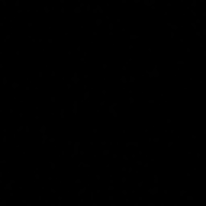
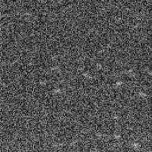

# tiff-reducer Test Report

**Generated:** 2026-05-28 23:24:46

## Summary

- [Lossless Report](#lossless-report): 5 working, 0 failed
- [Lossy Report](#lossy-report): 3 working, 2 failed

## Lossless Report

### Summary

| Category | Count | Percentage |
|----------|-------|------------|
| ✅ Working | 5 | 100.0% |
| ❌ Failed | 0 | 0.0% |
| **Total** | **5** | **100%** |

### ✅ Working Images

| Original | Compressed | Details |
|:---:|:---:|:---:|
|  |  | **File:** `12bit.cropped.rgb.tiff` **Codec:** zstd (lvl 19) **Size:** 18.3 KB → 3.1 KB **Red:** 82.8% **Time:** 8ms |
|  |  | **File:** `12bit.cropped.tiff` **Codec:** zstd (lvl 19) **Size:** 6.2 KB → 2.3 KB **Red:** 63.7% **Time:** 8ms |
|  |  | **File:** `170918_tn_neutrophil_migration_wave.ome.tif` **Codec:** zstd (lvl 19) **Size:** 2.0 MB → 1.3 MB **Red:** 35.1% **Time:** 49ms |
|  |  | **File:** `181003_multi_pos_time_course_1_MMStack.ome.tif` **Codec:** zstd (lvl 19) **Size:** 3.8 MB → 2.2 MB **Red:** 41.3% **Time:** 26ms |
|  |  | **File:** `4D-series.ome.tif` **Codec:** zstd (lvl 19) **Size:** 2.5 MB → 81.9 KB **Red:** 96.8% **Time:** 43ms |

## Lossy Report

### Summary

| Category | Count | Percentage |
|----------|-------|------------|
| ✅ Working | 3 | 60.0% |
| ❌ Failed | 2 | 40.0% |
| **Total** | **5** | **100%** |

### ❌ Failed Images

| File | Original Size | Error |
|------|---------------|-------|
| `170918_tn_neutrophil_migration_wave.ome.tif` | 2122029 bytes | Compression failed |
| `181003_multi_pos_time_course_1_MMStack.ome.tif` | 3994219 bytes | Compression failed |

### ✅ Working Images

| Original | Compressed | Details |
|:---:|:---:|:---:|
|  | *N/A* | **File:** `12bit.cropped.rgb.tiff` **Codec:** zstd (lvl 19) **Size:** 18.3 KB → 715 B **Red:** 96.2% **Time:** 2ms |
|  | *N/A* | **File:** `12bit.cropped.tiff` **Codec:** zstd (lvl 19) **Size:** 6.2 KB → 639 B **Red:** 90.0% **Time:** 2ms |
|  |  | **File:** `4D-series.ome.tif` **Codec:** zstd (lvl 19) **Size:** 2.5 MB → 138.7 KB **Red:** 94.6% **Time:** 11ms |
