# tiff-reducer Test Report

**Generated:** 2026-05-28 23:13:04
**Format:** zstd (level 19)

## Summary

| Category | Count | Percentage |
|----------|-------|------------|
| ✅ Working | 298 | 100.0% |
| ❌ Failed | 0 | 0.0% |
| **Total** | **298** | **100%** |

## ✅ Working Images

**298 images** successfully compressed with thumbnails below:

### 12bit.cropped.rgb.tiff

| Original | Compressed |
|:---:|:---:|
|  |  |

- **Original size:** 18.3 KB bytes
- **Compressed size:** 3.1 KB bytes
- **Reduction:** ⬇ 82.8%
- **Time:** 13ms

### 12bit.cropped.tiff

| Original | Compressed |
|:---:|:---:|
|  |  |

- **Original size:** 6.2 KB bytes
- **Compressed size:** 2.3 KB bytes
- **Reduction:** ⬇ 63.7%
- **Time:** 10ms

### 170918_tn_neutrophil_migration_wave.ome.tif

| Original | Compressed |
|:---:|:---:|
|  |  |

- **Original size:** 2.0 MB bytes
- **Compressed size:** 1.3 MB bytes
- **Reduction:** ⬇ 35.1%
- **Time:** 69ms

### 181003_multi_pos_time_course_1_MMStack.ome.tif

| Original | Compressed |
|:---:|:---:|
|  |  |

- **Original size:** 3.8 MB bytes
- **Compressed size:** 2.2 MB bytes
- **Reduction:** ⬇ 41.3%
- **Time:** 29ms

### 4D-series.ome.tif

| Original | Compressed |
|:---:|:---:|
|  |  |

- **Original size:** 2.5 MB bytes
- **Compressed size:** 81.9 KB bytes
- **Reduction:** ⬇ 96.8%
- **Time:** 45ms

### BigTIFF.tif

| Original | Compressed |
|:---:|:---:|
|  |  |

- **Original size:** 12.2 KB bytes
- **Compressed size:** 514 B bytes
- **Reduction:** ⬇ 95.9%
- **Time:** 7ms

### BigTIFFLong.tif

| Original | Compressed |
|:---:|:---:|
|  |  |

- **Original size:** 12.2 KB bytes
- **Compressed size:** 514 B bytes
- **Reduction:** ⬇ 95.9%
- **Time:** 8ms

### BigTIFFMotorola.tif

| Original | Compressed |
|:---:|:---:|
|  |  |

- **Original size:** 12.2 KB bytes
- **Compressed size:** 514 B bytes
- **Reduction:** ⬇ 95.9%
- **Time:** 8ms

### MMStack_Pos0.ome.tif

| Original | Compressed |
|:---:|:---:|
|  | 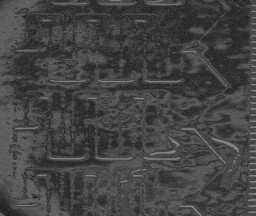 |

- **Original size:** 84.4 MB bytes
- **Compressed size:** 53.4 MB bytes
- **Reduction:** ⬇ 36.8%
- **Time:** 2424ms

### P1_T0.tif

| Original | Compressed |
|:---:|:---:|
|  |  |

- **Original size:** 130.3 KB bytes
- **Compressed size:** 107.0 KB bytes
- **Reduction:** ⬇ 17.9%
- **Time:** 9ms

### P1_T1.tif

| Original | Compressed |
|:---:|:---:|
|  |  |

- **Original size:** 130.3 KB bytes
- **Compressed size:** 107.5 KB bytes
- **Reduction:** ⬇ 17.5%
- **Time:** 8ms

### P1_T2.tif

| Original | Compressed |
|:---:|:---:|
|  | 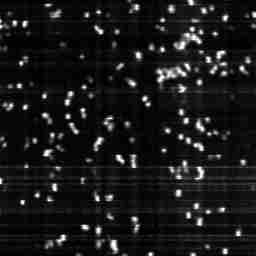 |

- **Original size:** 130.3 KB bytes
- **Compressed size:** 107.5 KB bytes
- **Reduction:** ⬇ 17.5%
- **Time:** 9ms

### P1_T3.tif

| Original | Compressed |
|:---:|:---:|
|  |  |

- **Original size:** 130.3 KB bytes
- **Compressed size:** 108.6 KB bytes
- **Reduction:** ⬇ 16.6%
- **Time:** 8ms

### P1_T4.tif

| Original | Compressed |
|:---:|:---:|
|  |  |

- **Original size:** 130.3 KB bytes
- **Compressed size:** 108.9 KB bytes
- **Reduction:** ⬇ 16.4%
- **Time:** 9ms

### P1_T5.tif

| Original | Compressed |
|:---:|:---:|
|  | 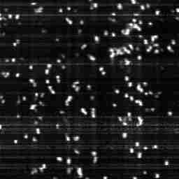 |

- **Original size:** 130.3 KB bytes
- **Compressed size:** 109.3 KB bytes
- **Reduction:** ⬇ 16.1%
- **Time:** 9ms

### P1_T6.tif

| Original | Compressed |
|:---:|:---:|
|  |  |

- **Original size:** 130.3 KB bytes
- **Compressed size:** 107.3 KB bytes
- **Reduction:** ⬇ 17.7%
- **Time:** 11ms

### P1_T7.tif

| Original | Compressed |
|:---:|:---:|
|  |  |

- **Original size:** 130.3 KB bytes
- **Compressed size:** 106.8 KB bytes
- **Reduction:** ⬇ 18.0%
- **Time:** 10ms

### P1_T8.tif

| Original | Compressed |
|:---:|:---:|
|  |  |

- **Original size:** 130.3 KB bytes
- **Compressed size:** 106.8 KB bytes
- **Reduction:** ⬇ 18.1%
- **Time:** 10ms

### P1_T9.tif

| Original | Compressed |
|:---:|:---:|
|  |  |

- **Original size:** 130.3 KB bytes
- **Compressed size:** 106.4 KB bytes
- **Reduction:** ⬇ 18.3%
- **Time:** 9ms

### P2_T0.tif

| Original | Compressed |
|:---:|:---:|
|  |  |

- **Original size:** 130.3 KB bytes
- **Compressed size:** 103.9 KB bytes
- **Reduction:** ⬇ 20.2%
- **Time:** 11ms

### P2_T1.tif

| Original | Compressed |
|:---:|:---:|
|  |  |

- **Original size:** 130.3 KB bytes
- **Compressed size:** 103.4 KB bytes
- **Reduction:** ⬇ 20.6%
- **Time:** 9ms

### P2_T2.tif

| Original | Compressed |
|:---:|:---:|
|  |  |

- **Original size:** 130.3 KB bytes
- **Compressed size:** 103.5 KB bytes
- **Reduction:** ⬇ 20.6%
- **Time:** 11ms

### P2_T3.tif

| Original | Compressed |
|:---:|:---:|
|  | 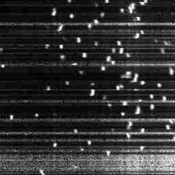 |

- **Original size:** 130.3 KB bytes
- **Compressed size:** 106.1 KB bytes
- **Reduction:** ⬇ 18.5%
- **Time:** 9ms

### P2_T4.tif

| Original | Compressed |
|:---:|:---:|
|  | 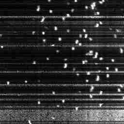 |

- **Original size:** 130.3 KB bytes
- **Compressed size:** 106.2 KB bytes
- **Reduction:** ⬇ 18.5%
- **Time:** 12ms

### P2_T5.tif

| Original | Compressed |
|:---:|:---:|
|  | 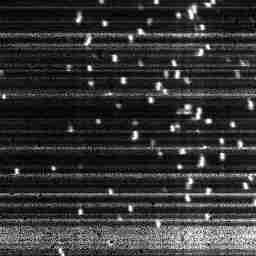 |

- **Original size:** 130.3 KB bytes
- **Compressed size:** 107.3 KB bytes
- **Reduction:** ⬇ 17.7%
- **Time:** 9ms

### P2_T6.tif

| Original | Compressed |
|:---:|:---:|
|  | 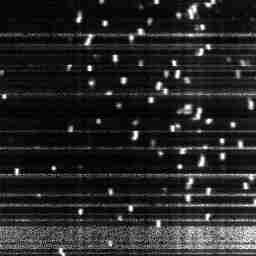 |

- **Original size:** 130.3 KB bytes
- **Compressed size:** 103.5 KB bytes
- **Reduction:** ⬇ 20.6%
- **Time:** 8ms

### P2_T7.tif

| Original | Compressed |
|:---:|:---:|
|  |  |

- **Original size:** 130.3 KB bytes
- **Compressed size:** 103.6 KB bytes
- **Reduction:** ⬇ 20.5%
- **Time:** 8ms

### P2_T8.tif

| Original | Compressed |
|:---:|:---:|
|  |  |

- **Original size:** 130.3 KB bytes
- **Compressed size:** 103.6 KB bytes
- **Reduction:** ⬇ 20.5%
- **Time:** 10ms

### P2_T9.tif

| Original | Compressed |
|:---:|:---:|
|  |  |

- **Original size:** 130.3 KB bytes
- **Compressed size:** 103.5 KB bytes
- **Reduction:** ⬇ 20.6%
- **Time:** 8ms

### TSeries-camp-005_Cycle00001_Ch1_000001.ome.tif

| Original | Compressed |
|:---:|:---:|
|  |  |

- **Original size:** 41.4 KB bytes
- **Compressed size:** 17.6 KB bytes
- **Reduction:** ⬇ 57.5%
- **Time:** 8ms

### TSeries-camp-005_Cycle00001_Ch1_000002.ome.tif

| Original | Compressed |
|:---:|:---:|
|  |  |

- **Original size:** 33.1 KB bytes
- **Compressed size:** 9.4 KB bytes
- **Reduction:** ⬇ 71.8%
- **Time:** 10ms

### TSeries-camp-005_Cycle00001_Ch1_000003.ome.tif

| Original | Compressed |
|:---:|:---:|
|  |  |

- **Original size:** 33.1 KB bytes
- **Compressed size:** 9.4 KB bytes
- **Reduction:** ⬇ 71.7%
- **Time:** 11ms

### TSeries-camp-005_Cycle00001_Ch1_000004.ome.tif

| Original | Compressed |
|:---:|:---:|
|  |  |

- **Original size:** 33.1 KB bytes
- **Compressed size:** 9.4 KB bytes
- **Reduction:** ⬇ 71.7%
- **Time:** 10ms

### TSeries-camp-005_Cycle00001_Ch2_000001.ome.tif

| Original | Compressed |
|:---:|:---:|
|  |  |

- **Original size:** 33.1 KB bytes
- **Compressed size:** 8.9 KB bytes
- **Reduction:** ⬇ 73.0%
- **Time:** 9ms

### TSeries-camp-005_Cycle00001_Ch2_000002.ome.tif

| Original | Compressed |
|:---:|:---:|
|  |  |

- **Original size:** 33.1 KB bytes
- **Compressed size:** 8.9 KB bytes
- **Reduction:** ⬇ 73.0%
- **Time:** 13ms

### TSeries-camp-005_Cycle00001_Ch2_000003.ome.tif

| Original | Compressed |
|:---:|:---:|
|  |  |

- **Original size:** 33.1 KB bytes
- **Compressed size:** 8.9 KB bytes
- **Reduction:** ⬇ 73.1%
- **Time:** 8ms

### TSeries-camp-005_Cycle00001_Ch2_000004.ome.tif

| Original | Compressed |
|:---:|:---:|
|  |  |

- **Original size:** 33.1 KB bytes
- **Compressed size:** 8.9 KB bytes
- **Reduction:** ⬇ 73.0%
- **Time:** 9ms

### TSeries-camp-005_Cycle00002_Ch1_000001.ome.tif

| Original | Compressed |
|:---:|:---:|
|  |  |

- **Original size:** 33.1 KB bytes
- **Compressed size:** 9.3 KB bytes
- **Reduction:** ⬇ 71.9%
- **Time:** 10ms

### TSeries-camp-005_Cycle00002_Ch1_000002.ome.tif

| Original | Compressed |
|:---:|:---:|
|  |  |

- **Original size:** 33.1 KB bytes
- **Compressed size:** 9.4 KB bytes
- **Reduction:** ⬇ 71.7%
- **Time:** 8ms

### TSeries-camp-005_Cycle00002_Ch1_000003.ome.tif

| Original | Compressed |
|:---:|:---:|
|  |  |

- **Original size:** 33.1 KB bytes
- **Compressed size:** 9.3 KB bytes
- **Reduction:** ⬇ 71.9%
- **Time:** 9ms

### TSeries-camp-005_Cycle00002_Ch1_000004.ome.tif

| Original | Compressed |
|:---:|:---:|
|  |  |

- **Original size:** 33.1 KB bytes
- **Compressed size:** 9.4 KB bytes
- **Reduction:** ⬇ 71.7%
- **Time:** 10ms

### TSeries-camp-005_Cycle00002_Ch2_000001.ome.tif

| Original | Compressed |
|:---:|:---:|
|  |  |

- **Original size:** 33.1 KB bytes
- **Compressed size:** 8.9 KB bytes
- **Reduction:** ⬇ 73.3%
- **Time:** 9ms

### TSeries-camp-005_Cycle00002_Ch2_000002.ome.tif

| Original | Compressed |
|:---:|:---:|
|  |  |

- **Original size:** 33.1 KB bytes
- **Compressed size:** 8.9 KB bytes
- **Reduction:** ⬇ 73.0%
- **Time:** 11ms

### TSeries-camp-005_Cycle00002_Ch2_000003.ome.tif

| Original | Compressed |
|:---:|:---:|
|  |  |

- **Original size:** 33.1 KB bytes
- **Compressed size:** 8.9 KB bytes
- **Reduction:** ⬇ 73.2%
- **Time:** 11ms

### TSeries-camp-005_Cycle00002_Ch2_000004.ome.tif

| Original | Compressed |
|:---:|:---:|
|  |  |

- **Original size:** 33.1 KB bytes
- **Compressed size:** 8.8 KB bytes
- **Reduction:** ⬇ 73.3%
- **Time:** 8ms

### TSeries-camp-005_Cycle00003_Ch1_000001.ome.tif

| Original | Compressed |
|:---:|:---:|
|  |  |

- **Original size:** 33.1 KB bytes
- **Compressed size:** 9.3 KB bytes
- **Reduction:** ⬇ 71.9%
- **Time:** 10ms

### TSeries-camp-005_Cycle00003_Ch1_000002.ome.tif

| Original | Compressed |
|:---:|:---:|
|  |  |

- **Original size:** 33.1 KB bytes
- **Compressed size:** 9.4 KB bytes
- **Reduction:** ⬇ 71.7%
- **Time:** 10ms

### TSeries-camp-005_Cycle00003_Ch1_000003.ome.tif

| Original | Compressed |
|:---:|:---:|
|  |  |

- **Original size:** 33.1 KB bytes
- **Compressed size:** 9.3 KB bytes
- **Reduction:** ⬇ 71.8%
- **Time:** 9ms

### TSeries-camp-005_Cycle00003_Ch1_000004.ome.tif

| Original | Compressed |
|:---:|:---:|
|  |  |

- **Original size:** 33.1 KB bytes
- **Compressed size:** 9.3 KB bytes
- **Reduction:** ⬇ 71.9%
- **Time:** 10ms

### TSeries-camp-005_Cycle00003_Ch2_000001.ome.tif

| Original | Compressed |
|:---:|:---:|
|  |  |

- **Original size:** 33.1 KB bytes
- **Compressed size:** 8.8 KB bytes
- **Reduction:** ⬇ 73.3%
- **Time:** 10ms

### TSeries-camp-005_Cycle00003_Ch2_000002.ome.tif

| Original | Compressed |
|:---:|:---:|
|  |  |

- **Original size:** 33.1 KB bytes
- **Compressed size:** 8.9 KB bytes
- **Reduction:** ⬇ 73.0%
- **Time:** 9ms

### TSeries-camp-005_Cycle00003_Ch2_000003.ome.tif

| Original | Compressed |
|:---:|:---:|
|  |  |

- **Original size:** 33.1 KB bytes
- **Compressed size:** 8.9 KB bytes
- **Reduction:** ⬇ 73.1%
- **Time:** 7ms

### TSeries-camp-005_Cycle00003_Ch2_000004.ome.tif

| Original | Compressed |
|:---:|:---:|
|  |  |

- **Original size:** 33.1 KB bytes
- **Compressed size:** 8.9 KB bytes
- **Reduction:** ⬇ 73.2%
- **Time:** 11ms

### Transparency-lzw.tif

| Original | Compressed |
|:---:|:---:|
|  |  |

- **Original size:** 6.0 KB bytes
- **Compressed size:** 3.0 KB bytes
- **Reduction:** ⬇ 49.7%
- **Time:** 8ms

### background_1_MMStack.ome.tif

| Original | Compressed |
|:---:|:---:|
|  | 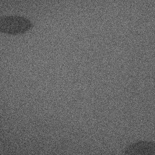 |

- **Original size:** 18.4 MB bytes
- **Compressed size:** 15.9 MB bytes
- **Reduction:** ⬇ 13.2%
- **Time:** 80ms

### bali.tif

| Original | Compressed |
|:---:|:---:|
|  |  |

- **Original size:** 175.2 KB bytes
- **Compressed size:** 152.5 KB bytes
- **Reduction:** ⬇ 12.9%
- **Time:** 20ms

### big_g4.tif

| Original | Compressed |
|:---:|:---:|
| *N/A* | *N/A* |

- **Original size:** 8.1 KB bytes
- **Compressed size:** 140 B bytes
- **Reduction:** ⬇ 98.3%
- **Time:** 11ms

### capitol.tif

| Original | Compressed |
|:---:|:---:|
|  |  |

- **Original size:** 23.5 KB bytes
- **Compressed size:** 12.3 KB bytes
- **Reduction:** ⬇ 47.7%
- **Time:** 7ms

### capitol2.tif

| Original | Compressed |
|:---:|:---:|
|  |  |

- **Original size:** 24.6 KB bytes
- **Compressed size:** 12.3 KB bytes
- **Reduction:** ⬇ 50.1%
- **Time:** 10ms

### caspian.tif

| Original | Compressed |
|:---:|:---:|
|  | *N/A* |

- **Original size:** 291.3 KB bytes
- **Compressed size:** 79.0 KB bytes
- **Reduction:** ⬇ 72.9%
- **Time:** 18ms

### cmyk-3c-16b.tiff

| Original | Compressed |
|:---:|:---:|
|  |  |

- **Original size:** 185.5 KB bytes
- **Compressed size:** 157.0 KB bytes
- **Reduction:** ⬇ 15.4%
- **Time:** 11ms

### cmyk-3c-32b-float.tiff

| Original | Compressed |
|:---:|:---:|
|  |  |

- **Original size:** 6.6 KB bytes
- **Compressed size:** 4.4 KB bytes
- **Reduction:** ⬇ 32.6%
- **Time:** 8ms

### cmyk-3c-8b.tiff

| Original | Compressed |
|:---:|:---:|
|  |  |

- **Original size:** 92.9 KB bytes
- **Compressed size:** 75.6 KB bytes
- **Reduction:** ⬇ 18.6%
- **Time:** 10ms

### cmyk-4c-8b.tiff

| Original | Compressed |
|:---:|:---:|
|  |  |

- **Original size:** 127.1 KB bytes
- **Compressed size:** 84.1 KB bytes
- **Reduction:** ⬇ 33.9%
- **Time:** 11ms

### coffee.tif

| Original | Compressed |
|:---:|:---:|
|  |  |

- **Original size:** 180.2 KB bytes
- **Compressed size:** 130.2 KB bytes
- **Reduction:** ⬇ 27.7%
- **Time:** 12ms

### cramps-tile.tif

| Original | Compressed |
|:---:|:---:|
|  |  |

- **Original size:** 768.3 KB bytes
- **Compressed size:** 76.5 KB bytes
- **Reduction:** ⬇ 90.0%
- **Time:** 15ms

### cramps.tif

| Original | Compressed |
|:---:|:---:|
|  |  |

- **Original size:** 189.6 KB bytes
- **Compressed size:** 76.5 KB bytes
- **Reduction:** ⬇ 59.7%
- **Time:** 14ms

### decodedata-rgb-3c-8b.tiff

| Original | Compressed |
|:---:|:---:|
|  |  |

- **Original size:** 29.5 KB bytes
- **Compressed size:** 916 B bytes
- **Reduction:** ⬇ 97.0%
- **Time:** 8ms

### dscf0013.tif

| Original | Compressed |
|:---:|:---:|
|  |  |

- **Original size:** 638.7 KB bytes
- **Compressed size:** 452.6 KB bytes
- **Reduction:** ⬇ 29.1%
- **Time:** 33ms

### earthlab.tif

| Original | Compressed |
|:---:|:---:|
|  |  |

- **Original size:** 465.5 KB bytes
- **Compressed size:** 115.7 KB bytes
- **Reduction:** ⬇ 75.1%
- **Time:** 43ms

### earthlab_compressed.tif

| Original | Compressed |
|:---:|:---:|
|  |  |

- **Original size:** 115.7 KB bytes
- **Compressed size:** 115.7 KB bytes
- **Reduction:** ⬇ 0.0%
- **Time:** 50ms

### extra_bits_gray_8b.tiff

| Original | Compressed |
|:---:|:---:|
|  |  |

- **Original size:** 338 B bytes
- **Compressed size:** 244 B bytes
- **Reduction:** ⬇ 27.8%
- **Time:** 10ms

### extra_bits_rgb_8b.tiff

| Original | Compressed |
|:---:|:---:|
|  |  |

- **Original size:** 482 B bytes
- **Compressed size:** 262 B bytes
- **Reduction:** ⬇ 45.6%
- **Time:** 9ms

### fax2d.tif

| Original | Compressed |
|:---:|:---:|
|  |  |

- **Original size:** 32.0 KB bytes
- **Compressed size:** 30.1 KB bytes
- **Reduction:** ⬇ 6.1%
- **Time:** 11ms

### fax4.tiff

| Original | Compressed |
|:---:|:---:|
|  |  |

- **Original size:** 32.8 KB bytes
- **Compressed size:** 31.8 KB bytes
- **Reduction:** ⬇ 3.2%
- **Time:** 11ms

### flagler.tif

| Original | Compressed |
|:---:|:---:|
|  |  |

- **Original size:** 424.2 KB bytes
- **Compressed size:** 243.4 KB bytes
- **Reduction:** ⬇ 42.6%
- **Time:** 21ms

### flower-minisblack-02.tif

| Original | Compressed |
|:---:|:---:|
|  |  |

- **Original size:** 1.1 KB bytes
- **Compressed size:** 540 B bytes
- **Reduction:** ⬇ 52.3%
- **Time:** 9ms

### flower-minisblack-04.tif

| Original | Compressed |
|:---:|:---:|
| 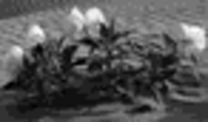 |  |

- **Original size:** 1.9 KB bytes
- **Compressed size:** 1.4 KB bytes
- **Reduction:** ⬇ 27.3%
- **Time:** 8ms

### flower-minisblack-06.tif

| Original | Compressed |
|:---:|:---:|
| 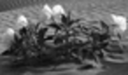 |  |

- **Original size:** 2.6 KB bytes
- **Compressed size:** 2.4 KB bytes
- **Reduction:** ⬇ 6.9%
- **Time:** 7ms

### flower-minisblack-08.tif

| Original | Compressed |
|:---:|:---:|
| 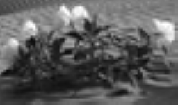 |  |

- **Original size:** 3.4 KB bytes
- **Compressed size:** 3.1 KB bytes
- **Reduction:** ⬇ 7.7%
- **Time:** 9ms

### flower-minisblack-10.tif

| Original | Compressed |
|:---:|:---:|
|  |  |

- **Original size:** 4.2 KB bytes
- **Compressed size:** 4.0 KB bytes
- **Reduction:** ⬇ 3.0%
- **Time:** 8ms

### flower-minisblack-12.tif

| Original | Compressed |
|:---:|:---:|
|  | 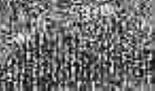 |

- **Original size:** 4.9 KB bytes
- **Compressed size:** 4.8 KB bytes
- **Reduction:** ⬇ 2.6%
- **Time:** 8ms

### flower-minisblack-14.tif

| Original | Compressed |
|:---:|:---:|
|  |  |

- **Original size:** 5.7 KB bytes
- **Compressed size:** 5.6 KB bytes
- **Reduction:** ⬇ 2.2%
- **Time:** 12ms

### flower-minisblack-16.tif

| Original | Compressed |
|:---:|:---:|
|  | 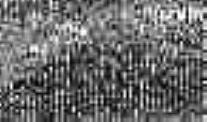 |

- **Original size:** 6.4 KB bytes
- **Compressed size:** 6.3 KB bytes
- **Reduction:** ⬇ 2.0%
- **Time:** 7ms

### flower-minisblack-24.tif

| Original | Compressed |
|:---:|:---:|
|  |  |

- **Original size:** 9.5 KB bytes
- **Compressed size:** 7.3 KB bytes
- **Reduction:** ⬇ 23.2%
- **Time:** 9ms

### flower-minisblack-32.tif

| Original | Compressed |
|:---:|:---:|
|  |  |

- **Original size:** 12.6 KB bytes
- **Compressed size:** 12.4 KB bytes
- **Reduction:** ⬇ 1.1%
- **Time:** 10ms

### flower-palette-02.tif

| Original | Compressed |
|:---:|:---:|
|  |  |

- **Original size:** 1.1 KB bytes
- **Compressed size:** 758 B bytes
- **Reduction:** ⬇ 34.9%
- **Time:** 7ms

### flower-palette-04.tif

| Original | Compressed |
|:---:|:---:|
|  |  |

- **Original size:** 2.0 KB bytes
- **Compressed size:** 1.5 KB bytes
- **Reduction:** ⬇ 22.1%
- **Time:** 9ms

### flower-palette-08.tif

| Original | Compressed |
|:---:|:---:|
|  |  |

- **Original size:** 4.9 KB bytes
- **Compressed size:** 4.7 KB bytes
- **Reduction:** ⬇ 3.8%
- **Time:** 9ms

### flower-palette-16.tif

| Original | Compressed |
|:---:|:---:|
|  |  |

- **Original size:** 390.4 KB bytes
- **Compressed size:** 389.3 KB bytes
- **Reduction:** ⬇ 0.3%
- **Time:** 11ms

### flower-rgb-contig-02.tif

| Original | Compressed |
|:---:|:---:|
| 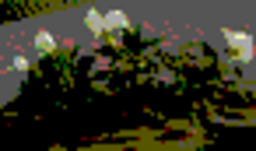 |  |

- **Original size:** 2.6 KB bytes
- **Compressed size:** 1.0 KB bytes
- **Reduction:** ⬇ 61.6%
- **Time:** 9ms

### flower-rgb-contig-04.tif

| Original | Compressed |
|:---:|:---:|
|  |  |

- **Original size:** 4.9 KB bytes
- **Compressed size:** 3.4 KB bytes
- **Reduction:** ⬇ 30.1%
- **Time:** 9ms

### flower-rgb-contig-08.tif

| Original | Compressed |
|:---:|:---:|
|  | 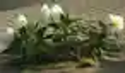 |

- **Original size:** 9.5 KB bytes
- **Compressed size:** 9.0 KB bytes
- **Reduction:** ⬇ 5.8%
- **Time:** 8ms

### flower-rgb-contig-10.tif

| Original | Compressed |
|:---:|:---:|
|  |  |

- **Original size:** 11.8 KB bytes
- **Compressed size:** 11.7 KB bytes
- **Reduction:** ⬇ 1.1%
- **Time:** 10ms

### flower-rgb-contig-12.tif

| Original | Compressed |
|:---:|:---:|
|  |  |

- **Original size:** 14.1 KB bytes
- **Compressed size:** 14.0 KB bytes
- **Reduction:** ⬇ 0.9%
- **Time:** 8ms

### flower-rgb-contig-14.tif

| Original | Compressed |
|:---:|:---:|
|  |  |

- **Original size:** 16.5 KB bytes
- **Compressed size:** 16.3 KB bytes
- **Reduction:** ⬇ 0.8%
- **Time:** 7ms

### flower-rgb-contig-16.tif

| Original | Compressed |
|:---:|:---:|
|  |  |

- **Original size:** 18.7 KB bytes
- **Compressed size:** 18.6 KB bytes
- **Reduction:** ⬇ 0.7%
- **Time:** 7ms

### flower-rgb-contig-24.tif

| Original | Compressed |
|:---:|:---:|
|  | 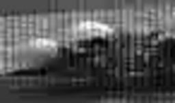 |

- **Original size:** 28.0 KB bytes
- **Compressed size:** 18.9 KB bytes
- **Reduction:** ⬇ 32.4%
- **Time:** 10ms

### flower-rgb-contig-32.tif

| Original | Compressed |
|:---:|:---:|
|  |  |

- **Original size:** 37.1 KB bytes
- **Compressed size:** 37.0 KB bytes
- **Reduction:** ⬇ 0.4%
- **Time:** 9ms

### flower-rgb-planar-02.tif

| Original | Compressed |
|:---:|:---:|
|  | *N/A* |

- **Original size:** 2.7 KB bytes
- **Compressed size:** 624 B bytes
- **Reduction:** ⬇ 77.7%
- **Time:** 9ms

### flower-rgb-planar-04.tif

| Original | Compressed |
|:---:|:---:|
|  | *N/A* |

- **Original size:** 5.0 KB bytes
- **Compressed size:** 1.5 KB bytes
- **Reduction:** ⬇ 70.6%
- **Time:** 8ms

### flower-rgb-planar-08.tif

| Original | Compressed |
|:---:|:---:|
|  | *N/A* |

- **Original size:** 9.5 KB bytes
- **Compressed size:** 3.2 KB bytes
- **Reduction:** ⬇ 66.4%
- **Time:** 8ms

### flower-rgb-planar-10.tif

| Original | Compressed |
|:---:|:---:|
|  | *N/A* |

- **Original size:** 11.9 KB bytes
- **Compressed size:** 4.1 KB bytes
- **Reduction:** ⬇ 65.8%
- **Time:** 7ms

### flower-rgb-planar-12.tif

| Original | Compressed |
|:---:|:---:|
|  | *N/A* |

- **Original size:** 14.2 KB bytes
- **Compressed size:** 4.8 KB bytes
- **Reduction:** ⬇ 65.9%
- **Time:** 9ms

### flower-rgb-planar-14.tif

| Original | Compressed |
|:---:|:---:|
|  | *N/A* |

- **Original size:** 16.5 KB bytes
- **Compressed size:** 5.6 KB bytes
- **Reduction:** ⬇ 66.0%
- **Time:** 8ms

### flower-rgb-planar-16.tif

| Original | Compressed |
|:---:|:---:|
|  | *N/A* |

- **Original size:** 18.7 KB bytes
- **Compressed size:** 6.3 KB bytes
- **Reduction:** ⬇ 66.1%
- **Time:** 9ms

### flower-rgb-planar-24.tif

| Original | Compressed |
|:---:|:---:|
|  | *N/A* |

- **Original size:** 28.0 KB bytes
- **Compressed size:** 7.7 KB bytes
- **Reduction:** ⬇ 72.4%
- **Time:** 8ms

### flower-rgb-planar-32.tif

| Original | Compressed |
|:---:|:---:|
|  | *N/A* |

- **Original size:** 37.1 KB bytes
- **Compressed size:** 12.5 KB bytes
- **Reduction:** ⬇ 66.4%
- **Time:** 8ms

### flower-separated-contig-08.tif

| Original | Compressed |
|:---:|:---:|
|  | 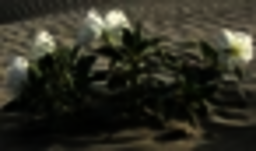 |

- **Original size:** 12.6 KB bytes
- **Compressed size:** 11.9 KB bytes
- **Reduction:** ⬇ 5.6%
- **Time:** 7ms

### flower-separated-contig-16.tif

| Original | Compressed |
|:---:|:---:|
|  |  |

- **Original size:** 24.9 KB bytes
- **Compressed size:** 24.7 KB bytes
- **Reduction:** ⬇ 0.6%
- **Time:** 10ms

### flower-separated-planar-08.tif

| Original | Compressed |
|:---:|:---:|
|  |  |

- **Original size:** 12.6 KB bytes
- **Compressed size:** 3.2 KB bytes
- **Reduction:** ⬇ 74.5%
- **Time:** 10ms

### flower-separated-planar-16.tif

| Original | Compressed |
|:---:|:---:|
|  | *N/A* |

- **Original size:** 24.9 KB bytes
- **Compressed size:** 6.4 KB bytes
- **Reduction:** ⬇ 74.4%
- **Time:** 10ms

### g3test.tif

| Original | Compressed |
|:---:|:---:|
| 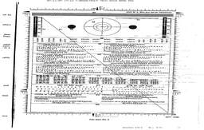 |  |

- **Original size:** 49.2 KB bytes
- **Compressed size:** 41.3 KB bytes
- **Reduction:** ⬇ 16.1%
- **Time:** 11ms

### geo-5b.tif

| Original | Compressed |
|:---:|:---:|
|  |  |

- **Original size:** 1.4 KB bytes
- **Compressed size:** 460 B bytes
- **Reduction:** ⬇ 67.6%
- **Time:** 9ms

### gradient-1c-32b-float.tiff

| Original | Compressed |
|:---:|:---:|
|  |  |

- **Original size:** 1.3 KB bytes
- **Compressed size:** 1.1 KB bytes
- **Reduction:** ⬇ 14.5%
- **Time:** 9ms

### gradient-1c-32b.tiff

| Original | Compressed |
|:---:|:---:|
|  |  |

- **Original size:** 1.3 KB bytes
- **Compressed size:** 1.0 KB bytes
- **Reduction:** ⬇ 23.5%
- **Time:** 9ms

### gradient-1c-64b-float.tiff

| Original | Compressed |
|:---:|:---:|
|  |  |

- **Original size:** 2.3 KB bytes
- **Compressed size:** 1.1 KB bytes
- **Reduction:** ⬇ 51.8%
- **Time:** 9ms

### gradient-1c-64b.tiff

| Original | Compressed |
|:---:|:---:|
| *N/A* | *N/A* |

- **Original size:** 2.3 KB bytes
- **Compressed size:** 1.1 KB bytes
- **Reduction:** ⬇ 51.3%
- **Time:** 7ms

### gradient-3c-32b-float.tiff

| Original | Compressed |
|:---:|:---:|
|  |  |

- **Original size:** 3.4 KB bytes
- **Compressed size:** 2.9 KB bytes
- **Reduction:** ⬇ 14.9%
- **Time:** 8ms

### gradient-3c-32b.tiff

| Original | Compressed |
|:---:|:---:|
|  |  |

- **Original size:** 3.3 KB bytes
- **Compressed size:** 2.6 KB bytes
- **Reduction:** ⬇ 22.8%
- **Time:** 7ms

### gradient-3c-64b.tiff

| Original | Compressed |
|:---:|:---:|
| *N/A* | *N/A* |

- **Original size:** 6.3 KB bytes
- **Compressed size:** 2.7 KB bytes
- **Reduction:** ⬇ 57.7%
- **Time:** 9ms

### house.tif

| Original | Compressed |
|:---:|:---:|
| *N/A* |  |

- **Original size:** 512.8 KB bytes
- **Compressed size:** 137.7 KB bytes
- **Reduction:** ⬇ 73.2%
- **Time:** 19ms

### hpredict-1c-12b.tiff

| Original | Compressed |
|:---:|:---:|
|  |  |

- **Original size:** 158 B bytes
- **Compressed size:** 156 B bytes
- **Reduction:** ⬇ 1.3%
- **Time:** 7ms

### imagemagick_group4.tiff

| Original | Compressed |
|:---:|:---:|
|  |  |

- **Original size:** 1.2 KB bytes
- **Compressed size:** 1.8 KB bytes
- **Reduction:** ⬇ -48.5%
- **Time:** 10ms

### int16.tif

| Original | Compressed |
|:---:|:---:|
|  |  |

- **Original size:** 8.3 KB bytes
- **Compressed size:** 7.8 KB bytes
- **Reduction:** ⬇ 5.6%
- **Time:** 10ms

### int16_rgb.tif

| Original | Compressed |
|:---:|:---:|
|  |  |

- **Original size:** 24.3 KB bytes
- **Compressed size:** 8.4 KB bytes
- **Reduction:** ⬇ 65.6%
- **Time:** 11ms

### int16_zstd.tif

| Original | Compressed |
|:---:|:---:|
|  |  |

- **Original size:** 7.7 KB bytes
- **Compressed size:** 7.8 KB bytes
- **Reduction:** ⬇ -2.5%
- **Time:** 10ms

### int8.tif

| Original | Compressed |
|:---:|:---:|
| 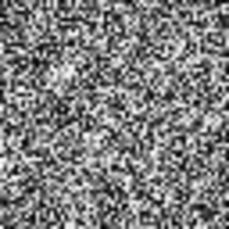 |  |

- **Original size:** 4.3 KB bytes
- **Compressed size:** 4.2 KB bytes
- **Reduction:** ⬇ 1.8%
- **Time:** 9ms

### int8_rgb.tif

| Original | Compressed |
|:---:|:---:|
|  |  |

- **Original size:** 12.3 KB bytes
- **Compressed size:** 12.3 KB bytes
- **Reduction:** ⬇ 0.5%
- **Time:** 8ms

### issue_69_lzw.tiff

| Original | Compressed |
|:---:|:---:|
|  | 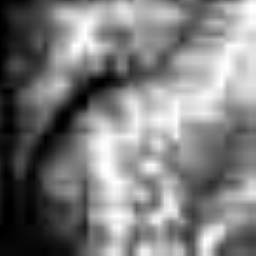 |

- **Original size:** 2.9 KB bytes
- **Compressed size:** 2.2 KB bytes
- **Reduction:** ⬇ 23.0%
- **Time:** 10ms

### issue_69_packbits.tiff

| Original | Compressed |
|:---:|:---:|
|  |  |

- **Original size:** 4.3 KB bytes
- **Compressed size:** 2.2 KB bytes
- **Reduction:** ⬇ 48.8%
- **Time:** 8ms

### jello.tif

| Original | Compressed |
|:---:|:---:|
| 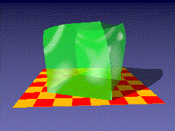 |  |

- **Original size:** 46.0 KB bytes
- **Compressed size:** 21.3 KB bytes
- **Reduction:** ⬇ 53.6%
- **Time:** 12ms

### jim___ah.tif

| Original | Compressed |
|:---:|:---:|
|  |  |

- **Original size:** 66.1 KB bytes
- **Compressed size:** 14.2 KB bytes
- **Reduction:** ⬇ 78.5%
- **Time:** 9ms

### jim___cg.tif

| Original | Compressed |
|:---:|:---:|
|  |  |

- **Original size:** 91.9 KB bytes
- **Compressed size:** 57.7 KB bytes
- **Reduction:** ⬇ 37.2%
- **Time:** 12ms

### jim___dg.tif

| Original | Compressed |
|:---:|:---:|
|  |  |

- **Original size:** 91.9 KB bytes
- **Compressed size:** 63.6 KB bytes
- **Reduction:** ⬇ 30.7%
- **Time:** 14ms

### jim___gg.tif

| Original | Compressed |
|:---:|:---:|
|  |  |

- **Original size:** 91.9 KB bytes
- **Compressed size:** 63.6 KB bytes
- **Reduction:** ⬇ 30.8%
- **Time:** 14ms

### julia.tif

| Original | Compressed |
|:---:|:---:|
|  |  |

- **Original size:** 456.8 KB bytes
- **Compressed size:** 8.1 KB bytes
- **Reduction:** ⬇ 98.2%
- **Time:** 10ms

### kodim02-lzw.tif

| Original | Compressed |
|:---:|:---:|
|  |  |

- **Original size:** 709.6 KB bytes
- **Compressed size:** 618.7 KB bytes
- **Reduction:** ⬇ 12.8%
- **Time:** 44ms

### kodim07-lzw.tif

| Original | Compressed |
|:---:|:---:|
|  |  |

- **Original size:** 628.0 KB bytes
- **Compressed size:** 620.2 KB bytes
- **Reduction:** ⬇ 1.2%
- **Time:** 40ms

### ladoga.tif

| Original | Compressed |
|:---:|:---:|
|  |  |

- **Original size:** 19.9 KB bytes
- **Compressed size:** 16.7 KB bytes
- **Reduction:** ⬇ 16.4%
- **Time:** 11ms

### logluv-3c-16b.tiff

| Original | Compressed |
|:---:|:---:|
|  | *N/A* |

- **Original size:** 166 B bytes
- **Compressed size:** 186 B bytes
- **Reduction:** ⬇ -12.0%
- **Time:** 9ms

### mask_lzw.tif

| Original | Compressed |
|:---:|:---:|
|  |  |

- **Original size:** 2.2 MB bytes
- **Compressed size:** 11.2 KB bytes
- **Reduction:** ⬇ 99.5%
- **Time:** 175ms

### minisblack-1c-16b.tiff

| Original | Compressed |
|:---:|:---:|
|  |  |

- **Original size:** 46.6 KB bytes
- **Compressed size:** 42.5 KB bytes
- **Reduction:** ⬇ 8.9%
- **Time:** 7ms

### minisblack-1c-3b.tiff

| Original | Compressed |
|:---:|:---:|
|  |  |

- **Original size:** 140 B bytes
- **Compressed size:** 150 B bytes
- **Reduction:** ⬇ -7.1%
- **Time:** 8ms

### minisblack-1c-5b.tiff

| Original | Compressed |
|:---:|:---:|
|  |  |

- **Original size:** 144 B bytes
- **Compressed size:** 154 B bytes
- **Reduction:** ⬇ -6.9%
- **Time:** 8ms

### minisblack-1c-7b.tiff

| Original | Compressed |
|:---:|:---:|
|  |  |

- **Original size:** 148 B bytes
- **Compressed size:** 158 B bytes
- **Reduction:** ⬇ -6.8%
- **Time:** 10ms

### minisblack-1c-8b.tiff

| Original | Compressed |
|:---:|:---:|
|  |  |

- **Original size:** 23.4 KB bytes
- **Compressed size:** 16.7 KB bytes
- **Reduction:** ⬇ 29.0%
- **Time:** 8ms

### minisblack-1c-i16b.tiff

| Original | Compressed |
|:---:|:---:|
|  |  |

- **Original size:** 46.6 KB bytes
- **Compressed size:** 42.4 KB bytes
- **Reduction:** ⬇ 8.9%
- **Time:** 8ms

### minisblack-1c-i8b.tiff

| Original | Compressed |
|:---:|:---:|
|  |  |

- **Original size:** 23.4 KB bytes
- **Compressed size:** 16.6 KB bytes
- **Reduction:** ⬇ 29.0%
- **Time:** 11ms

### minisblack-2c-8b-alpha.tiff

| Original | Compressed |
|:---:|:---:|
|  | *N/A* |

- **Original size:** 4.0 KB bytes
- **Compressed size:** 2.0 KB bytes
- **Reduction:** ⬇ 50.8%
- **Time:** 7ms

### miniswhite-1c-12b.tiff

| Original | Compressed |
|:---:|:---:|
|  |  |

- **Original size:** 146 B bytes
- **Compressed size:** 156 B bytes
- **Reduction:** ⬇ -6.8%
- **Time:** 7ms

### miniswhite-1c-1b.tiff

| Original | Compressed |
|:---:|:---:|
| 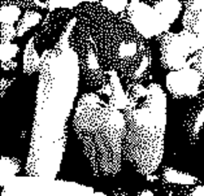 |  |

- **Original size:** 3.2 KB bytes
- **Compressed size:** 2.2 KB bytes
- **Reduction:** ⬇ 32.3%
- **Time:** 11ms

### miniswhite-1c-3b.tiff

| Original | Compressed |
|:---:|:---:|
|  |  |

- **Original size:** 140 B bytes
- **Compressed size:** 150 B bytes
- **Reduction:** ⬇ -7.1%
- **Time:** 7ms

### miniswhite-1c-6b.tiff

| Original | Compressed |
|:---:|:---:|
|  |  |

- **Original size:** 146 B bytes
- **Compressed size:** 156 B bytes
- **Reduction:** ⬇ -6.8%
- **Time:** 9ms

### mri.tif

| Original | Compressed |
|:---:|:---:|
|  |  |

- **Original size:** 225.2 KB bytes
- **Compressed size:** 133.3 KB bytes
- **Reduction:** ⬇ 40.8%
- **Time:** 33ms

### multi-channel-4D-series.ome.tif

| Original | Compressed |
|:---:|:---:|
|  |  |

- **Original size:** 7.5 MB bytes
- **Compressed size:** 287.9 KB bytes
- **Reduction:** ⬇ 96.3%
- **Time:** 109ms

### multi-channel-time-series.ome.tif

| Original | Compressed |
|:---:|:---:|
|  |  |

- **Original size:** 1.5 MB bytes
- **Compressed size:** 51.9 KB bytes
- **Reduction:** ⬇ 96.6%
- **Time:** 32ms

### multi-channel-z-series.ome.tif

| Original | Compressed |
|:---:|:---:|
|  |  |

- **Original size:** 1.1 MB bytes
- **Compressed size:** 38.0 KB bytes
- **Reduction:** ⬇ 96.5%
- **Time:** 24ms

### multi-channel.ome.tif

| Original | Compressed |
|:---:|:---:|
|  |  |

- **Original size:** 221.2 KB bytes
- **Compressed size:** 7.3 KB bytes
- **Reduction:** ⬇ 96.7%
- **Time:** 16ms

### multifile-Z1.ome.tiff

| Original | Compressed |
|:---:|:---:|
| 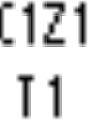 |  |

- **Original size:** 1.7 KB bytes
- **Compressed size:** 1.1 KB bytes
- **Reduction:** ⬇ 36.5%
- **Time:** 11ms

### multifile-Z2.ome.tiff

| Original | Compressed |
|:---:|:---:|
| 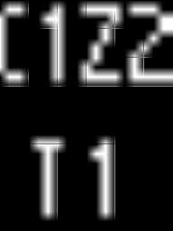 |  |

- **Original size:** 1.7 KB bytes
- **Compressed size:** 1.1 KB bytes
- **Reduction:** ⬇ 36.4%
- **Time:** 9ms

### multifile-Z3.ome.tiff

| Original | Compressed |
|:---:|:---:|
| 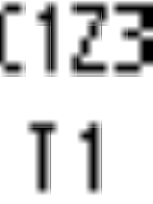 |  |

- **Original size:** 1.7 KB bytes
- **Compressed size:** 1.1 KB bytes
- **Reduction:** ⬇ 36.5%
- **Time:** 9ms

### multifile-Z4.ome.tiff

| Original | Compressed |
|:---:|:---:|
|  | 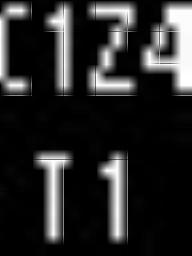 |

- **Original size:** 1.7 KB bytes
- **Compressed size:** 1.1 KB bytes
- **Reduction:** ⬇ 36.7%
- **Time:** 7ms

### multifile-Z5.ome.tiff

| Original | Compressed |
|:---:|:---:|
| 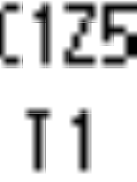 |  |

- **Original size:** 1.7 KB bytes
- **Compressed size:** 1.1 KB bytes
- **Reduction:** ⬇ 35.8%
- **Time:** 10ms

### no_rows_per_strip.tiff

| Original | Compressed |
|:---:|:---:|
|  |  |

- **Original size:** 768.1 KB bytes
- **Compressed size:** 743.0 KB bytes
- **Reduction:** ⬇ 3.3%
- **Time:** 13ms

### nonometif.tif

| Original | Compressed |
|:---:|:---:|
|  |  |

- **Original size:** 2.2 KB bytes
- **Compressed size:** 2.2 KB bytes
- **Reduction:** ⬇ 0.7%
- **Time:** 9ms

### off_l16.tif

| Original | Compressed |
|:---:|:---:|
|  |  |

- **Original size:** 70.5 KB bytes
- **Compressed size:** 55.4 KB bytes
- **Reduction:** ⬇ 21.4%
- **Time:** 11ms

### off_luv24.tif

| Original | Compressed |
|:---:|:---:|
| 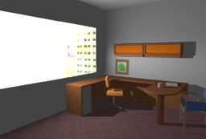 | *N/A* |

- **Original size:** 220.0 KB bytes
- **Compressed size:** 83.3 KB bytes
- **Reduction:** ⬇ 62.1%
- **Time:** 19ms

### off_luv32.tif

| Original | Compressed |
|:---:|:---:|
| 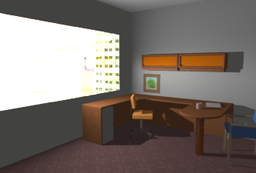 | *N/A* |

- **Original size:** 112.5 KB bytes
- **Compressed size:** 94.8 KB bytes
- **Reduction:** ⬇ 15.7%
- **Time:** 17ms

### oxford.tif

| Original | Compressed |
|:---:|:---:|
|  | *N/A* |

- **Original size:** 20.7 KB bytes
- **Compressed size:** 2.1 KB bytes
- **Reduction:** ⬇ 90.1%
- **Time:** 8ms

### palette-1c-1b.tiff

| Original | Compressed |
|:---:|:---:|
|  |  |

- **Original size:** 3.2 KB bytes
- **Compressed size:** 2.2 KB bytes
- **Reduction:** ⬇ 31.8%
- **Time:** 10ms

### palette-1c-4b.tiff

| Original | Compressed |
|:---:|:---:|
|  |  |

- **Original size:** 12.0 KB bytes
- **Compressed size:** 8.6 KB bytes
- **Reduction:** ⬇ 28.9%
- **Time:** 8ms

### palette-1c-8b.tiff

| Original | Compressed |
|:---:|:---:|
|  |  |

- **Original size:** 24.9 KB bytes
- **Compressed size:** 18.3 KB bytes
- **Reduction:** ⬇ 26.8%
- **Time:** 11ms

### pc260001.tif

| Original | Compressed |
|:---:|:---:|
| 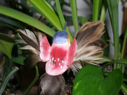 |  |

- **Original size:** 914.6 KB bytes
- **Compressed size:** 798.1 KB bytes
- **Reduction:** ⬇ 12.7%
- **Time:** 31ms

### planar-rgb-u8.tif

| Original | Compressed |
|:---:|:---:|
| 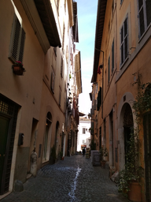 | *N/A* |

- **Original size:** 506.4 KB bytes
- **Compressed size:** 123.9 KB bytes
- **Reduction:** ⬇ 75.5%
- **Time:** 13ms

### poppies.tif

| Original | Compressed |
|:---:|:---:|
|  |  |

- **Original size:** 747.4 KB bytes
- **Compressed size:** 432.9 KB bytes
- **Reduction:** ⬇ 42.1%
- **Time:** 29ms

### predictor-3-gray-f32.tif

| Original | Compressed |
|:---:|:---:|
|  | 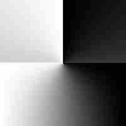 |

- **Original size:** 100.7 KB bytes
- **Compressed size:** 54.2 KB bytes
- **Reduction:** ⬇ 46.2%
- **Time:** 12ms

### predictor-3-rgb-f32.tif

| Original | Compressed |
|:---:|:---:|
|  |  |

- **Original size:** 10.1 KB bytes
- **Compressed size:** 1.9 KB bytes
- **Reduction:** ⬇ 81.5%
- **Time:** 11ms

### quad-lzw-compat.tiff

| Original | Compressed |
|:---:|:---:|
| 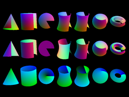 |  |

- **Original size:** 209.3 KB bytes
- **Compressed size:** 155.9 KB bytes
- **Reduction:** ⬇ 25.5%
- **Time:** 14ms

### quad-lzw.tif

| Original | Compressed |
|:---:|:---:|
|  |  |

- **Original size:** 209.3 KB bytes
- **Compressed size:** 155.9 KB bytes
- **Reduction:** ⬇ 25.5%
- **Time:** 16ms

### quad-tile.tif

| Original | Compressed |
|:---:|:---:|
|  |  |

- **Original size:** 204.3 KB bytes
- **Compressed size:** 155.9 KB bytes
- **Reduction:** ⬇ 23.7%
- **Time:** 16ms

### random-fp16-pred2.tiff

| Original | Compressed |
|:---:|:---:|
|  |  |

- **Original size:** 683 B bytes
- **Compressed size:** 586 B bytes
- **Reduction:** ⬇ 14.2%
- **Time:** 9ms

### random-fp16-pred3.tiff

| Original | Compressed |
|:---:|:---:|
|  |  |

- **Original size:** 698 B bytes
- **Compressed size:** 586 B bytes
- **Reduction:** ⬇ 16.0%
- **Time:** 11ms

### random-fp16.tiff

| Original | Compressed |
|:---:|:---:|
|  |  |

- **Original size:** 621 B bytes
- **Compressed size:** 586 B bytes
- **Reduction:** ⬇ 5.6%
- **Time:** 8ms

### renamed_internalfilenames.ome.tif

| Original | Compressed |
|:---:|:---:|
|  |  |

- **Original size:** 3.8 MB bytes
- **Compressed size:** 2.2 MB bytes
- **Reduction:** ⬇ 41.3%
- **Time:** 39ms

### renamed_uuids.ome.tif

| Original | Compressed |
|:---:|:---:|
|  |  |

- **Original size:** 2.5 MB bytes
- **Compressed size:** 81.9 KB bytes
- **Reduction:** ⬇ 96.8%
- **Time:** 46ms

### rgb-3c-16b.tiff

| Original | Compressed |
|:---:|:---:|
|  |  |

- **Original size:** 139.3 KB bytes
- **Compressed size:** 126.5 KB bytes
- **Reduction:** ⬇ 9.2%
- **Time:** 8ms

### rgb-3c-8b.tiff

| Original | Compressed |
|:---:|:---:|
|  |  |

- **Original size:** 69.8 KB bytes
- **Compressed size:** 49.0 KB bytes
- **Reduction:** ⬇ 29.8%
- **Time:** 10ms

### seq-1c-10b-6d739fa2.tiff

| Original | Compressed |
|:---:|:---:|
|  |  |

- **Original size:** 466 B bytes
- **Compressed size:** 464 B bytes
- **Reduction:** ⬇ 0.4%
- **Time:** 8ms

### seq-1c-10b-hpredict-6d739fa2.tiff

| Original | Compressed |
|:---:|:---:|
|  |  |

- **Original size:** 466 B bytes
- **Compressed size:** 464 B bytes
- **Reduction:** ⬇ 0.4%
- **Time:** 8ms

### seq-1c-10b-miniswhite-6d739fa2.tiff

| Original | Compressed |
|:---:|:---:|
|  |  |

- **Original size:** 466 B bytes
- **Compressed size:** 464 B bytes
- **Reduction:** ⬇ 0.4%
- **Time:** 8ms

### seq-1c-12b-47c39b31.tiff

| Original | Compressed |
|:---:|:---:|
|  |  |

- **Original size:** 530 B bytes
- **Compressed size:** 504 B bytes
- **Reduction:** ⬇ 4.9%
- **Time:** 10ms

### seq-1c-12b-hpredict-47c39b31.tiff

| Original | Compressed |
|:---:|:---:|
|  |  |

- **Original size:** 530 B bytes
- **Compressed size:** 504 B bytes
- **Reduction:** ⬇ 4.9%
- **Time:** 8ms

### seq-1c-12b-miniswhite-47c39b31.tiff

| Original | Compressed |
|:---:|:---:|
|  |  |

- **Original size:** 530 B bytes
- **Compressed size:** 502 B bytes
- **Reduction:** ⬇ 5.3%
- **Time:** 9ms

### seq-1c-14b-e883657f.tiff

| Original | Compressed |
|:---:|:---:|
|  |  |

- **Original size:** 594 B bytes
- **Compressed size:** 540 B bytes
- **Reduction:** ⬇ 9.1%
- **Time:** 10ms

### seq-1c-14b-hpredict-e883657f.tiff

| Original | Compressed |
|:---:|:---:|
|  |  |

- **Original size:** 594 B bytes
- **Compressed size:** 540 B bytes
- **Reduction:** ⬇ 9.1%
- **Time:** 7ms

### seq-1c-14b-miniswhite-e883657f.tiff

| Original | Compressed |
|:---:|:---:|
|  |  |

- **Original size:** 594 B bytes
- **Compressed size:** 536 B bytes
- **Reduction:** ⬇ 9.8%
- **Time:** 8ms

### seq-1c-16b-bigendian-68f373a0.tiff

| Original | Compressed |
|:---:|:---:|
|  |  |

- **Original size:** 658 B bytes
- **Compressed size:** 194 B bytes
- **Reduction:** ⬇ 70.5%
- **Time:** 11ms

### seq-1c-16b-deflate-68f373a0.tiff

| Original | Compressed |
|:---:|:---:|
|  |  |

- **Original size:** 500 B bytes
- **Compressed size:** 194 B bytes
- **Reduction:** ⬇ 61.2%
- **Time:** 7ms

### seq-1c-16b-lzw-68f373a0.tiff

| Original | Compressed |
|:---:|:---:|
|  |  |

- **Original size:** 758 B bytes
- **Compressed size:** 194 B bytes
- **Reduction:** ⬇ 74.4%
- **Time:** 11ms

### seq-1c-16b-multistrip-68f373a0.tiff

| Original | Compressed |
|:---:|:---:|
|  |  |

- **Original size:** 682 B bytes
- **Compressed size:** 194 B bytes
- **Reduction:** ⬇ 71.6%
- **Time:** 7ms

### seq-1c-16b-tiled-68f373a0.tiff

| Original | Compressed |
|:---:|:---:|
|  |  |

- **Original size:** 670 B bytes
- **Compressed size:** 194 B bytes
- **Reduction:** ⬇ 71.0%
- **Time:** 11ms

### seq-1c-1b-71f6a21a.tiff

| Original | Compressed |
|:---:|:---:|
|  |  |

- **Original size:** 178 B bytes
- **Compressed size:** 150 B bytes
- **Reduction:** ⬇ 15.7%
- **Time:** 11ms

### seq-1c-1b-miniswhite-71f6a21a.tiff

| Original | Compressed |
|:---:|:---:|
|  |  |

- **Original size:** 178 B bytes
- **Compressed size:** 150 B bytes
- **Reduction:** ⬇ 15.7%
- **Time:** 8ms

### seq-1c-24b-072a9dc9.tiff

| Original | Compressed |
|:---:|:---:|
|  |  |

- **Original size:** 914 B bytes
- **Compressed size:** 518 B bytes
- **Reduction:** ⬇ 43.3%
- **Time:** 9ms

### seq-1c-24b-hpredict-072a9dc9.tiff

| Original | Compressed |
|:---:|:---:|
|  |  |

- **Original size:** 914 B bytes
- **Compressed size:** 518 B bytes
- **Reduction:** ⬇ 43.3%
- **Time:** 7ms

### seq-1c-24b-miniswhite-072a9dc9.tiff

| Original | Compressed |
|:---:|:---:|
|  | 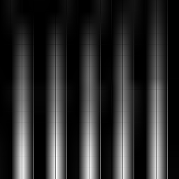 |

- **Original size:** 914 B bytes
- **Compressed size:** 516 B bytes
- **Reduction:** ⬇ 43.5%
- **Time:** 7ms

### seq-1c-2b-58b25f76.tiff

| Original | Compressed |
|:---:|:---:|
|  |  |

- **Original size:** 210 B bytes
- **Compressed size:** 150 B bytes
- **Reduction:** ⬇ 28.6%
- **Time:** 11ms

### seq-1c-32f-390fe673.tiff

| Original | Compressed |
|:---:|:---:|
|  |  |

- **Original size:** 1.1 KB bytes
- **Compressed size:** 1.1 KB bytes
- **Reduction:** ⬇ 5.5%
- **Time:** 7ms

### seq-1c-32f-deflate-fpredict-390fe673.tiff

| Original | Compressed |
|:---:|:---:|
|  |  |

- **Original size:** 298 B bytes
- **Compressed size:** 1.1 KB bytes
- **Reduction:** ⬇ -271.1%
- **Time:** 7ms

### seq-1c-3b-ef237c07.tiff

| Original | Compressed |
|:---:|:---:|
|  |  |

- **Original size:** 242 B bytes
- **Compressed size:** 152 B bytes
- **Reduction:** ⬇ 37.2%
- **Time:** 10ms

### seq-1c-3b-miniswhite-ef237c07.tiff

| Original | Compressed |
|:---:|:---:|
|  |  |

- **Original size:** 242 B bytes
- **Compressed size:** 152 B bytes
- **Reduction:** ⬇ 37.2%
- **Time:** 10ms

### seq-1c-4b-fb92dcae.tiff

| Original | Compressed |
|:---:|:---:|
|  |  |

- **Original size:** 274 B bytes
- **Compressed size:** 158 B bytes
- **Reduction:** ⬇ 42.3%
- **Time:** 8ms

### seq-1c-4b-miniswhite-fb92dcae.tiff

| Original | Compressed |
|:---:|:---:|
|  |  |

- **Original size:** 274 B bytes
- **Compressed size:** 158 B bytes
- **Reduction:** ⬇ 42.3%
- **Time:** 8ms

### seq-1c-4b-palette-85108c5a.tiff

| Original | Compressed |
|:---:|:---:|
|  |  |

- **Original size:** 382 B bytes
- **Compressed size:** 266 B bytes
- **Reduction:** ⬇ 30.4%
- **Time:** 9ms

### seq-1c-5b-73098d17.tiff

| Original | Compressed |
|:---:|:---:|
|  |  |

- **Original size:** 306 B bytes
- **Compressed size:** 170 B bytes
- **Reduction:** ⬇ 44.4%
- **Time:** 10ms

### seq-1c-5b-miniswhite-73098d17.tiff

| Original | Compressed |
|:---:|:---:|
|  |  |

- **Original size:** 306 B bytes
- **Compressed size:** 170 B bytes
- **Reduction:** ⬇ 44.4%
- **Time:** 9ms

### seq-1c-64f-afa8560e.tiff

| Original | Compressed |
|:---:|:---:|
|  |  |

- **Original size:** 2.1 KB bytes
- **Compressed size:** 1.1 KB bytes
- **Reduction:** ⬇ 47.8%
- **Time:** 9ms

### seq-1c-64f-deflate-fpredict-afa8560e.tiff

| Original | Compressed |
|:---:|:---:|
|  |  |

- **Original size:** 318 B bytes
- **Compressed size:** 1.1 KB bytes
- **Reduction:** ⬇ -260.4%
- **Time:** 8ms

### seq-1c-6b-miniswhite-79cafbb6.tiff

| Original | Compressed |
|:---:|:---:|
|  |  |

- **Original size:** 338 B bytes
- **Compressed size:** 200 B bytes
- **Reduction:** ⬇ 40.8%
- **Time:** 7ms

### seq-1c-7b-9c61ba70.tiff

| Original | Compressed |
|:---:|:---:|
|  |  |

- **Original size:** 370 B bytes
- **Compressed size:** 264 B bytes
- **Reduction:** ⬇ 28.6%
- **Time:** 8ms

### seq-1c-7b-miniswhite-9c61ba70.tiff

| Original | Compressed |
|:---:|:---:|
|  |  |

- **Original size:** 370 B bytes
- **Compressed size:** 264 B bytes
- **Reduction:** ⬇ 28.6%
- **Time:** 7ms

### seq-1c-8b-bigendian-20f3db0c.tiff

| Original | Compressed |
|:---:|:---:|
|  |  |

- **Original size:** 402 B bytes
- **Compressed size:** 206 B bytes
- **Reduction:** ⬇ 48.8%
- **Time:** 10ms

### seq-1c-8b-bigtiff-20f3db0c.tiff

| Original | Compressed |
|:---:|:---:|
|  |  |

- **Original size:** 508 B bytes
- **Compressed size:** 206 B bytes
- **Reduction:** ⬇ 59.4%
- **Time:** 9ms

### seq-1c-8b-deflate-20f3db0c.tiff

| Original | Compressed |
|:---:|:---:|
|  |  |

- **Original size:** 414 B bytes
- **Compressed size:** 206 B bytes
- **Reduction:** ⬇ 50.2%
- **Time:** 8ms

### seq-1c-8b-lzw-20f3db0c.tiff

| Original | Compressed |
|:---:|:---:|
|  |  |

- **Original size:** 438 B bytes
- **Compressed size:** 206 B bytes
- **Reduction:** ⬇ 53.0%
- **Time:** 10ms

### seq-1c-8b-lzw-hpredict-20f3db0c.tiff

| Original | Compressed |
|:---:|:---:|
|  |  |

- **Original size:** 212 B bytes
- **Compressed size:** 206 B bytes
- **Reduction:** ⬇ 2.8%
- **Time:** 11ms

### seq-1c-8b-multipage-adeefdcc.tiff

| Original | Compressed |
|:---:|:---:|
|  |  |

- **Original size:** 1.2 KB bytes
- **Compressed size:** 602 B bytes
- **Reduction:** ⬇ 52.3%
- **Time:** 13ms

### seq-1c-8b-multistrip-20f3db0c.tiff

| Original | Compressed |
|:---:|:---:|
|  |  |

- **Original size:** 426 B bytes
- **Compressed size:** 206 B bytes
- **Reduction:** ⬇ 51.6%
- **Time:** 8ms

### seq-1c-8b-packbits-20f3db0c.tiff

| Original | Compressed |
|:---:|:---:|
|  |  |

- **Original size:** 418 B bytes
- **Compressed size:** 206 B bytes
- **Reduction:** ⬇ 50.7%
- **Time:** 8ms

### seq-1c-8b-palette-89b39bc3.tiff

| Original | Compressed |
|:---:|:---:|
|  |  |

- **Original size:** 1.9 KB bytes
- **Compressed size:** 1.7 KB bytes
- **Reduction:** ⬇ 10.1%
- **Time:** 7ms

### seq-1c-8b-tiled-20f3db0c.tiff

| Original | Compressed |
|:---:|:---:|
|  |  |

- **Original size:** 414 B bytes
- **Compressed size:** 206 B bytes
- **Reduction:** ⬇ 50.2%
- **Time:** 8ms

### seq-1c-8b-tiled-bigtiff-20f3db0c.tiff

| Original | Compressed |
|:---:|:---:|
|  |  |

- **Original size:** 528 B bytes
- **Compressed size:** 206 B bytes
- **Reduction:** ⬇ 61.0%
- **Time:** 10ms

### seq-1c-8b-tiled-deflate-20f3db0c.tiff

| Original | Compressed |
|:---:|:---:|
|  |  |

- **Original size:** 426 B bytes
- **Compressed size:** 206 B bytes
- **Reduction:** ⬇ 51.6%
- **Time:** 10ms

### seq-1c-8b-tiled-lzw-20f3db0c.tiff

| Original | Compressed |
|:---:|:---:|
|  |  |

- **Original size:** 450 B bytes
- **Compressed size:** 206 B bytes
- **Reduction:** ⬇ 54.2%
- **Time:** 10ms

### seq-1c-i16-63af2488.tiff

| Original | Compressed |
|:---:|:---:|
|  |  |

- **Original size:** 658 B bytes
- **Compressed size:** 200 B bytes
- **Reduction:** ⬇ 69.6%
- **Time:** 9ms

### seq-1c-i32-99fddec2.tiff

| Original | Compressed |
|:---:|:---:|
|  |  |

- **Original size:** 1.1 KB bytes
- **Compressed size:** 210 B bytes
- **Reduction:** ⬇ 82.1%
- **Time:** 9ms

### seq-1c-i8-f8446bbe.tiff

| Original | Compressed |
|:---:|:---:|
|  |  |

- **Original size:** 402 B bytes
- **Compressed size:** 206 B bytes
- **Reduction:** ⬇ 48.8%
- **Time:** 9ms

### seq-3c-10b-contig-d08d5dc0.tiff

| Original | Compressed |
|:---:|:---:|
|  |  |

- **Original size:** 1.1 KB bytes
- **Compressed size:** 1.1 KB bytes
- **Reduction:** ⬇ -0.9%
- **Time:** 7ms

### seq-3c-10b-planar-c82e8ab6.tiff

| Original | Compressed |
|:---:|:---:|
|  | *N/A* |

- **Original size:** 1.1 KB bytes
- **Compressed size:** 506 B bytes
- **Reduction:** ⬇ 55.5%
- **Time:** 10ms

### seq-3c-12b-contig-e6f40b4a.tiff

| Original | Compressed |
|:---:|:---:|
|  |  |

- **Original size:** 1.3 KB bytes
- **Compressed size:** 1.2 KB bytes
- **Reduction:** ⬇ 4.1%
- **Time:** 8ms

### seq-3c-12b-planar-e29e8e25.tiff

| Original | Compressed |
|:---:|:---:|
|  | *N/A* |

- **Original size:** 1.3 KB bytes
- **Compressed size:** 546 B bytes
- **Reduction:** ⬇ 58.9%
- **Time:** 11ms

### seq-3c-14b-contig-f4dcc6cc.tiff

| Original | Compressed |
|:---:|:---:|
|  |  |

- **Original size:** 1.5 KB bytes
- **Compressed size:** 1.3 KB bytes
- **Reduction:** ⬇ 9.9%
- **Time:** 8ms

### seq-3c-14b-planar-4dde706b.tiff

| Original | Compressed |
|:---:|:---:|
|  | *N/A* |

- **Original size:** 1.5 KB bytes
- **Compressed size:** 582 B bytes
- **Reduction:** ⬇ 61.7%
- **Time:** 9ms

### seq-3c-16b-bigtiff-1b40ca6e.tiff

| Original | Compressed |
|:---:|:---:|
|  |  |

- **Original size:** 1.7 KB bytes
- **Compressed size:** 302 B bytes
- **Reduction:** ⬇ 83.1%
- **Time:** 8ms

### seq-3c-24b-contig-27b9f8ce.tiff

| Original | Compressed |
|:---:|:---:|
|  |  |

- **Original size:** 2.4 KB bytes
- **Compressed size:** 1.4 KB bytes
- **Reduction:** ⬇ 40.5%
- **Time:** 7ms

### seq-3c-24b-planar-6296c0c9.tiff

| Original | Compressed |
|:---:|:---:|
|  | *N/A* |

- **Original size:** 2.4 KB bytes
- **Compressed size:** 560 B bytes
- **Reduction:** ⬇ 77.4%
- **Time:** 10ms

### seq-3c-32f-9a471c2b.tiff

| Original | Compressed |
|:---:|:---:|
|  |  |

- **Original size:** 3.2 KB bytes
- **Compressed size:** 2.9 KB bytes
- **Reduction:** ⬇ 9.3%
- **Time:** 7ms

### seq-3c-5b-contig-09f197f4.tiff

| Original | Compressed |
|:---:|:---:|
|  |  |

- **Original size:** 638 B bytes
- **Compressed size:** 194 B bytes
- **Reduction:** ⬇ 69.6%
- **Time:** 10ms

### seq-3c-64f-9fff098a.tiff

| Original | Compressed |
|:---:|:---:|
|  |  |

- **Original size:** 6.2 KB bytes
- **Compressed size:** 3.7 KB bytes
- **Reduction:** ⬇ 40.1%
- **Time:** 8ms

### seq-3c-7b-contig-2e4f43c5.tiff

| Original | Compressed |
|:---:|:---:|
|  |  |

- **Original size:** 830 B bytes
- **Compressed size:** 288 B bytes
- **Reduction:** ⬇ 65.3%
- **Time:** 8ms

### seq-3c-8b-bigendian-8743c999.tiff

| Original | Compressed |
|:---:|:---:|
|  |  |

- **Original size:** 926 B bytes
- **Compressed size:** 256 B bytes
- **Reduction:** ⬇ 72.4%
- **Time:** 9ms

### seq-3c-8b-lzw-8743c999.tiff

| Original | Compressed |
|:---:|:---:|
| 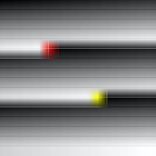 |  |

- **Original size:** 770 B bytes
- **Compressed size:** 256 B bytes
- **Reduction:** ⬇ 66.8%
- **Time:** 8ms

### seq-3c-8b-multistrip-8743c999.tiff

| Original | Compressed |
|:---:|:---:|
|  |  |

- **Original size:** 950 B bytes
- **Compressed size:** 256 B bytes
- **Reduction:** ⬇ 73.1%
- **Time:** 10ms

### seq-3c-8b-tiled-8743c999.tiff

| Original | Compressed |
|:---:|:---:|
|  |  |

- **Original size:** 938 B bytes
- **Compressed size:** 256 B bytes
- **Reduction:** ⬇ 72.7%
- **Time:** 7ms

### seq-3c-i16-f7fcf423.tiff

| Original | Compressed |
|:---:|:---:|
|  |  |

- **Original size:** 1.7 KB bytes
- **Compressed size:** 322 B bytes
- **Reduction:** ⬇ 81.0%
- **Time:** 8ms

### seq-3c-i8-d7550ce4.tiff

| Original | Compressed |
|:---:|:---:|
|  |  |

- **Original size:** 926 B bytes
- **Compressed size:** 256 B bytes
- **Reduction:** ⬇ 72.4%
- **Time:** 9ms

### seq-4c-16b-cmyk-c6e52592.tiff

| Original | Compressed |
|:---:|:---:|
|  |  |

- **Original size:** 2.2 KB bytes
- **Compressed size:** 304 B bytes
- **Reduction:** ⬇ 86.3%
- **Time:** 10ms

### seq-4c-16b-rgba-5181991f.tiff

| Original | Compressed |
|:---:|:---:|
|  |  |

- **Original size:** 2.2 KB bytes
- **Compressed size:** 304 B bytes
- **Reduction:** ⬇ 86.3%
- **Time:** 9ms

### seq-4c-8b-cmyk-352ac1da.tiff

| Original | Compressed |
|:---:|:---:|
|  |  |

- **Original size:** 1.2 KB bytes
- **Compressed size:** 232 B bytes
- **Reduction:** ⬇ 80.6%
- **Time:** 10ms

### seq-4c-8b-rgba-50969cda.tiff

| Original | Compressed |
|:---:|:---:|
|  |  |

- **Original size:** 1.2 KB bytes
- **Compressed size:** 232 B bytes
- **Reduction:** ⬇ 80.6%
- **Time:** 11ms

### seq-4c-8b-rgba-unassoc-50969cda.tiff

| Original | Compressed |
|:---:|:---:|
|  |  |

- **Original size:** 1.2 KB bytes
- **Compressed size:** 232 B bytes
- **Reduction:** ⬇ 80.6%
- **Time:** 10ms

### shapes_deflate.tif

| Original | Compressed |
|:---:|:---:|
|  |  |

- **Original size:** 9.6 KB bytes
- **Compressed size:** 8.8 KB bytes
- **Reduction:** ⬇ 8.2%
- **Time:** 8ms

### shapes_hyper.tif

| Original | Compressed |
|:---:|:---:|
| 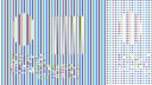 |  |

- **Original size:** 252.2 KB bytes
- **Compressed size:** 12.2 KB bytes
- **Reduction:** ⬇ 95.2%
- **Time:** 10ms

### shapes_lzw.tif

| Original | Compressed |
|:---:|:---:|
|  |  |

- **Original size:** 11.3 KB bytes
- **Compressed size:** 8.8 KB bytes
- **Reduction:** ⬇ 21.6%
- **Time:** 9ms

### shapes_lzw_12bps.tif

| Original | Compressed |
|:---:|:---:|
|  |  |

- **Original size:** 16.2 KB bytes
- **Compressed size:** 12.1 KB bytes
- **Reduction:** ⬇ 25.3%
- **Time:** 10ms

### shapes_lzw_14bps.tif

| Original | Compressed |
|:---:|:---:|
|  |  |

- **Original size:** 19.1 KB bytes
- **Compressed size:** 14.8 KB bytes
- **Reduction:** ⬇ 22.5%
- **Time:** 11ms

### shapes_lzw_palette.tif

| Original | Compressed |
|:---:|:---:|
|  |  |

- **Original size:** 7.3 KB bytes
- **Compressed size:** 6.2 KB bytes
- **Reduction:** ⬇ 14.9%
- **Time:** 9ms

### shapes_lzw_planar.tif

| Original | Compressed |
|:---:|:---:|
|  | *N/A* |

- **Original size:** 11.3 KB bytes
- **Compressed size:** 5.6 KB bytes
- **Reduction:** ⬇ 50.3%
- **Time:** 11ms

### shapes_lzw_planar_10bps.tif

| Original | Compressed |
|:---:|:---:|
|  | *N/A* |

- **Original size:** 14.6 KB bytes
- **Compressed size:** 6.5 KB bytes
- **Reduction:** ⬇ 55.4%
- **Time:** 7ms

### shapes_lzw_predictor3.tif

| Original | Compressed |
|:---:|:---:|
|  |  |

- **Original size:** 27.2 KB bytes
- **Compressed size:** 14.0 KB bytes
- **Reduction:** ⬇ 48.4%
- **Time:** 11ms

### shapes_lzw_tiled.tif

| Original | Compressed |
|:---:|:---:|
|  |  |

- **Original size:** 12.7 KB bytes
- **Compressed size:** 8.8 KB bytes
- **Reduction:** ⬇ 30.6%
- **Time:** 10ms

### shapes_lzw_tiled_planar.tif

| Original | Compressed |
|:---:|:---:|
|  | *N/A* |

- **Original size:** 13.8 KB bytes
- **Compressed size:** 4.1 KB bytes
- **Reduction:** ⬇ 70.3%
- **Time:** 9ms

### shapes_multi_color.tif

| Original | Compressed |
|:---:|:---:|
|  |  |

- **Original size:** 74.4 KB bytes
- **Compressed size:** 27.7 KB bytes
- **Reduction:** ⬇ 62.7%
- **Time:** 17ms

### shapes_multi_size.tif

| Original | Compressed |
|:---:|:---:|
|  |  |

- **Original size:** 40.5 KB bytes
- **Compressed size:** 12.0 KB bytes
- **Reduction:** ⬇ 70.5%
- **Time:** 17ms

### shapes_tiled_multi.tif

| Original | Compressed |
|:---:|:---:|
|  |  |

- **Original size:** 36.7 KB bytes
- **Compressed size:** 20.4 KB bytes
- **Reduction:** ⬇ 44.6%
- **Time:** 16ms

### shapes_uncompressed.tif

| Original | Compressed |
|:---:|:---:|
|  |  |

- **Original size:** 30.9 KB bytes
- **Compressed size:** 8.8 KB bytes
- **Reduction:** ⬇ 71.5%
- **Time:** 9ms

### shapes_uncompressed_half.tif

| Original | Compressed |
|:---:|:---:|
|  |  |

- **Original size:** 10.6 KB bytes
- **Compressed size:** 6.2 KB bytes
- **Reduction:** ⬇ 41.6%
- **Time:** 7ms

### shapes_uncompressed_tiled_planar.tif

| Original | Compressed |
|:---:|:---:|
|  | *N/A* |

- **Original size:** 40.1 KB bytes
- **Compressed size:** 4.1 KB bytes
- **Reduction:** ⬇ 89.8%
- **Time:** 9ms

### single-black-fp16.tiff

| Original | Compressed |
|:---:|:---:|
|  |  |

- **Original size:** 457 B bytes
- **Compressed size:** 241 B bytes
- **Reduction:** ⬇ 47.3%
- **Time:** 8ms

### single-channel.ome.tif

| Original | Compressed |
|:---:|:---:|
|  |  |

- **Original size:** 74.3 KB bytes
- **Compressed size:** 3.0 KB bytes
- **Reduction:** ⬇ 96.0%
- **Time:** 10ms

### spine.tif

| Original | Compressed |
|:---:|:---:|
| 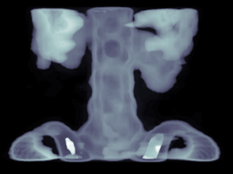 |  |

- **Original size:** 67.7 KB bytes
- **Compressed size:** 30.6 KB bytes
- **Reduction:** ⬇ 54.7%
- **Time:** 11ms

### spring.tif

| Original | Compressed |
|:---:|:---:|
|  | 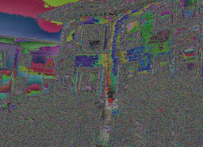 |

- **Original size:** 3.0 MB bytes
- **Compressed size:** 2.1 MB bytes
- **Reduction:** ⬇ 29.8%
- **Time:** 90ms

### strike.tif

| Original | Compressed |
|:---:|:---:|
| 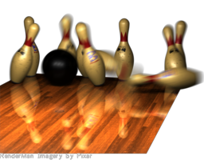 |  |

- **Original size:** 108.1 KB bytes
- **Compressed size:** 91.6 KB bytes
- **Reduction:** ⬇ 15.2%
- **Time:** 12ms

### subsubifds.tif

| Original | Compressed |
|:---:|:---:|
|  |  |

- **Original size:** 4.7 KB bytes
- **Compressed size:** 1000 B bytes
- **Reduction:** ⬇ 79.1%
- **Time:** 17ms

### tiled-cmyk-i8.tif

| Original | Compressed |
|:---:|:---:|
|  | 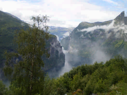 |

- **Original size:** 553.0 KB bytes
- **Compressed size:** 389.6 KB bytes
- **Reduction:** ⬇ 29.6%
- **Time:** 26ms

### tiled-gray-i1.tif

| Original | Compressed |
|:---:|:---:|
|  |  |

- **Original size:** 614 B bytes
- **Compressed size:** 154 B bytes
- **Reduction:** ⬇ 74.9%
- **Time:** 8ms

### tiled-jpeg-rgb-u8.tif

| Original | Compressed |
|:---:|:---:|
|  | 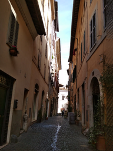 |

- **Original size:** 97.4 KB bytes
- **Compressed size:** 412.7 KB bytes
- **Reduction:** ⬇ -323.7%
- **Time:** 21ms

### tiled-oversize-gray-i8.tif

| Original | Compressed |
|:---:|:---:|
| 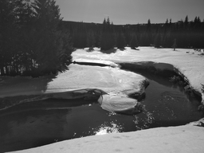 | 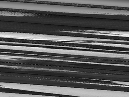 |

- **Original size:** 112.7 KB bytes
- **Compressed size:** 96.7 KB bytes
- **Reduction:** ⬇ 14.2%
- **Time:** 18ms

### tiled-rect-rgb-u8.tif

| Original | Compressed |
|:---:|:---:|
| 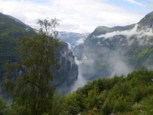 |  |

- **Original size:** 576.6 KB bytes
- **Compressed size:** 414.6 KB bytes
- **Reduction:** ⬇ 28.1%
- **Time:** 20ms

### tiled-rgb-u8.tif

| Original | Compressed |
|:---:|:---:|
|  | 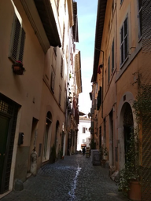 |

- **Original size:** 406.6 KB bytes
- **Compressed size:** 403.7 KB bytes
- **Reduction:** ⬇ 0.7%
- **Time:** 23ms

### time-series.ome.tif

| Original | Compressed |
|:---:|:---:|
|  |  |

- **Original size:** 514.4 KB bytes
- **Compressed size:** 15.3 KB bytes
- **Reduction:** ⬇ 97.0%
- **Time:** 23ms

### underwater_bmx.tif

| Original | Compressed |
|:---:|:---:|
|  | 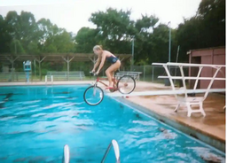 |

- **Original size:** 1.0 MB bytes
- **Compressed size:** 1.7 MB bytes
- **Reduction:** ⬇ -66.7%
- **Time:** 66ms

### usda_naip_256_webp_z3.tif

| Original | Compressed |
|:---:|:---:|
|  |  |

- **Original size:** 20.1 KB bytes
- **Compressed size:** 155.1 KB bytes
- **Reduction:** ⬇ -673.3%
- **Time:** 55ms

### white-fp16-pred2.tiff

| Original | Compressed |
|:---:|:---:|
|  |  |

- **Original size:** 1.3 KB bytes
- **Compressed size:** 255 B bytes
- **Reduction:** ⬇ 80.5%
- **Time:** 9ms

### white-fp16-pred3.tiff

| Original | Compressed |
|:---:|:---:|
|  |  |

- **Original size:** 1.3 KB bytes
- **Compressed size:** 255 B bytes
- **Reduction:** ⬇ 81.2%
- **Time:** 9ms

### white-fp16.tiff

| Original | Compressed |
|:---:|:---:|
|  |  |

- **Original size:** 128.3 KB bytes
- **Compressed size:** 238 B bytes
- **Reduction:** ⬇ 99.8%
- **Time:** 10ms

### z-series.ome.tif

| Original | Compressed |
|:---:|:---:|
|  |  |

- **Original size:** 367.7 KB bytes
- **Compressed size:** 10.8 KB bytes
- **Reduction:** ⬇ 97.1%
- **Time:** 18ms

## Performance Metrics

- **Total execution time:** 25.71s
- **Average time per image:** 86ms
- **Throughput:** 11.6 images/sec
